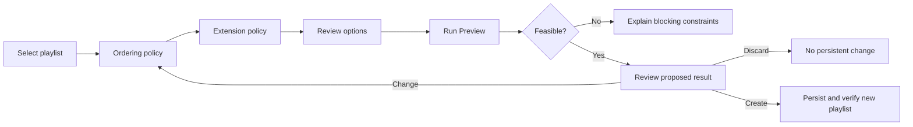

# Bliss 'Em All productization and implementation plan

**Status:** In progress - deterministic automatic and exact-count previews implemented; immutable-anchor gap filling next
**Date:** 2026-07-20
**Primary objective:** Productize the experimentally exercised playlist sequencing and
bridge-insertion workflow, add order-preserving gap filling and destination
routes for the live queue, and deliver it as a separately maintained Lyrion
plugin without requiring Python on the server or modifying `lms-blissmixer`.
**Latest implementation checkpoint:** [Exact-count bridge-selection preview](IMPLEMENTATION_CHECKPOINT_10.md)
**Previous checkpoints:** [Automatic bridge-selection preview](IMPLEMENTATION_CHECKPOINT_9.md), [Provider-neutral semantic bridge ranking](IMPLEMENTATION_CHECKPOINT_8.md), [Native bridge-analysis CLI](IMPLEMENTATION_CHECKPOINT_7.md), [Contextual bridge-scoring kernel](IMPLEMENTATION_CHECKPOINT_6.md), [Deterministic native route search](IMPLEMENTATION_CHECKPOINT_5.md), [Parallel contextual scoring](IMPLEMENTATION_CHECKPOINT_4.md), [First shared-core consumers](IMPLEMENTATION_CHECKPOINT_3.md), [Repository publication](IMPLEMENTATION_CHECKPOINT_2.md), [Phase 1 shared-core extraction](IMPLEMENTATION_CHECKPOINT_1.md), [Phase 0 bootstrap](IMPLEMENTATION_CHECKPOINT_0.md)
**Reference implementation:** The tracked Python tools and sanitized 2025/2026
execution reports in this repository remain a migration and parity oracle until
the Rust implementation reaches declared parity. They are not the normative
design specification.

## Canonical design references

The generic design contracts live in the published documentation and are
canonical for this implementation plan:

- [fixed-set sequencing and bridge insertion](docs/mixing/fixed-set-sequencing.md)
  defines problem boundaries, constrained-route variants, Adaptive continuation
  scoring, route objectives, hard repeat constraints, bridge rescoring, frozen
  contextual percentiles, and generalized semantic evidence;
- [similarity strategies](docs/mixing/similarity-strategies.md#adaptive-as-a-directional-continuation-score)
  defines the current Adaptive algorithm semantics reused by route scoring;
- [transition-aware selection](docs/mixing/transitions.md#relationship-to-fixed-set-sequencing)
  distinguishes whole-track route optimization, multi-track gap routes,
  path interpolation, and later boundary-aware reranking;
- [fixed-set sequencing evaluation](docs/evaluation/mixing-evaluation.md#fixed-set-sequencing-evaluation)
  defines structural invariants, controls, metrics, ablations, and listening
  requirements;
- the [exploratory fixed-set case study](docs/evaluation/fixed-set-case-study.md)
  records the deliberately limited aggregate evidence and bounds claims made
  from the two one-shot executions;
- [one-shot operations](docs/mixing/operations.md#one-shot-reproducibility-and-deployment-observability)
  and the [future interactive execution contract](docs/mixing/operations.md#future-interactive-execution-contract)
  define reproducibility, decision traces, playlist serialization, deployment
  verification, and transactional execution; and
- the [mixing roadmap](docs/evaluation/mixing-roadmap.md#phase-1a-experimental-fixed-set-sequencing)
  defines the research status, risks, and unresolved design questions.

This document specializes those contracts into component ownership, interfaces,
Lyrion behavior, packaging, and release work. If it conflicts with a generic
design contract, the published design documentation takes precedence. A
deliberate semantic change must first be made and justified there, then reflected
here and in implementation tests. Product-specific names, modules, commands,
screens, and release mechanics remain authoritative only in this plan and the
eventual owning repositories.

## Decision summary

Build a companion Lyrion plugin named **Bliss 'Em All**, with its own native
Rust helper. Extract the scoring, database,
matrix, and filtering behavior currently embedded in `bliss-mixer` into a
versioned `bliss-mixer-core` Rust library used by both native applications.

The product boundary is:

```text
lms-blissmixer (unchanged)
  owns analysis, bliss.db, learned matrix, and mixer preferences
                       |
                       v
lms-bliss-em-all (new Perl plugin)
  owns LMS integration, optional semantic providers, jobs, UX, reports, and playlists
                       |
                       v
bliss-playlist-optimizer (new native Rust program)
  owns route optimization and bridge selection
                       |
                       v
bliss-mixer-core (new shared Rust library)
  owns database access, feature order, filtering, and similarity scoring
```

This architecture results in two installed native programs, but not two
independently maintained implementations of Adaptive similarity. The existing
`lms-blissmixer` plugin neither loads code from the new plugin nor exposes
private process state to it.

The first `lms-bliss-em-all` implementation owns its optional ListenBrainz
adapter directly. [BrainzMix](https://github.com/chrober/lms-brainzmix) is a
possible later provider or extraction target, not a prerequisite for playlist
optimization, bridge insertion, or the first public release. The direct adapter
must therefore sit behind a provider-neutral contract that can later be
implemented by BrainzMix without changing optimizer requests, ranking policy,
or user workflows.

## Scope

The first product release must support:

- reordering every track of an existing saved playlist exactly once;
- preserving an existing playlist order as immutable anchors and filling its
  gaps without moving those original tracks;
- preserving the source playlist by default and writing a new optimized copy;
- the strict sliding Adaptive seed context used by the current BlissMixer;
- dynamic variance weights and learned-matrix blending;
- the configured track, artist, and album look-back windows;
- directional open-path optimization with aggregate and worst-leg objectives;
- automatic bridge insertion and an exact additional-track count;
- optional endpoint-local track and artist evidence from Last.fm and/or
  ListenBrainz, with original-collection fallback only when local semantic
  evidence is empty;
- MusicBrainz recording and artist IDs already maintained by Lyrion as the
  preferred external identity keys;
- reproducible JSON and human-readable reports;
- playlist context-menu and Applications/My Apps entry points;
- a mandatory `Settings.pm` surface for validated durable preferences, with
  safe defaults that permit zero-configuration Bliss-only operation;
- a track context action that can append a fluent route from the current queue
  tail to a selected destination track;
- safe LMS-native playlist creation and M3U serialization; and
- native packages for the server platforms declared by a plugin release.

The following are not required for the first release:

- changing the current `lms-blissmixer` implementation;
- replacing `/api/mix` or `/api/list`;
- modifying `bliss.db` or its schema;
- publishing raw playlists, private music metadata, server details, or raw
  semantic-provider responses;
- installing or running BrainzMix;
- intro/outro audio decoding or boundary-anchor analysis;
- globally optimizing or replacing the unsaved current player queue; or
- automatically overwriting a source playlist.

## Repository plan

Repository names are provisional but should be settled before code is split so
package names, plugin identifiers, release URLs, and documentation do not churn.

| Repository | State | Responsibility | Release artifact |
| --- | --- | --- | --- |
| `chrober/bliss-mixer-core` | New | Reusable Rust library for Bliss database access, shared models, matrices, filters, and similarity scoring | Tagged Rust library source; optional crates.io package later |
| `chrober/bliss-playlist-optimizer` | New | Headless fixed-set ordering and bridge-selection engine | Native executables and checksums per supported platform |
| `chrober/lms-bliss-em-all` | New | Perl Lyrion plugin, UI, jobs, optional semantic-provider adapters, playlist persistence, and bundled optimizer executables | Platform-specific LMS plugin ZIP files |
| `chrober/lms-plugins` | Existing; reuse | Lyrion extension repository listing the new plugin alongside BlissMixer | `repo.xml` served from the existing raw GitHub URL |
| `chrober/bliss-mixer` | Existing | Refactor the maintained fork to consume `bliss-mixer-core` without changing `/api/mix` or `/api/list` behavior | Existing mixer binaries |
| `chrober/lms-blissmixer` | Existing; unchanged by this project | Produces and maintains the analysis artifacts and preferences consumed by the companion plugin | Existing LMS plugin ZIP files |
| `chrober/bliss-similarity-design` | Existing | Canonical design, prototype evidence, parity fixtures policy, and cross-repository decisions | Documentation site |

The settled component identities are:

- display name: **Bliss 'Em All**;
- GitHub repository: `chrober/lms-bliss-em-all`;
- plugin directory and Perl namespace root: `BlissEmAll`;
- LMS command namespace: `blissemall`; and
- native executable: `bliss-playlist-optimizer`.
The existing local `D:\LMS\lms-plugins` checkout already points to
`chrober/lms-plugins` and contains a valid `repo.xml`. It should be committed and
extended rather than replaced by another extension-index repository. A separate
index repository is warranted only if different ownership, availability, or
release permissions are later required.

### Repository creation checklist

For each new repository:

1. add a concise README, license, security policy, contribution notes, and
   release policy;
2. enable protected default branches and required CI checks;
3. use issues and milestones matching the phases in this plan;
4. add Dependabot or an equivalent dependency-update process;
5. prohibit real `bliss.db`, learned matrices, playlists, artist profiles, and
   run artifacts through `.gitignore` and fixture-review rules; and
6. record the upstream/fork relationship and copyright provenance before
   moving existing GPL code.

Because `bliss-mixer` is GPL-3.0-only, code extracted from it must retain its
copyright and compatible GPL licensing. License choices for original new code
must be reviewed before the initial public commits; using GPL-3.0-only across
the shared core and native optimizer is the simplest compatibility choice.

## `bliss-mixer-core` design

### Responsibilities

The shared crate should own behavior that must remain identical between the
mixer and playlist optimizer:

- the `TracksV2` feature order and raw track representation;
- read-only SQLite opening and supported-schema validation;
- path lookup and track metadata loading;
- learned-matrix loading, dimensions, finiteness, symmetry, and compatibility
  validation;
- static Bliss distance primitives;
- population-variance calculation and inverse-variance normalization;
- Adaptive matrix construction and learned-matrix blending;
- single-seed learned-matrix behavior;
- mean-seed construction and Mahalanobis distance;
- genre, duration, ignored-track, Christmas, BPM, duplicate, artist, album, and
  track filtering primitives that are genuinely shared;
- normalized diagnostics describing the active algorithm and effective matrix;
  and
- stable typed errors rather than process exits or HTTP responses.

The exact Adaptive behavior is governed by the canonical
[directional-continuation definition](docs/mixing/similarity-strategies.md#adaptive-as-a-directional-continuation-score)
and the more detailed
[fixed-set scoring contract](docs/mixing/fixed-set-sequencing.md#adaptive-similarity-as-a-continuation-score).
Extraction into a shared crate must preserve those semantics rather than infer
new ones from product defaults.

The crate must not own:

- Actix routes or daemon lifecycle;
- LMS preferences or playlist persistence;
- Last.fm, ListenBrainz, or other semantic-provider network access;
- route search, energy arcs, or bridge-position policy;
- HTML, OPML, JSON-RPC, or other Lyrion UI concerns; or
- audio decoding and feature extraction already owned by `bliss-rs`.

### Proposed crate modules

```text
src/
  lib.rs
  error.rs
  schema.rs
  db.rs
  track.rs
  matrix.rs
  scoring/
    mod.rs
    static.rs
    adaptive.rs
  filtering.rs
  diagnostics.rs
```

The library should continue using the appropriate `bliss_audio::playlist`
primitives instead of copying Mahalanobis and variance implementations already
provided by `bliss-rs`.

### Compatibility and versioning

- Start at `0.1.0` and use semantic versioning.
- Pin consumers to a released tag and commit through `Cargo.lock`; do not track
  a mutable branch in release builds.
- Expose a core library version and supported database/schema identities.
- Treat feature ordering, population-versus-sample variance, epsilon,
  normalization total, matrix blend, and single-seed behavior as part of the
  compatibility contract.
- Require a golden parity test before any change to those semantics.
- Publish to crates.io only after the API has stabilized enough to support an
  external consumer; Git tags are sufficient initially.

## Refactoring `bliss-mixer`

The first consumer of the core must be the existing `chrober/bliss-mixer` fork.
This proves that the extraction is genuinely shared rather than a new copy made
only for the optimizer.

Refactor in behavior-preserving steps:

1. freeze representative `/api/mix` and `/api/list` requests and results;
2. add unit tests for database mapping, static scoring, Adaptive scoring,
   learned blending, and single-seed fallback;
3. move one cohesive unit at a time into `bliss-mixer-core`;
4. retain HTTP payload parsing, response formatting, server startup, tree/forest
   selection, and mixer-specific orchestration in `bliss-mixer`;
5. compare old and refactored binaries against the same sanitized database;
6. require identical accepted candidates and rankings, or document and approve
   any intentional numerical tolerance; and
7. release the refactored mixer only after the existing API regression suite
   passes.

This source refactor does not require a corresponding change to
`lms-blissmixer` for the optimizer project to proceed. Already released mixer
binaries naturally contain their historical implementation; maintained source
must no longer duplicate it.

## `bliss-playlist-optimizer` design

### Responsibilities

The native optimizer builds on `bliss-mixer-core` and owns:

- parsing and validating an explicit fixed track set;
- selecting either reorderable originals or immutable ordered anchors;
- deterministic directional route construction;
- strict sliding-context rescoring at every proposed position;
- open-path nearest-neighbour, insertion, randomized greedy, 2-opt, swap, and
  relocation search;
- total-cost and worst-leg route objectives;
- hard artist, album, and track repeat windows;
- optional start/end locks and forbidden adjacencies;
- energy-arc evaluation as a secondary selector;
- bridge candidate generation from the analyzed local library;
- contextual evaluation of one or more inserted tracks between fixed endpoints;
- frozen cross-context reference distributions;
- endpoint recording- and artist-evidence tiers supplied by the caller;
- automatic and exact-count bridge policies;
- source-to-destination route generation for the live-queue action; and
- structured progress, warnings, results, and reproducibility diagnostics.

These responsibilities implement the canonical
[constrained-route variants](docs/mixing/fixed-set-sequencing.md#constrained-route-variants),
[route objective and search contract](docs/mixing/fixed-set-sequencing.md#route-objective-and-search),
and [bridge insertion rules](docs/mixing/fixed-set-sequencing.md#bridge-insertion).
This plan may choose search procedures and resource budgets, but it must not
weaken membership, anchor, destination, contextual-rescoring, or repeat-window
invariants.

The optimizer must not call Last.fm, ListenBrainz, or any other remote service
directly. It receives a frozen, provider-neutral semantic evidence bundle from
the LMS plugin and remains fully usable when that bundle is empty.

### Initial command-line contract

Prefer a non-daemon one-process-per-job interface for the first release:

```text
bliss-playlist-optimizer version --json
bliss-playlist-optimizer validate --request request.json
bliss-playlist-optimizer optimize --request request.json --result result.json
```

The Perl plugin must invoke the executable with an argument array, never a
shell-composed command. Results should be written to an atomic temporary file
and renamed only after success. Optional JSON-lines progress may be written to
a separate file that the plugin polls.

Each request includes an explicit `schema_version` and, at minimum:

- database and learned-matrix locations;
- the ordered source track identities;
- the captured BlissMixer algorithm settings;
- route objective and deterministic search settings;
- ordering policy (`optimize_order`, `preserve_order`, or
  `queue_destination`) and immutable endpoints/anchors where applicable;
- look-back windows;
- extension mode and bridge budget/count;
- the frozen provider-neutral track/artist evidence graph, provider provenance,
  and coverage/failure metadata; and
- output/report policy.

Each result includes:

- result schema and executable/core versions;
- input artifact hashes and schema identities;
- complete output ordering and original/bridge classification;
- per-leg seed context, raw cost, normalized cost, and effective algorithm;
- repeat validation;
- route candidates and selection reason;
- every accepted bridge's contextual costs, semantic evidence tier, provider
  provenance, and identity-match confidence;
- rejected/fallback counts and warnings;
- deterministic seed, restart count, timings, and termination state; and
- a success, partial-capability, validation-error, cancelled, or internal-error
  outcome with stable machine-readable codes.

The request and result schemas operationalize the canonical
[interactive execution contract](docs/mixing/operations.md#future-interactive-execution-contract).
Fields may be extended and versioned here, but artifact identity, frozen input,
per-leg traceability, atomic completion, and failure semantics remain governed
by that design contract.

### Database safety

- Open `bliss.db` read-only and never migrate it.
- Validate the schema before loading tracks.
- Use a busy timeout and fail clearly if a consistent read cannot be obtained.
- Prefer postponing optimization while Bliss analysis is active.
- Record database identity at the beginning and end of a job.
- Consider an optimizer-owned snapshot for long jobs if live read consistency
  cannot be guaranteed; snapshots must live in the plugin cache and never Git.

## `lms-bliss-em-all` design

### Dependency model

Lyrion does not provide a general `install.xml` dependency mechanism that can
be relied on to install and version-check another plugin automatically. The new
plugin must load safely and perform runtime capability checks in
`postinitPlugin`.

Check:

1. `Plugins::BlissMixer::Plugin` is enabled;
2. the supported BlissMixer version range;
3. the current preferences directory contains readable `bliss.db`;
4. the database schema is supported;
5. `learned_matrix.json` is present when the captured mode requires it;
6. the bundled optimizer matches the current platform and passes
   `version --json`;
7. the selected playlist has sufficient analysis coverage;
8. Bliss analysis is not currently writing the database;
9. LastMix availability and callable interface when Last.fm evidence is enabled;
   and
10. HTTPS reachability and supported response shape when the built-in
    ListenBrainz adapter is enabled.

The plugin should remain enabled when a core capability is missing, but hide or
disable affected execution and show a precise remediation message. Missing,
disabled, unreachable, or failing semantic providers are never core capability
failures: optimization continues with cached evidence when safe and otherwise
with Bliss-only scoring. Avoid compile-time imports, direct calls to
underscore-prefixed BlissMixer functions, access to its lexical process/port
variables, or reliance on the running `/api/mix` process.

Keep all observed BlissMixer compatibility assumptions in one module, for
example:

```text
Plugins::BlissEmAll::BlissCompatibility
```

That adapter derives the current preferences directory, reads
`preferences('plugin.blissmixer')`, validates artifact names and schemas, and
maps supported preference versions into the optimizer request. It reads but
never changes BlissMixer preferences.

### Proposed plugin modules

```text
BlissEmAll/
  install.xml
  Plugin.pm
  Settings.pm
  AppMenu.pm
  Jobs.pm
  OptimizerProcess.pm
  QueueRoute.pm
  BlissCompatibility.pm
  SemanticEvidence.pm
  SemanticProvider.pm
  LastMixAdapter.pm
  ListenBrainzAdapter.pm
  PlaylistWriter.pm
  Report.pm
  strings.txt
  HTML/EN/plugins/BlissEmAll/
  Bin/<platform>/bliss-playlist-optimizer[.exe]
```

`Settings.pm` is mandatory. It provides the standard Lyrion plugin-settings
surface, validates and migrates durable preferences, and keeps configuration
ownership separate from job execution. Its presence does not imply that a user
must complete setup before Bliss-only optimization can run.

### Configuration ownership

Configuration has three distinct sources:

1. **Inherited BlissMixer state:** the selected supported mixing strategy, its
   corresponding parameters, seed behavior, repeat windows, database location,
   and learned-matrix identity are captured read-only through
   `BlissCompatibility.pm`. They are displayed in Preview and recorded in the
   report, but are never duplicated as editable settings here.
2. **Durable plugin preferences:** `Settings.pm` owns optional semantic-provider
   enablement, cache and bounded stale-cache policy, default optimizer resource
   budget, report retention, and output-name suffixes. Every preference needs a
   safe default, validation, and migration behavior.
3. **Per-job choices:** ordering policy, automatic or exact-count extension,
   target length, endpoint additions, output name, destination, and any explicit
   source-replacement confirmation belong to Preview/Create workflows. They are
   not silently promoted to global defaults.

The plugin must remain useful without mandatory manual configuration: supported
BlissMixer settings are inherited, semantic providers may be disabled, and
conservative operational defaults apply. Logging level remains owned by
Lyrion's standard logging UI rather than `Settings.pm`.

### LMS command surface

Register a namespaced command family such as:

```text
blissemall capabilities
blissemall optimize
blissemall route_to
blissemall status
blissemall cancel
blissemall result
blissemall history
```

Commands should accept a playlist ID for the immediate request but resolve and
record its URL/path because a playlist database ID is not stable across scanner
recreation. Only one write phase may run for a target output name at a time.

### Optional semantic evidence adapters

Semantic evidence refines bridge candidates and ranking; it is never required
for route construction. Every playlist mode and **Bliss me there…** must work
with both providers disabled, with no Internet connection, or after every
remote request has failed.

Provider adapters must implement the canonical
[generalized semantic-evidence policy](docs/mixing/fixed-set-sequencing.md#generalized-semantic-evidence):
recording evidence precedes artist evidence, endpoint-local evidence precedes
collection fallback, provider provenance and identity confidence remain
visible, raw provider scores are not assumed comparable, and the evidence
snapshot is frozen before optimization.

`SemanticProvider.pm` defines the narrow internal contract. A provider accepts
a frozen batch of recording/artist contexts, ordinary metadata for identity
fallback, a request deadline, and explicit evidence types. It returns
provider-neutral recording and artist relationships with source context,
provider/dataset identity, raw rank or score, identity confidence, observation
time, and cache state. Resolution to one analyzed local LMS track remains in
the orchestration layer. Contract fixtures apply to every provider adapter,
including LastMix, the direct ListenBrainz implementation, and any later
BrainzMix adapter.

Use Lyrion's existing MusicBrainz support rather than inventing another identity
store. Read recording and artist MBIDs from the resolved LMS track and artist
objects. Match external results by recording MBID first, then artist MBID plus
normalized title, and only then normalized artist/title with an explicit lower
confidence. An external result becomes a candidate only after it resolves to
exactly one local LMS track that is also present in `bliss.db`.

Build the semantic evidence bundle from every distinct original track and
artist, while retaining per-source results. Rank evidence in this order:

1. a candidate recording endorsed for both transition endpoints;
2. a candidate recording endorsed for one endpoint;
3. a candidate artist endorsed locally for both or one endpoint;
4. an artist from the global original-collection pool, but only when the local
   endpoint evidence is empty; and
5. Bliss-only candidacy when no usable semantic evidence exists.

Do not compare raw scores from different providers as though they shared a
scale. Preserve provider, source endpoint, raw rank/score, lookup time, and
identity confidence; combine providers only through a documented normalized
tier/rank policy. Freeze the complete evidence bundle before optimization, and
never turn inserted tracks into new remote-query seeds.

Provider-specific constraints for LastMix/Last.fm and ListenBrainz are kept in
[Appendix C](#appendix-c-optional-semantic-provider-integration-notes). They
specialize this policy without changing the provider-independent evidence
model or making remote evidence mandatory.

#### Availability, caching, and failure policy

Expose independent **Last.fm evidence** and **ListenBrainz evidence** settings;
both default policies must permit Bliss-only operation. When both are enabled,
query them independently so one provider cannot suppress results from the
other.

- Apply short connect and total timeouts, bounded concurrency, request limits,
  and a per-provider circuit breaker.
- Cache successful and empty responses by provider, entity MBID, and response
  version. Permit bounded stale-cache use while offline and label it clearly.
- Treat DNS errors, TLS errors, timeouts, rate limits, malformed responses,
  partial coverage, and temporary lack of Internet connectivity as recoverable
  provider outcomes, never optimizer failures.
- Continue with evidence from successful requests; if none remains, continue
  with Bliss-only candidates and scoring.
- Surface provider state as disabled, fresh, cached, stale, partial, unavailable,
  or failed in Preview, the report, and the correlated server log.
- Never claim artist- or track-assisted selection when the accepted candidate
  was chosen through a collection-level or Bliss-only fallback.

### Playlist persistence

Use LMS playlist objects and core persistence APIs instead of manually editing
M3U files over SSH:

1. create a new saved playlist with an unused, cleaned output name;
2. resolve every returned path to exactly one local LMS track object;
3. set the tracks in the returned order;
4. write through `Slim::Formats::Playlists->writeList` or the corresponding
   supported playlist command path;
5. rely on the core M3U writer for `#EXTURL`, `#EXTINF`, and path formatting;
6. commit and invalidate LMS caches through supported APIs;
7. verify the persisted playlist track-for-track; and
8. report, rather than conceal, any scanner/catalog mismatch.

Default to `<source> (Optimized)` and `<source> (Extended)`. Source replacement
is an explicitly confirmed advanced action and should be deferred until copy
creation and recovery behavior have been proven.

This product-specific persistence procedure implements the canonical
[extended-M3U contract](docs/mixing/operations.md#extended-m3u-contract),
[post-deployment verification](docs/mixing/operations.md#post-deployment-verification),
and the preference for
[host-managed atomic persistence](docs/mixing/operations.md#future-interactive-execution-contract).
The implementation may use supported LMS APIs internally, but the resulting
ordered identities and serialized playlist must remain verifiable against the
optimizer result.

### UX

The primary entry point is one playlist context-menu provider:

> Bliss 'Em All…

The distinction between reorderable originals, immutable anchors, and a fixed
destination comes from the canonical
[constrained-route taxonomy](docs/mixing/fixed-set-sequencing.md#constrained-route-variants).
The labels and presets below are product choices; they must expose rather than
blur those underlying contracts.

It opens a workflow rather than changing the playlist immediately. The user
first chooses whether Bliss 'Em All may optimize the order or must preserve the
source order as immutable anchors. Every saved-playlist mode then starts with
the same invariants:

- let `S` be the number of unique original tracks;
- preserve all `S` original tracks exactly once and never remove one to satisfy
  a target length;
- either optimize their directional order or retain their exact source order,
  according to the selected workflow;
- apply the captured artist, album, and track look-back windows to the complete
  final sequence;
- admit only analyzed, unique, acoustically acceptable bridge tracks, using
  optional semantic evidence when available and Bliss-only fallback otherwise;
- rescore both sides of every insertion, including the outgoing leg with the
  bridge present in its sliding seed context; and
- Preview first and create a new playlist by default.

The modes then differ as follows.

#### Reorder only

With **Optimize order** selected, find the best feasible ordering of the
supplied set and add nothing. The output contains exactly `S` tracks. This
mode is not offered with **Preserve order**, where it would be a no-op. It is
the safest mode for a playlist whose
membership has already been curated and answers only the question, "In what
order should these tracks play?"

The preview must prove exact membership, zero duplicates, zero requested bridge
tracks, repeat-window compliance, and the change in aggregate and worst-leg
transition cost relative to the source order. If no feasible order satisfies
the hard repeat windows, the job fails with an explanation; it does not remove
tracks or silently weaken those windows.

#### Extend automatically

Establish the original route using the selected ordering policy, then inspect
its direct transitions. A bridge is considered only for a transition that
exceeds the configured severe-gap threshold and for which an eligible insertion
improves the contextual route. The optimizer may therefore add zero tracks when
the reordered or preserved playlist is already sufficiently fluent.

Automatic mode is deliberately conservative. It uses a configurable maximum
bridge budget, adds at most one bridge to an original transition in version 1,
and returns between `S` and `S + budget` tracks. It is the right choice when the
user cares about flow but does not care about reaching a particular length.
Every non-insertion should be explainable as below threshold, no eligible local
candidate after fallback, repeat conflict, or acoustic rejection.

#### Add exactly N tracks

Create an output containing exactly `S + N` tracks. This is a strict request,
not a target or best-effort hint. The optimizer ranks the most useful viable
insertion positions, normally starting with the hardest internal transitions,
while jointly preserving contextual quality and repeat windows.

With **Optimize order**, version 1 permits at most one added track in each
original internal transition. Start and end slots may be used when the requested
count cannot be met from eligible internal slots—for example when doubling a
20-track playlist requires 20 additions but it has only 19 internal
transitions, or when one internal gap has no acceptable bridge. With
**Preserve order**, multiple additions may instead form a route inside one
fixed anchor gap; opening and closing additions remain explicit opt-ins. If
exactly `N` acceptable unique tracks cannot be placed under the selected
rules, Preview fails visibly and creates no playlist. It must never quietly
return fewer additions.

`N = 0` is equivalent to Reorder only. The UI should state the resulting total
before execution, for example, "20 original + 8 additional = 28 tracks."

#### One bridge per transition

This is a strict structural preset. After establishing the optimized or
preserved order of the `S` originals, insert exactly one bridge between every
adjacent pair of original tracks. It therefore
adds `S - 1` tracks and produces `2S - 1` total tracks:

```text
Original A -> bridge AB -> Original B -> bridge BC -> Original C
```

It does not add an opening track before the first original or a closing track
after the last. Unlike Extend automatically, even an already-smooth original
transition receives a bridge. This is useful for deliberately spacious,
discovery-oriented playlists, but it is more demanding and can make a sequence
less direct. If any transition has no eligible bridge, the strict preset fails
and the preview identifies the blocked transitions; the UI may then offer to
switch to Extend automatically rather than silently producing a partial result.

#### Target length and Double length

Target length is a convenience wrapper around Add exactly N tracks. For a
requested total `T`, require `T >= S` and calculate `N = T - S`. A smaller
target is invalid because this product does not discard curated originals.

Double length sets `T = 2S`, and therefore requests `N = S` additions. This is
not the same as One bridge per transition: that preset adds only `S - 1` and
produces `2S - 1`. With optimized ordering, Double length normally fills
viable internal transitions and uses an endpoint slot where necessary. With
preserved ordering, it may place multiple additions inside fixed anchor gaps
and uses endpoints only when explicitly enabled. It retains the same strict
failure rule as Add exactly N tracks if the target cannot be reached safely.

The UI should always show the calculation before Preview:

```text
Source:       20 tracks
Target:       40 tracks
To be added:  20 tracks
Mode:         Double length (strict)
```

#### Preserve order and fill gaps

Treat every original track as an immutable anchor. The output must contain the
original playlist as an identical ordered subsequence: none of its tracks may
move relative to another original. Bliss 'Em All may add tracks only around or
between those anchors, so this workflow answers, "How can these intended
transitions become fluent without changing my running order?"

The default form fills internal gaps only. The user then chooses the desired
addition policy: automatic, exactly `N`, one bridge per original transition,
or a target/double length. More than one inserted track may be used within a
difficult gap when required by an exact target; whether this is implemented
with waypoints, chained bridge search, or another route-search technique is an
optimizer detail rather than part of the UX contract. Opening and closing
tracks are separate opt-in controls and must never be used silently just to
satisfy a count.

Preview must visualize each unchanged anchor and its proposed inserted
sub-sequence, show why each gap was or was not filled, and prove that filtering,
repeat windows, and contextual scoring were evaluated over the complete final
sequence. A preserve-order request fails instead of quietly reordering anchors
or weakening constraints.

#### Track action: Bliss me there…

Register **Bliss me there…** on the context menu of a playable local track. Its
destination is the selected track; its source is the last playable track
already in the selected player's queue. If no usable source exists, the action
is disabled with an explanation.

The action never removes, reorders, or replaces existing queue entries. It
finds zero or more intermediate local tracks, applies the current queue tail as
look-back context, and appends the intermediates followed by the selected
destination. If the direct transition is already acceptable, Auto may append
only the destination. The user can choose Auto or an exact number of
intermediate tracks and sees a short Preview before confirming **Append to
queue**.

The selected destination is fixed, while intermediate tracks remain subject to
analysis coverage, uniqueness, repeat windows, acoustic quality, and the
configured optional semantic-evidence policy. If no valid route exists, the
queue remains unchanged and the UI identifies the blocking constraint. Every
invocation gets
a normal job ID and report so its decisions are as reproducible as saved-
playlist optimization.

The workflow displays source size, analysis coverage, inherited BlissMixer
settings, output name, Last.fm/ListenBrainz state, and a collapsed advanced
section.
It runs Preview before Create and summarizes moved tracks, added bridges,
repeat compliance, mean/worst transition change, warnings, and semantic evidence
tiers.

### Applications/My Apps experience

Expose exactly one management application through Applications/My Apps. Do not
register a duplicate classic Extras entry. `AppMenu.pm` owns the client-facing
menu/feed and registers one stable application item through the supported Jive
application-menu mechanism. It may use the OPML-based feed helpers internally,
but all actions must resolve to the documented `blissemall` commands rather
than embed product state in menu callbacks.

The Applications contribution is a client-rendered hierarchical list, not an
assumption that every client can display a free-form HTML dashboard. Material
and other capable clients may show icons, secondary text, counts, and richer
formatting, while the same information remains understandable as plain text on
more limited clients. Do not rely on color, badges, hover state, wide tables, or
custom JavaScript for correctness.

The root menu is deliberately small:

```text
Applications
└─ Bliss 'Em All
   ├─ Optimize a saved playlist
   ├─ Active jobs (count when non-zero)
   ├─ Recent results
   ├─ System status: Ready | Attention required
   ├─ Settings
   └─ Help and about
```

When no optimization can run, the application remains visible. **System
status** explains the missing capability, and **Optimize a saved playlist**
opens the same actionable remediation instead of disappearing or failing after
the user has configured a job.

#### New playlist workflow

**Optimize a saved playlist** uses progressive disclosure:

1. **Select playlist:** browse or search saved playlists and show source track
   count. A playlist context action enters here with the source preselected.
2. **Choose ordering policy:** Optimize order or Preserve order and fill gaps.
   Explain in one sentence whether original order may change.
3. **Choose extension policy:** none where meaningful, Auto, exactly `N`, one
   per original transition, target length, or double length. Show the resulting
   count calculation before continuing.
4. **Review job options:** output name, endpoint-addition policy where relevant,
   inherited BlissMixer strategy and repeat windows, analysis coverage, and
   semantic-provider state. Inherited settings are read-only; advanced
   product-owned choices remain collapsed by default.
5. **Run Preview:** validate capabilities and inputs, execute optimization, and
   produce a non-persistent candidate result.
6. **Review Preview:** inspect the summary, proposed sequence, additions,
   warnings, and decision report before choosing Create playlist, Change
   options, or Discard.



Preview is mandatory before persistence. Navigating away does not cancel the
job, and returning through **Active jobs** restores its current state. Back
navigation before Preview preserves the draft for the current interaction;
leaving a completed Preview does not create a playlist implicitly.

#### Preview and result presentation

The Preview summary leads with decisions, not diagnostics:

```text
Preview: <playlist name>
Mode: Optimize order + Auto extension
Tracks: 20 original -> 22 proposed
Flow proxy: mean improved; worst leg improved
Constraints: track/artist/album windows satisfied
Evidence: 2 additions; endpoint-supported
Warnings: 1

> Proposed order
> Added tracks and reasons
> Transition summary
> Warnings
> Full report

[Create playlist]  [Change options]  [Discard]
```

Exact numbers replace qualitative labels when available. **Proposed order** is
a numbered submenu that marks every entry as Original or Added without exposing
private paths. An added-track item shows its insertion gap, acoustic costs,
semantic evidence tier, and acceptance reason. **Transition summary** leads
with mean, upper-tail, and worst-leg changes; per-leg contexts remain a deeper
diagnostic view. Warnings appear before the Create action and must be explicitly
visible when operation continues with reduced semantic evidence.

Create writes a new playlist by default and shows **Creating** followed by
**Verifying**. Success presents the final name and track count plus actions to
open the saved playlist and view the report. Persistence or verification
failure presents a stable error code, remediation, and report link; it never
claims success or modifies the source playlist.

#### Jobs and history

**Active jobs** lists jobs newest first with source name, operation, stage, and
elapsed time. The portable stage vocabulary is: Queued, Validating, Loading,
Optimizing, Selecting additions, Persisting, Verifying, Cancelling, Completed,
Failed, and Cancelled. Preview-only jobs normally stop at Completed until the
user requests persistence.

Opening a running job shows current stage, bounded progress when the engine can
measure it, start time, and **Cancel job**. Indeterminate work uses stage text
and elapsed time rather than invented percentages. Cancellation requires
confirmation once persistence has begun and must report whether no playlist was
created or an incomplete output was removed.

**Recent results** shows retained completed, failed, and cancelled jobs. Each
entry exposes its summary and report; successful persisted jobs can open the
resulting playlist. History is not a guarantee that a playlist database ID or
path still exists, so stale results are labelled rather than silently rebound
to another catalog item.

#### System status and settings

**System status** presents one concise row per capability:

- BlissMixer compatibility and captured strategy support;
- database health and analysis availability;
- learned-matrix state when required;
- optimizer executable/platform compatibility;
- Last.fm and ListenBrainz state; and
- active-job and persistence health.

Each non-ready row opens an explanation and remediation. Provider failure is
shown as reduced capability when Bliss-only operation remains available, not as
a core failure.

The mandatory `Settings.pm` page owns only the durable preferences defined
under [Configuration ownership](#configuration-ownership). The **Settings**
application item shows a read-only summary and, where the client supports it, a
link to the standard server settings page; otherwise it tells the administrator
where to open it. It must not duplicate playlist selection, active jobs,
reports, or history.

#### Context actions and consistency

Playlist and track context actions are shortcuts into the same workflow state
machine, not separate implementations. A playlist action preselects the source;
**Bliss me there…** preselects the player, immutable queue tail, and destination
before showing its shorter Auto/exact-intermediate Preview. Terminology,
validation, job status, cancellation, reports, and confirmation behavior must
remain identical regardless of entry point.

All visible text is localized through `strings.txt`. Destructive or persistent
actions use explicit verbs, confirmations, and final outcome messages. Empty,
loading, disabled, partial-capability, error, and stale-history states require
designed menu responses rather than blank lists or raw exceptions.

### Lyrion server logging

Register one standard `plugin.blissemall` category in Lyrion's normal logging
UI and use the normal server log as the primary operational log. Correlate UI,
plugin, native-helper, and report events with a short opaque job ID.

Keep the native optimizer's machine-readable result and progress protocol
separate from diagnostics. Logging must be level-aware, bounded, and redacted;
the retained job report carries detailed reproduction evidence that does not
belong in routine server logs. The exact category declaration, level contract,
helper mapping, stderr handling, privacy rules, and required tests are defined
in [Appendix B](#appendix-b-logging-and-diagnostic-contract).

## Testing and parity strategy

The canonical
[fixed-set evaluation contract](docs/evaluation/mixing-evaluation.md#fixed-set-sequencing-evaluation)
defines the minimum structural, metric, control, ablation, and human-validation
requirements. Repository tests below add implementation parity, packaging, and
integration coverage; passing them does not by itself establish audible mixing
quality.

### Sanitized fixtures

Create small synthetic or explicitly sanitized fixtures containing:

- a minimal supported `bliss.db` subset;
- known raw feature vectors and metadata;
- present, missing, conflicting, and ambiguous recording/artist MBIDs and
  normalized-name fallbacks;
- learned matrices including valid, missing, invalid, and single-seed cases;
- playlists with feasible and infeasible repeat windows;
- frozen recording/artist evidence with both-endpoint, one-endpoint,
  empty-local-pool, disabled-provider, offline, stale-cache, and partial/all-
  failure cases; and
- expected route/report outputs for fixed deterministic settings.

Do not commit a subset of the real music library unless every field has been
reviewed and approved for publication.

### Differential parity

The existing Python tools remain the oracle during migration:

1. run Python and Rust against the same frozen fixtures;
2. compare feature ordering, matrices, centroids, per-leg costs, route
   objectives, repeat results, bridge evidence, and final ordering;
3. declare tolerances for floating-point diagnostics while requiring identical
   eligibility and deterministic selection where ties are fully specified;
4. compare shared scorer behavior against the existing native mixer debug
   output; and
5. retire Python as a production dependency only after all required parity
   suites pass.

### Repository CI

`bliss-mixer-core`:

- formatting, clippy with warnings denied, unit tests, schema fixtures,
  property tests, and minimum-supported-Rust checks;
- dependency and license audit; and
- public-API and semantic-version review on tags.

`bliss-mixer`:

- existing tests plus old-versus-refactored API differential tests;
- matrix and candidate-ranking parity; and
- unchanged `/api/mix`, `/api/list`, and `/api/ready` contracts.

`bliss-playlist-optimizer`:

- unit, property, golden, cancellation, malformed-input, and determinism tests;
- Python differential tests during development;
- build jobs for every release target; and
- smoke execution of `version`, `validate`, and a small optimization fixture on
  each runnable CI platform.

`lms-bliss-em-all`:

- Perl compile checks and focused unit tests with mocked LMS objects;
- `Settings.pm` default, validation, persistence, and migration tests;
- Applications/My Apps registration and verification that no duplicate Extras
  dashboard is registered;
- `AppMenu.pm` contract tests for the root menu, workflow drill-down, localized
  labels, plain-text fallback, empty/loading/disabled/error states, and stable
  item/action identifiers;
- Preview-before-persistence, back-navigation, job-resume, cancellation,
  confirmation, and playlist/track-context shortcut tests over the same workflow
  state machine;
- capability-state, path-validation, command, job-lifecycle, LastMix-adapter,
  ListenBrainz-adapter, cache, timeout, and offline-fallback tests;
- plugin ZIP structure and executable-presence validation;
- LMS-native playlist writer and exact-order integration tests;
- transactional live-queue append and fixed-destination tests;
- log-level, job-correlation, helper-diagnostic, throttling, and redaction
  tests; and
- installation, upgrade, disable, uninstall, and server-restart tests on a
  disposable LMS instance.

`lms-plugins`:

- XML parsing and schema/content validation;
- URL reachability after release publication;
- SHA-1 verification of every listed ZIP, because Lyrion requires it;
- duplicate plugin/version/target detection; and
- validation that plugin names match package directories and `install.xml`.

## Build and release pipeline

Use independent semantic versions for core, optimizer, and LMS plugin. A plugin
release records the exact optimizer and core versions it contains.

Release order:

1. tag and release `bliss-mixer-core`;
2. pin the core tag and commit in `bliss-playlist-optimizer`;
3. build native optimizer artifacts for the declared targets;
4. publish optimizer artifacts plus SHA-256 checksums and provenance;
5. update the LMS plugin's pinned artifact manifest;
6. package separate Linux, macOS, and Windows plugin ZIPs containing only the
   applicable native binaries;
7. verify ZIP root layout, permissions, `install.xml`, and executable smoke
   tests;
8. publish the plugin GitHub release;
9. calculate the plugin ZIP SHA-1 values required by Lyrion;
10. update `chrober/lms-plugins/repo.xml` only after every asset is publicly
    reachable and verified; and
11. install the release through Lyrion's extension manager on at least one clean
    server before announcing it.

Do not use mutable `latest` URLs. Keep the previous plugin release available so
rolling `repo.xml` back is sufficient to recover from a bad release. Preserve
executable bits for Unix artifacts and test on piCorePlayer rather than assuming
a generic ARM64 CI binary is ABI-compatible.

The existing `lms-blissmixer` `mkrel.py` and multi-platform packaging layout are
useful references, but the new release workflow should be automated in GitHub
Actions and should use an artifact manifest rather than downloading whichever
workflow artifact happens to be newest.

## Security, privacy, and failure behavior

- Treat playlist names, paths, JSON requests, and helper output as untrusted.
- Pass process arguments without a shell and validate all resolved paths.
- Restrict job files to the plugin-owned cache directory.
- Use unpredictable job IDs and atomic request/result writes.
- Never log SSH credentials, LMS authorization values, full artist profiles,
  complete private playlists, or raw analysis databases by default.
- Bind any future helper HTTP service to loopback and require an unguessable
  per-process token; the initial CLI design avoids this surface.
- Never write `bliss.db` or `learned_matrix.json`.
- Cancel and clean up child processes during plugin shutdown.
- Leave incomplete output playlists clearly marked or remove them through
  supported LMS APIs; never replace the source after a failed job.
- Make every semantic-provider state explicit and distinguish recording-level,
  artist-level, collection-level, and Bliss-only fallbacks in reports.

## Implementation phases

These phases are product-delivery sequencing. They complement rather than
replace the canonical
[mixing research roadmap](docs/evaluation/mixing-roadmap.md#phase-1a-experimental-fixed-set-sequencing),
whose evidence gates and open questions remain applicable throughout delivery.

### Phase 0: bootstrap and contracts

- Create the three new repositories.
- Commit or otherwise establish the existing `chrober/lms-plugins` repository.
- Choose final package, plugin, command, and UUID names.
- Freeze request/result schema version 1 drafts.
- Freeze the provider-neutral `SemanticProvider` request/result contract and
  reusable contract fixtures before implementing either network adapter.
- Prepare sanitized parity fixtures and Python oracle commands.
- Decide licenses and preserve extracted-code attribution.

**Exit gate:** repository ownership, artifacts, schemas, and release order are
documented; no production logic has been forked without provenance.

### Phase 1: extract `bliss-mixer-core`

- Add characterization tests to `bliss-mixer`.
- Extract models, database access, matrices, and scorers incrementally.
- Refactor the mixer fork to consume the tagged core.
- Prove existing API and binary behavior within declared tolerances.

**Exit gate:** `bliss-mixer` uses the new core and all baseline API/scoring tests
pass without an intentional behavior change.

### Phase 2: reorder-only native optimizer

**Implemented checkpoint:** bliss-playlist-optimizer revision
aef1a7d038d9919a927b4bef80d3965a429dcdbd provides the read-only native
route request slice, versioned route artifact, exact-membership and repeat
validation, deterministic parallel restarts, energy-arc selection, and
synthetic Python parity. The remaining product-level work is folded into the
unified optimize result/progress protocol and later playlist persistence; it
must not change the frozen route semantics.

- Implement request validation and result schemas.
- Port the dynamic directional scorer and deterministic route search.
- Enforce exact membership and repeat windows.
- Generate JSON diagnostics and progress.
- Establish Python/Rust parity on 2025/2026-shaped sanitized cases.

**Exit gate:** deterministic reorder-only output passes exact membership,
matrix, per-leg, objective, and repeat parity.

### Phase 3: bridges and semantic evidence

**Published checkpoints:** bliss-playlist-optimizer revision
0a59b6c2ac71a42cb5a7d641d3cc7c534194508c exposes production Rust APIs for
the frozen Adaptive reference distribution, two-sided insertion rescoring,
hard repeat and membership checks, acoustic acceptance gates, and deterministic
parallel candidate ranking. Revision
4ede2f8f4c48fe46bbdba4232ea9ac421c7512f8 adds stable TracksV2 candidate
enumeration and a versioned, read-only `bridge` analysis artifact. It uses
opaque database-bound candidate IDs, reports every gap and rejection class,
and fails closed on semantic evidence until its precedence rules are
implemented. Revision
2338d38602056667421017abe148483c5d54e91a consumes the frozen
provider-neutral graph, applies recording-before-artist and
endpoint-before-collection precedence, preserves provider provenance and
failure states, and deterministically ranks the narrowed pool before acoustic
criteria. Revision
9fae3c3d8fbf7c4542508fdac8de4e02c9f280f1 adds a deterministic read-only
automatic bridge-selection preview. It processes original gaps from left to
right, contextually rescores each retained candidate against the evolving
route, enforces the explicit trigger and bridge budget, preserves all original
tracks as an ordered subsequence, and reports a stable reason for every gap.
Revision
43e2d1a7d265f7f112dd70d2c06d330d8625f311 adds bounded deterministic
exact-count search over original internal gaps. Feasible previews contain
exactly the requested count; unsuccessful previews expose no partial route and
distinguish proven structural infeasibility from search exhaustion inside the
declared beam. Immutable-anchor multi-track gaps, endpoint slots, provider
adapters, applying a preview, and playlist persistence remain subsequent
slices.

- Port frozen reference distributions and two-leg bridge scoring.
- Implement automatic and exact-count modes. Both are complete as read-only
  previews for at most one bridge per original internal gap; endpoint and
  immutable-anchor multi-track variants remain.
- Implement immutable-anchor gap filling and destination-route requests.
- Accept and validate the frozen provider-neutral recording/artist evidence
  graph.
- Enforce track-before-artist evidence tiers, endpoint-local then collection
  fallback, provider provenance, Bliss-only operation, and full-route repeat
  constraints.
- Add detailed acceptance/rejection reporting.

**Exit gate:** bridge fixtures cover every evidence tier, preserve-order outputs
retain an identical anchor subsequence, destination routes end at their fixed
target, impossible exact-count requests fail visibly, and Python/Rust parity
passes.

### Phase 4: headless LMS plugin backend

- Implement capability checks and preference capture.
- Add job creation, status, cancellation, report, and `route_to` commands.
- Register `plugin.blissemall`, relay structured helper diagnostics, and
  enforce the logging/redaction contract.
- Implement provider-neutral evidence orchestration, the guarded LastMix
  adapter, and a built-in direct ListenBrainz adapter behind the same contract,
  including caches, timeouts, and circuit breakers.
- Invoke the native optimizer safely.
- Create and positionally verify new playlists through LMS APIs.
- Append a validated destination route to the selected player queue without
  altering its existing entries.

**Exit gate:** CLI/JSON-RPC requests can create a verified optimized or
order-preserved copy and append a validated destination route on a test Lyrion
server without modifying the source playlist, existing queue entries, or
`lms-blissmixer`; job events are correlated in the Lyrion server log.

### Phase 5: user experience

- Register the playlist context-menu provider.
- Implement reorder and Preserve order and fill gaps Preview/Create workflows.
- Register the track context action **Bliss me there…** with Preview and
  **Append to queue** confirmation.
- Implement `AppMenu.pm`, register the single Applications/My Apps entry, and
  do not register a duplicate Extras entry.
- Implement the documented root menu, playlist wizard, Preview/result
  drill-down, active-job resume/cancel flow, recent-result history, capability
  status, and limited-client text fallback.
- Implement the mandatory `Settings.pm` page for validated durable preferences
  without duplicating inherited BlissMixer settings or per-job controls.
- Keep advanced algorithm controls collapsed and inherit BlissMixer settings by
  default.
- Validate the workflow on every Applications-capable client in the declared
  compatibility matrix, including Material and at least one plain hierarchical
  menu renderer.

**Exit gate:** the complete workflow is usable through the targeted
Applications/My Apps and context-menu interfaces, durable preferences survive
restart and migration, long-running jobs survive navigation, no persistence can
bypass Preview and confirmation, and failures produce actionable messages.

### Phase 6: packaging and private beta

- Build platform-specific binaries and plugin ZIPs.
- Test first on Linux ARM64/piCorePlayer and the Windows development server.
- Exercise analysis-running, missing-matrix, providers disabled, unavailable
  LastMix, ListenBrainz schema change, DNS/TLS/timeout/rate-limit failures,
  complete Internet loss, server restart, cancellation, output collision, and
  scanner-recreation cases.
- Audit reports for private-data leakage.

**Exit gate:** platform smoke tests, install/upgrade tests, and real-server
playlist verification pass.

### Phase 7: extension repository and public release

- Publish versioned plugin ZIPs and checksums.
- Add Linux/macOS/Windows entries to `chrober/lms-plugins/repo.xml` as supported.
- Validate installation through the raw repository URL.
- Publish user documentation, compatibility matrix, known limitations, and
  rollback instructions.

**Exit gate:** a clean Lyrion installation can discover, install, validate, use,
upgrade, and uninstall the plugin through the extension manager.

## Acceptance criteria for the first public release

- `lms-blissmixer` contains no change required solely for this feature.
- The plugin never calls BlissMixer private functions or owns its process.
- No Python interpreter is required on the Lyrion server.
- `bliss-mixer` and `bliss-playlist-optimizer` use the same released core
  scoring implementation.
- Reorder-only mode preserves every original track exactly once.
- Preserve order and fill gaps returns the originals as an identical ordered
  subsequence and never moves an anchor.
- **Bliss me there…** leaves the existing queue unchanged and atomically appends
  only a validated route ending at the selected destination.
- Exact bridge count either produces exactly the requested count or fails
  without creating a misleading partial result.
- All outputs satisfy captured repeat windows.
- Adaptive mode ignores static feature sliders and uses the captured dynamic
  matrix and learned blend, including defined single-seed behavior.
- Lyrion-provided recording/artist MBIDs are the preferred semantic identity
  keys, with lower-confidence fallbacks reported explicitly.
- Last.fm and ListenBrainz are independently optional; every mode succeeds with
  both disabled or unavailable when a Bliss-only solution exists.
- BrainzMix is not installed, discovered, or required for the first release;
  its absence never reduces core optimizer capability.
- The built-in ListenBrainz adapter passes provider-contract fixtures that a
  later BrainzMix-backed adapter can reuse without changing optimizer JSON.
- Recording-, artist-, collection-, and Bliss-only evidence tiers, provider
  provenance, request failures, and cache state are visible in the report.
- The source playlist is unchanged by the default workflow.
- New playlists are written through LMS and match the returned result order.
- Jobs are cancellable, survive UI navigation, and clean up on server shutdown.
- Applications/My Apps is the sole management dashboard; no duplicate classic
  Extras dashboard is registered.
- The application exposes the documented compact root menu, keeps capability
  failures visible and actionable, and remains usable without rich formatting.
- Every playlist and destination-route workflow requires Preview before Create
  or Append, shows membership and constraint outcomes, and cannot persist by
  navigation alone.
- Active jobs can be reopened after navigation, report honest determinate or
  indeterminate progress, and require confirmation for cancellation during
  persistence.
- Playlist and track context actions enter the same workflow state machine and
  produce the same validation, report, and confirmation behavior as the
  Applications entry.
- The mandatory `Settings.pm` page validates and persists durable plugin
  preferences while inherited BlissMixer state and per-job choices retain their
  separate ownership.
- Reports contain enough identity and decision data to reproduce a run without
  exposing private server data by default.
- The `plugin.blissemall` category appears in Lyrion's logging UI; each level
  follows the documented contract, correlates by job ID, and passes redaction
  tests.
- Each advertised platform has an executable smoke test and a real installation
  result.
- Lyrion validates the published ZIP SHA-1 and installs it from
  `chrober/lms-plugins`.

## Open decisions

Resolve these before or during Phase 0:

1. Final plugin UUID and whether every internal command namespace should use
   `blissemall`. The settled user-facing name is `Bliss 'Em All`, the plugin
   repository is `lms-bliss-em-all`, and the native optimizer retains the
   technical name `bliss-playlist-optimizer`.
2. Whether `bliss-mixer-core` should be public immediately or begin privately
   until extracted-code provenance is reviewed.
3. Whether the first beta targets only Linux ARM64/x86-64 or all platforms
   currently packaged by BlissMixer.
4. Minimum supported Lyrion version; begin with the actually tested release and
   widen only after compatibility testing.
5. Default provider selection, cache/stale-cache lifetimes, and normalized
   evidence-combination policy. Last.fm and the built-in direct ListenBrainz
   adapter are settled as independently optional and failure-tolerant;
   delegating ListenBrainz evidence to BrainzMix is a later compatibility
   decision, not a Phase 0 or first-release blocker.
6. Whether the LastMix maintainer will provide or approve a supported raw-
   similarity interface; lack of one must not block Bliss-only or ListenBrainz
   operation.
7. Whether long jobs read the live database in one transaction or always use an
   optimizer-owned SQLite snapshot.
8. Default route-search effort and a server-class-aware time/memory budget.
9. Report retention duration and whether users can explicitly export a private
   full report.
10. Whether replacing a source playlist is omitted entirely from version 1.
11. Default Auto behavior and exact-count limits for Preserve order and fill
    gaps and **Bliss me there…**, including whether endpoint additions are ever
    enabled by default.
12. Whether to propose a small future public capability API to the
    `lms-blissmixer` maintainer; this must not block the companion plugin.

## Documentation work accompanying implementation

- Keep generic design rationale, algorithm contracts, constrained-route
  definitions, evaluation requirements, operational invariants, and research
  status in the canonical `bliss-similarity-design` pages linked under
  [Canonical design references](#canonical-design-references).
- Keep the Rust core API and compatibility rules in `bliss-mixer-core`.
- Keep CLI schemas and optimizer algorithm details in
  `bliss-playlist-optimizer`.
- Keep installation, dependency diagnostics, UI, and user workflows in
  `lms-bliss-em-all`.
- Keep only extension-repository usage and available-plugin summaries in
  `lms-plugins`.
- Replace references to the untracked Python prototype with stable repository
  links only after the corresponding repositories and releases exist.

Do not propagate product names or implementation topology throughout the design
site. When implementation work reveals a reusable concept or changes a generic
semantic contract, update the relevant canonical design page first and link to
it from the owning implementation document. Avoid copying the same normative
algorithm or evaluation prose into multiple repositories.

The one-shot reports remain historical evidence. They should inform golden
tests and aggregate case studies, but their private paths, credentials, catalog
IDs, track lists, database copies, and run hashes must not migrate into public
product repositories.

## Appendix A: Native architecture alternatives considered

The selected design uses a separately versioned `bliss-mixer-core` library
shared by the existing mixer and the playlist optimizer. Three alternatives
remain technically possible:

| Alternative | Main advantage | Main restriction compared with the selected design |
| --- | --- | --- |
| Extend the `bliss-mixer` HTTP API and make the optimizer its client | One scoring implementation can support new algorithms without exposing their mathematics to the optimizer. | Route search needs high-volume contextual scoring, immutable sessions, bulk requests, service discovery, lifecycle ownership, and runtime protocol compatibility. Reusing the mixer process currently owned by LMS BlissMixer would also couple jobs to its restart and timeout behavior. |
| Keep a shared engine internal to one `bliss-mixer` Cargo workspace | Same in-process performance and type safety as a separate core, with one repository and release line. | Both native executables must live and release together; the engine is not independently reusable by another repository. |
| Integrate optimization into `bliss-mixer`, for example as `bliss-mixer optimize` | Fewest native repositories and no HTTP dependency inside route search. | Broadens `bliss-mixer` from a mixing service into the complete optimization engine and tightly couples its release, packaging, and regression risk to both LMS integrations. |

An API-based design would require versioned capability discovery, frozen
scoring sessions, bulk candidate/context or route scoring, deterministic
diagnostics, cancellation, and a process lifecycle independent of LMS
BlissMixer's private mixer instance. The current `/api/mix` and `/api/list`
contracts are not sufficient for this role. If complete route optimization were
moved behind one high-level endpoint instead, the separate optimizer would have
little remaining native responsibility.

The current `bliss-mixer-core` choice is retained because it combines one
scoring implementation with in-process performance, compile-time interfaces,
independent executable ownership, and explicit semantic versioning. Its costs
are the additional repository, release ordering, compatibility policy, and CI
coordination described elsewhere in this plan.

Revisit the decision if evidence changes one of those assumptions: consolidate
into an internal workspace if both binaries naturally acquire one release
cadence; integrate the optimizer command if it no longer has a meaningful
independent boundary; or adopt a scoring service only after a bulk-session
prototype demonstrates parity, performance, lifecycle safety, and simpler
operations than the library approach.

## Appendix B: Logging and diagnostic contract

Follow the integration pattern used by `lms-blissmixer`: register one standard
Lyrion log category with `Slim::Utils::Log`, place it in the scanner-related
group, and let administrators change its level through Lyrion's normal logging
UI. The plugin declaration should be equivalent to:

```perl
my $log = Slim::Utils::Log->addLogCategory({
    category     => 'plugin.blissemall',
    defaultLevel => 'INFO',
    logGroups    => 'SCANNER',
});
```

Add the corresponding `DEBUG_PLUGIN_BLISSEMALL` label to `strings.txt` so
the category has a clear user-facing name in Server Settings > Logging.

The primary operational log is therefore the normal Lyrion server log, not a
private plugin log that users must discover separately. Use a short, opaque job
ID in every job-related message so a UI result, native-helper run, report, and
server-log sequence can be correlated.

Apply levels consistently:

| Level | Server-log contract |
| --- | --- |
| **ERROR** | An unexpected failure prevented a safe result: invalid/corrupt helper output, child-process failure, database failure, playlist write or verification failure, or an uncaught internal error. Include the stable error code and job ID. |
| **WARN** | The job can continue only with reduced capability or needs attention: partial Last.fm or ListenBrainz coverage, a provider outage, an unexpected Bliss-only fallback while semantic evidence was enabled, analysis starting during a job, rejected output-name collision, or a cleanup/recovery issue. Providers intentionally disabled and expected infeasibility reported cleanly in Preview are INFO, not WARN/ERROR. |
| **INFO** | Concise lifecycle and audit summary: capability state at startup, job start, action/mode, original and requested counts, inherited scoring mode and look-back windows, stage changes, completion/cancellation, output count, objective improvement, warning count, report ID, and elapsed time. Do not emit one line per candidate or track. |
| **DEBUG** | Reproduction and diagnosis detail: sanitized request options, stage timings, candidate/filter counts, per-gap decision summaries, route-search restarts, repeat-window rejections, semantic evidence tiers, helper diagnostics, and LMS persistence/verification steps. Full private track lists and paths still belong only in an explicitly exported private report. |

Use `main::INFOLOG`/`main::DEBUGLOG`, `$log->is_info`, and
`$log->is_debug` guards around expensive message construction, matching
Lyrion conventions already used by BlissMixer. Warnings and errors must not
depend on those guards.

The native optimizer must keep its machine-readable result and progress
protocol separate from diagnostics. Give each request a job ID and requested
helper log level. The plugin derives helper verbosity from the active
`plugin.blissemall` level, captures structured helper diagnostic events, and
maps their `error`, `warn`, `info`, and `debug` levels into the same
Lyrion category. This serves the same purpose as BlissMixer passing
`--logging debug` to its native process, without mixing human log lines into
the optimizer result JSON. Unexpected raw stderr is captured with size/rate
limits, redacted, logged at WARN or DEBUG as appropriate, and referenced from
the job report.

Logging and reports have different purposes: the server log explains lifecycle
and failure at an operational level; the retained job report carries the
structured decision evidence needed for reproduction. Neither may log
credentials, authorization values, database contents, raw semantic-provider
payloads, or complete playlists by default. Track titles, artist names,
playlist paths, and filesystem paths must be omitted or minimized at INFO and
sanitized at DEBUG. Add automated tests for level filtering, job-ID
correlation, multiline stderr, rate limiting, and redaction.

## Appendix C: Optional semantic-provider integration notes

These notes specialize the provider-independent evidence and failure policies
defined under
[Optional semantic evidence adapters](#optional-semantic-evidence-adapters).

### Last.fm through LastMix

The current `lms-blissmixer` implementation is useful precedent but not a
formal LastMix API contract. It checks whether `Plugins/LastMix/LFM.pm` is
already loaded and directly calls
`Plugins::LastMix::LFM->getSimilarArtists`. Its public plugin manifest declares
no LastMix dependency, while LastMix's registered CLI exposes only
`lastmix play` and `lastmix add`, not raw similarity lookup. The integration
was accepted into upstream BlissMixer in
[PR 18](https://github.com/CDrummond/lms-blissmixer/pull/18), but that review
contains no explicit approval from the LastMix maintainer or statement that
`Plugins::LastMix::LFM` is a stable third-party interface.

Keep this risk inside `LastMixAdapter.pm`. Runtime-check the plugin, module,
method, and expected callback shape; never copy or extract LastMix's bundled
Last.fm application key. Before public release, ask the LastMix maintainer for
a supported similarity interface or explicit permission to rely on the current
one. If that is not available, use a separately authorized Last.fm application
identity or ship without Last.fm support. None of these outcomes may block the
Bliss-only product.

When the adapter is available, collect both `track.getSimilar` and
`artist.getSimilar` evidence. Prefer the track method's recording-MBID lookup
and retain its artist/title fallback as lower-confidence evidence.

### ListenBrainz now; optional BrainzMix integration later

For the first release, implement ListenBrainz directly in
`ListenBrainzAdapter.pm`; do not wait for or depend on BrainzMix. The adapter
uses the official Labs
[similar-recordings](https://labs.api.listenbrainz.org/similar-recordings) and
[similar-artists](https://labs.api.listenbrainz.org/similar-artists) datasets
with recording/artist MBIDs. When a source track has no usable MBID, it may use
ListenBrainz's authenticated
[metadata lookup](https://listenbrainz.readthedocs.io/en/latest/users/api/metadata.html)
as an identity-enrichment step. Failure or ambiguity disables only the affected
evidence path; it never blocks Bliss-only optimization.

Keep responsibilities narrow so the direct implementation can be replaced or
extracted later:

- `ListenBrainzAdapter.pm` owns HTTPS transport, authentication, endpoint and
  algorithm selection, response-schema validation, and conversion into the
  `SemanticProvider` contract.
- `SemanticEvidence.pm` owns frozen-context orchestration, identity-confidence
  policy, local analyzed-track resolution, evidence-tier fusion, and fallback.
- `bliss-playlist-optimizer` receives only the frozen provider-neutral evidence
  graph; it never receives credentials or calls ListenBrainz.
- Provider-specific payloads and caches remain private to the adapter. Reports
  retain only the provider, dataset/algorithm identity, rank or score,
  confidence, cache state, and sanitized selection rationale required by the
  canonical observability contract.

The Labs endpoints are experimental. Validate their JSON request and response
shapes strictly, pin and report algorithm identifiers, use bounded timeouts and
caches, and treat schema or availability changes as recoverable provider
failure. ListenBrainz must neither require LastMix nor become a transitive
requirement for the native optimizer.

The canonical
[BrainzMix design](https://github.com/chrober/lms-brainzmix/blob/main/docs/DESIGN.md)
separately proposes a reusable ListenBrainz similarity-evidence service for
DSTM and other Lyrion consumers. If that service becomes implemented and
stable, a later `BrainzMixAdapter.pm` may satisfy the same `SemanticProvider`
contract through versioned capability discovery and bulk similarity-evidence
requests. That is an enhancement and ownership refactor, not a prerequisite in
this plan.

Migration must not change optimizer input or ranking semantics. A job selects
exactly one ListenBrainz evidence path--the built-in adapter or BrainzMix--so
the same remote evidence is not queried and counted twice. Cache namespaces and
provider provenance remain distinct, unsupported BrainzMix schema versions
fail closed to the built-in or Bliss-only path, and neither plugin reaches into
the other's private Perl modules, preferences, credentials, or cache files.
Only after parity, failure-isolation, and Raspberry Pi latency tests pass should
BrainzMix become the preferred implementation or the direct adapter be
deprecated.

## Appendix D: Deterministic parallel execution policy

Parallelize only independent, CPU-bound work with immutable inputs: fixed-route
contextual legs, route-search restarts, candidate batches, and independent
bridge-gap searches. Use indexed Rayon iterators where source order matters.
Assign deterministic derived random seeds to parallel search units and reduce
results with the complete objective plus a stable lexical tie-break key.

Keep SQLite reads, schema validation, artifact hashing, LMS communication,
playlist persistence, cancellation ownership, logging order, and report
assembly sequential. Do not share a SQLite connection across Rayon workers.
The optimizer defaults to one fewer worker than available logical CPUs so
Lyrion retains capacity; `RAYON_NUM_THREADS` is the explicit override.

Adaptive scoring is contextual: its weight matrix depends on the preceding seed
window. Do not cache or publish it as a single static pairwise matrix. Fixed
Euclidean, statically weighted, and learned-matrix modes may use parallel
pairwise matrices when implemented.
