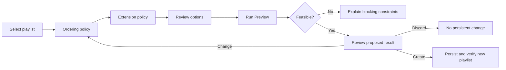

# Better Call Bliss productization and implementation plan

**Status:** In progress - full ARM64 UX shell deployed and private-beta release
packaging established. Version `0.16.2` is published and listed through the
private Lyrion extension repository; its package pins optimizer `v0.1.9`.
Standalone optimizer `v0.1.10` contains the newer shared anchored-path kernel
and is published independently, but is not yet bundled by the plugin. Optimized source order supports no
additions, difficult-transition improvements, Extend playlist additions
(exact count, target count, and double count); preserved source order supports
difficult-transition improvements plus the same Extend playlist amounts placed
around ordered anchors. Completed editor previews
are read-only until the user accepts them as a verified copy, confirmed source
overwrite, or player-queue output. The three **Bliss me there...** track
shortcuts are deliberate exceptions: they run destination routes in the
background and automatically append, replace the upcoming queue, or insert a
round-trip excursion only after route and live-anchor validation succeed. Static
scoring, matrix-free Adaptive fallback, per-job Adaptive gap context,
per-job variation, optional Last.fm similar-track/artist guidance,
per-job Lyrion virtual-library candidate scoping,
saved-playlist context preselection, and the full **Bliss me there...**
destination-locked quick action are functionally connected but remain partial
for musical-quality correctness; see the destination-route investigation.
Incomplete explicit endpoint controls, duration targets, provider-owned durable
caches, durable history, localization, and persistence-phase cancellation
remain visibly marked.  
**Date:** 2026-09-01  
**Primary objective:** Productize the experimentally exercised playlist sequencing and
bridge-insertion workflow, add order-preserving gap filling and destination
routes for the live queue, let short source lists reach an exact target through
the same fixed-source extension, and deliver it as a separately maintained
Lyrion plugin without requiring Python on the server or modifying
`lms-blissmixer`.  
**Latest implementation checkpoint:** [Shared anchored A-to-B path engine](IMPLEMENTATION_CHECKPOINT_34.md).  
**Published implementation through `0.16.2`:** `lms-better-call-bliss`
revision `5d8f85b` completed the original background **Bliss me there...**
workflow; revision `ec3ce81` grouped durable settings, disabled inapplicable
route/Last.fm controls, and migrated the two Last.fm guidance defaults to 25%.
Optimizer revisions through `3bdb777` supplied the packaged `0.1.7`
destination-route foundation. Revisions `1f5cf38` and `8199bc9` then added
richer reporting plus native waypoint-and-rejoin routing, published by
`3142987` as optimizer `0.1.8`. Better Call Bliss revision `59ee5d0` publishes
that binary contract and the three sibling route modes as Better Call Bliss
`0.16.0`. Revision `96cec2e` publishes their final labels and exact menu order
as Better Call Bliss `0.16.1`: **Bliss me there...** starts from the currently
playing song and replaces upcoming tracks, **Bliss me there... and back again!**
inserts the round trip, and **Bliss me there... when we're through!** starts
from the queue end and appends. The round-trip action uses
a native three-anchor request—current song, mandatory selected waypoint, and
first upcoming rejoin—with one bridge budget, quality result, and repeat
contract spanning both legs. Optimizer revision `2029a0d` and Better Call Bliss
revisions `67f2372`/`a3ffdde` add virtual-library candidate scoping and are
published as optimizer `v0.1.9` and Better Call Bliss `0.16.2`.  
**Working-tree Gate 2 (2026-08-19):** destination routes now use a dedicated  
fixed-matrix layered adjacent path search with complete-route Variation, a  
shared transformed-feature distance index, and configurable Fast, Balanced, or  
Thorough effort. Fast is the deliberately bounded plugin default; its label  
does not imply a particular server platform. Automatic destination routing  
also accepts independently validated minimum and maximum intermediate counts.  
**Conservative destination gate (2026-08-19):** Adaptive destination requests  
with a learned matrix also evaluate the direct edge using current Static  
BlissMixer weights. The higher-risk view governs discovery, path scoring, and  
acceptance, while artifacts and Preview expose both verdicts. The exact  
Aretha/Rotor replay now inserts a bridge in 1.432 seconds of native runtime.  
**Reporting and diagnostics gate (2026-08-24):** destination-route artifacts
now distinguish immutable listening history from generated route membership,
tolerating repeated historical tracks while still constraining new
intermediates. Direct routes retained after cautious bridge search now report
`best_effort_reason=no-beneficial-bridge-over-direct` even when the quality
target was met, and their search statistics aggregate the bridge search that
actually ran rather than showing only the selected zero-bridge option. The
Extras page now explains the target-met and target-missed no-beneficial cases
separately.  
**Virtual-library gate (2026-08-25):** every track-adding job now freezes a
per-job Lyrion virtual-library membership and applies it at the shared native
addition boundary. Extras exposes a Candidate library selector that initially
follows Material Skin's active library, then the active player's assignment.
Existing input/history/destination/waypoint/rejoin anchors remain valid outside
the selection.  
**Shared anchored-path gate (2026-09-01):** the optimizer's bounded destination
search now lives behind a pure outer-planner-neutral A-to-B kernel. It receives
anchors, immutable history, unavailable route membership, candidate evidence,
repeat policy, search controls, Variation, and an adjacent-distance function,
then returns complete scored alternatives without mutating a playlist or queue.
The existing one-way and waypoint-and-rejoin destination adapters retain one
alternative per bridge count and preserve their wire artifacts. The kernel can
retain several alternatives for the future global playlist-gap planner.
Optimizer revisions `84e2d8b` and `57f4d8a` are published as standalone
optimizer `v0.1.10`; Better Call Bliss `0.16.2` remains pinned to `v0.1.9`
because this extraction changes neither the plugin nor the wire contract.  
**Previous checkpoints:** [Lyrion virtual-library candidate scope](IMPLEMENTATION_CHECKPOINT_33.md), [Destination-route maturity and reporting](IMPLEMENTATION_CHECKPOINT_32.md), [Context entry points and 0.14.4 release](IMPLEMENTATION_CHECKPOINT_31.md), [Target and double track-count presets](IMPLEMENTATION_CHECKPOINT_30.md), [Accept-time output targets and release packaging](IMPLEMENTATION_CHECKPOINT_29.md), [Per-job variation and optional Last.fm track/artist evidence](IMPLEMENTATION_CHECKPOINT_28.md), [Finalized Grow from these seeds](IMPLEMENTATION_CHECKPOINT_27.md), [Draft retention, audit clarity, and second-server deployment](IMPLEMENTATION_CHECKPOINT_26.md), [LMS-local bridge inventory and persistent audit](IMPLEMENTATION_CHECKPOINT_25.md), [Preserve source order and fill gaps](IMPLEMENTATION_CHECKPOINT_24.md), [Strict-rank bridge shortlist and live scaling](IMPLEMENTATION_CHECKPOINT_23.md), [Prepared-library cache and measured Pi performance](IMPLEMENTATION_CHECKPOINT_22.md), [Live exact-count extension](IMPLEMENTATION_CHECKPOINT_21.md), [Accessible outcomes and monochrome Extras icon](IMPLEMENTATION_CHECKPOINT_20.md), [Clarified job controls and extension icon](IMPLEMENTATION_CHECKPOINT_19.md), [Visible outcomes and safe copy naming](IMPLEMENTATION_CHECKPOINT_18.md), [Live automatic extension](IMPLEMENTATION_CHECKPOINT_17.md), [Verified optimized-copy persistence](IMPLEMENTATION_CHECKPOINT_16.md), [Complete UX shell](IMPLEMENTATION_CHECKPOINT_15.md), [First live Lyrion preview](IMPLEMENTATION_CHECKPOINT_14.md), [Explicit endpoint insertion](IMPLEMENTATION_CHECKPOINT_13.md), [Multi-track preserved-gap routing](IMPLEMENTATION_CHECKPOINT_12.md), [Preserve-order gap-filling preview](IMPLEMENTATION_CHECKPOINT_11.md), [Exact-count bridge-selection preview](IMPLEMENTATION_CHECKPOINT_10.md), [Automatic bridge-selection preview](IMPLEMENTATION_CHECKPOINT_9.md), [Provider-neutral semantic bridge ranking](IMPLEMENTATION_CHECKPOINT_8.md), [Native bridge-analysis CLI](IMPLEMENTATION_CHECKPOINT_7.md), [Contextual bridge-scoring kernel](IMPLEMENTATION_CHECKPOINT_6.md), [Deterministic native route search](IMPLEMENTATION_CHECKPOINT_5.md), [Parallel contextual scoring](IMPLEMENTATION_CHECKPOINT_4.md), [First shared-core consumers](IMPLEMENTATION_CHECKPOINT_3.md), [Repository publication](IMPLEMENTATION_CHECKPOINT_2.md), [Phase 1 shared-core extraction](IMPLEMENTATION_CHECKPOINT_1.md), [Phase 0 bootstrap](IMPLEMENTATION_CHECKPOINT_0.md)  
**Reference implementation:** The tracked Python tools and sanitized 2025/2026
execution reports in this repository remain a migration and parity oracle until
the Rust implementation reaches declared parity. They are not the normative
design specification.

## User features at a glance

This is the product-level view: what a Lyrion user can actually do today.
`✅` means usable end to end, `🟡` means only part of the experience is
connected, and `⬜` means it remains on the roadmap. The detailed engineering
inventory follows this table.

| User feature | Status | What is available now / still missing |
| --- | --- | --- |
| Re-run playlist optimization without re-preparing an unchanged Bliss library | ✅ Available | Warm jobs reuse a checksum-protected decoded library. Addition jobs also bound repeated evolving-route work to a deterministic 256-candidate shortlist per internal gap; the formerly four-minute native exact-eight request now completes in about 21 seconds. |
| Exclude and review Bliss rows that are not current local LMS tracks | ✅ Available | Every addition job uses a frozen LMS-local allowlist before candidate search. A private persistent ledger records current and historically resolved unmatched rows with reason and first/last-seen observations; Extras and `bettercallbliss status` show its count and location. |
| Respect BlissMixer genre and Christmas filtering | ✅ Available | Every track-adding workflow captures BlissMixer's genre groups/globs, match-all and per-track-genre modes, plus its December-aware Christmas switch. One shared native candidate boundary filters generated additions while leaving source tracks, immutable history, destinations, waypoints, and queue-rejoin anchors untouched. Preview and INFO logs report ordinary-genre and Christmas rejection counts. |
| Restrict additions to a Lyrion virtual library | ✅ Available | Extras offers a per-job **Candidate library** selector, initially following Material Skin's active library and then the active player's assigned library. Only generated tracks must belong to the frozen selection; existing playlist/queue tracks, listening history, destinations, waypoints, and rejoin anchors remain valid outside it. |
| Reorder a curated saved playlist for better flow | ✅ Available | Select a playlist, optimize every original track exactly once, Preview the route, then accept it as a copy, confirmed source overwrite, or player-queue output. |
| Use a current player queue as input | ✅ Available | The Extras editor can select a saved playlist or current player queue. Queue input is captured as a frozen source snapshot with full queue, now-playing plus upcoming, or upcoming-only scopes. Queue output also has a replace-upcoming action for seamless active-player updates, including accept-time snapshot reconciliation for same-player output. The workflow has been exercised on the ARM64 LMS server and shipped through the private-beta release path. |
| Choose addition purpose before amount details | ✅ Available | The Extras editor exposes a listener-facing **Additional tracks** purpose first: no additions, improve difficult transitions, or Extend playlist. Only **Extend playlist** opens the amount selector for exact additions, target count, or double count; it submits a native fixed-source extension request after calculating the requested final size. Internal strict gap-bridge modes remain specialized/advanced paths. |
| Add bridge tracks automatically where transitions are difficult | ✅ Available | Bliss-only automatic insertion is connected; it may correctly decide that zero additions are needed. |
| Extend playlist | ✅ Available | Enter exact additions, a final target count, or double-count per job. The plugin calculates the final size and uses fixed-source membership selection, so the requested amount is not capped by internal source gaps. A short input can therefore serve as a mood reference without needing a separate Grow strategy. |
| Fill every gap with N bridge tracks | ⬜ Planned | A strict per-gap preset will insert the same configured number of bridges between every adjacent pair of original tracks. `N = 1` replaces the old one-bridge-per-transition preset. The shared A-to-B kernel now exists; the missing work is the global playlist planner that requests alternatives for every gap and selects an all-or-nothing combination under shared membership and repeat constraints. |
| Reach a chosen target track count or double the playlist by count | ✅ Available | These are amount choices under **Extend playlist**. They derive the required additions and use fixed-source membership selection. Duration-based targets remain future work. |
| Turn a short source list into a full similar playlist | ✅ Available | Choose **Extend playlist** and **Reach a final track count**. The same fixed-source extension keeps the complete original set as its relevance reference, then either optimizes all tracks together or preserves the originals as ordered anchors. This is a usage of Extend playlist, not a separate strategy. |
| Preserve the existing song order and fill its gaps | ✅ Available | Choose preserved source order with difficult-transition improvements or Extend playlist. Every original remains in exact relative order; Extend playlist places selected additions around the ordered anchors instead of being capped by source-gap count. |
| Allow explicit opening or closing additions | 🟡 Engine only | Native capacity-one endpoint slots exist; user controls and result presentation are missing. |
| Choose scoring, context, repeat windows, variation, semantic guidance, and search effort per job | ✅ Available | Working modes accept job-local overrides initialized from BlissMixer without changing its global preferences. A blank generation seed varies a run; reusing the reported seed reproduces it. |
| Use optional similar-track/artist evidence | 🟡 Partial | Last.fm similar-track and similar-artist evidence are connected through optional LastMix, use endpoint-local precedence with complete-source fallback, and degrade to Bliss on failures. ListenBrainz, a formal adapter boundary, and plugin-owned durable semantic caching remain. |
| Optimize without Internet access | ✅ Available | Current workflows operate entirely from local Bliss analysis and tolerate both semantic providers being absent. |
| Preview safely before changing anything | ✅ Available | Optimization runs asynchronously and read-only, with proposed order/additions and actionable failures shown before any output target is chosen. |
| Create an optimized copy while preserving the source | ✅ Available | LMS-native M3U creation, verification, catalog registration, and exclusive non-overwriting publication are connected as an accept-time action. |
| Automatically choose a safe copy name | ✅ Available | Unicode filenames are preserved; blank names receive the next free numbered suffix and explicit collisions fail visibly. |
| Embed reproducible provenance in generated playlists | ⬜ Planned | Generated M3U files should carry Better Call Bliss comment metadata describing plugin/native versions, source playlist identity, job parameters, source-track positions, generated additions, and report identity. |
| Restore job options from Better Call Bliss playlist metadata | ⬜ Planned | When a generated playlist is selected as input, the plugin should detect embedded provenance and offer to prefill the previous job parameters instead of forcing manual reconstruction. |
| Adjust a finished or failed job and run it again | ✅ Available | The Extras editor restores submitted ordering, extension, scoring, repeat, search, and semantic values after polling, failure, success, or accept actions instead of silently returning to global defaults. |
| Explicitly overwrite the source playlist | ✅ Available | Completed previews can be accepted as a confirmed source overwrite with generated-M3U verification, LMS catalog replacement, and recovery attempt on publication failure. |
| Send the accepted preview to a player queue | ✅ Available | Completed previews can replace, replace only upcoming tracks, append to, or play next on a selected player queue, with optional playback start. Same-player replace-upcoming rechecks the live queue and trims already-played preview items when the snapshot is still recognizable. |
| Start from the Extras job editor | ✅ Available | The rich per-job editor is the working primary interface. |
| Start from a saved-playlist context action | ✅ Available | The context item opens the Better Call Bliss Extras job editor with the selected saved playlist preselected. In Material this appears through the item menu / More affordance rather than as a permanent inline row button. |
| Use the **Bliss me there...** track shortcuts | 🟡 Partial | The queue-end action appends a route; the current-song action preserves playback and replaces only upcoming tracks; the round-trip action inserts a route through the selected waypoint and back to the unchanged first upcoming track. All capture immutable history separately, use calibrated adjacent evidence and destination-aware repeat rules, and validate their live anchors before mutation. The round trip uses two gap-specific shortlists, carries outward membership into return search, and shares one total minimum/maximum or exact bridge count across both legs. Remaining quality work includes split trigger/target controls, depth-aware candidate discovery beyond frozen endpoint shortlists, richer acoustic evidence, intermediate semantic-path evidence, and convergence with playlist gap filling through a shared A-to-B route engine. |
| See running, success, failure, and accept-action outcomes in the UI | ✅ Available | The page polls current jobs and presents accessible, actionable status banners for previews, copy creation, source overwrite, and player-queue output without requiring log inspection. |
| Cancel jobs, resume after restart, and browse/export past results | 🟡 Limited | Current in-memory jobs can be polled by ID, listed in the Extras page, and cancelled while the native optimizer process is running. Restart recovery, durable history, persistence-phase cancellation, search, and report export are missing. |
| Configure durable defaults and inspect system readiness | 🟡 Partial | The settings page and core readiness checks exist; complete provider, active-job, and persistence-health status is unfinished. |
| Install and update from a Lyrion extension repository | 🟡 Private beta | The plugin release workflow builds ZIP/checksum artifacts, bundles optimizer binaries, publishes GitHub releases, and updates `chrober/lms-plugins`; `0.16.2` is the current private-beta package and pins optimizer release `v0.1.9`. Clean install/upgrade/failure testing, cache/update visibility, and public compatibility documentation remain. |

## Detailed roadmap status

This table is the authoritative detailed implementation inventory. It is
updated whenever a checkpoint changes user-visible or lower-layer capability.
A checked native-engine row does **not** imply that the corresponding Lyrion
workflow is connected; those are listed separately.

| Status | Meaning |
| --- | --- |
| ✅ Implemented | Complete for the row's stated scope and covered by a published checkpoint. |
| 🟡 Partial | Some layers or UX scaffolding exist, but the capability is not complete end to end. |
| ⬜ Not implemented | Roadmap contract exists, but no usable implementation is connected. |

Current inventory: **53 implemented**, **21 partial**, and **12 not implemented
or later-roadmap** rows. These are feature rows, not a percentage-complete
release estimate; foundational and user-facing capabilities intentionally have
the same row weight.

| Area | Roadmap feature | Status | Current boundary / remaining work |
| --- | --- | --- | --- |
| Foundation | Bulk database preparation and identity-bound decoded-library cache | ✅ Implemented | Cold jobs use one ordered SQLite query. Cache v3 separates compact metadata—including normalized genres—from route features, rejects inconsistent vector counts, and lets warm jobs reuse the hash, successful integrity result, and decoded library only for an unchanged plugin-supplied file identity. Destination jobs borrow cached tracks instead of cloning the complete library. |
| Foundation | Component identities and public repositories | ✅ Implemented | Core, optimizer, plugin, design, mixer fork, and extension-index ownership are established. |
| Foundation | Shared `bliss-mixer-core` library | ✅ Implemented | Database, matrix, Adaptive scoring, filtering, and diagnostics are shared rather than copied. |
| Foundation | `bliss-mixer` consumes the shared core | ✅ Implemented | The maintained learned-matrix-enabled mixer fork and optimizer use the same core. |
| Foundation | Versioned native request/result schemas and artifact validation | ✅ Implemented | Read-only database/schema, matrix, identity, hash, and result validation are in place. |
| Foundation | Differential parity, fixtures, and CI across all product layers | 🟡 Partial | Core/optimizer fixtures and Python parity exist; complete plugin, browser, packaging, and release-matrix coverage remains. |
| Scoring | Directional Adaptive context scoring | ✅ Implemented | Uses the strict rolling window of preceding tracks for each directional leg. |
| Scoring | Dynamic variance weights and learned-matrix blending | ✅ Implemented | Per-context dynamic matrices and the configured learned blend are used; static UI sliders are not substituted. |
| Scoring | Matrix-free Adaptive fallback | ✅ Implemented | Adaptive uses the learned matrix when available; without it, multi-track contexts use variance weighting and one-track contexts use Static BlissMixer weights. |
| Scoring | Static-weighted and random-forest route strategies | 🟡 Partial | Static-weighted routing is connected and can be selected per job using BlissMixer static weights; Extended Isolation Forest remains disabled and unimplemented for playlist routing. |
| Scoring | Deterministic parallel scoring and route search | ✅ Implemented | Indexed Rayon work, derived seeds, stable tie-breaking, and bounded CPU defaults are implemented. |
| Scoring | Reproducible per-job variation | ✅ Implemented | A strategy-neutral 0-100 control and explicit or generated seed vary route search for movable routes and membership sampling for fixed-source extension. Zero preserves strict best-match behavior; identical seeds reproduce selection. |
| Native routing | Reorder-only fixed-set optimization | ✅ Implemented | Exact membership, repeat windows, aggregate/worst-leg objectives, restarts, and optional energy-arc selection are available. |
| Native routing | Shared anchored A-to-B path engine | 🟡 Partial | A pure bounded kernel now accepts anchors, immutable history, unavailable membership, candidate evidence, repeat windows, search breadth, Variation, and a caller-owned adjacent-distance function. It can retain multiple complete alternatives per intermediate count. Destination and waypoint-and-rejoin adapters use it without schema or artifact changes; preserved playlist gaps and fixed-source placement have not yet migrated to a global outer planner. |
| Native routing | Contextual bridge candidate analysis | ✅ Implemented | Stable Bliss candidates, two-sided rescoring, acoustic gates, rejection reasons, and database-bound identities are available. |
| Native routing | Provider-neutral semantic evidence ranking | ✅ Implemented | Recording-before-artist and endpoint-before-collection tiers, provenance, failure state, and Bliss fallback are supported in optimizer input. |
| Native routing | Automatic bridge insertion | ✅ Implemented | Conservative threshold/budget selection over the evolving route is implemented. |
| Native routing | Exact-count insertion | ✅ Implemented | Strict exactly-N bounded search fails without returning a misleading partial route. |
| Native routing | LMS-local candidate membership before bridge search | ✅ Implemented | The plugin freezes a checksum-protected allowlist bound to the LMS scan generation and exact `bliss.db` identity. The native optimizer validates it and excludes non-local rows before semantic ranking, shortlisting, or scoring; post-result catalog/file resolution remains mandatory. |
| Native routing | Lyrion virtual-library candidate scope | ✅ Implemented | Every track-adding workflow may narrow the frozen LMS-local allowlist to one registered virtual library. A membership digest invalidates stale caches even when the LMS scan timestamp is unchanged. The optimizer treats the inventory strictly as an addition allowlist, so immutable source/history/destination/waypoint/rejoin anchors need usable Bliss rows but need not belong to the selected library. Outside-library LMS rows are reported separately from genuinely stale/non-LMS Bliss rows. |
| Native routing | BlissMixer-compatible genre policy for generated candidates | ✅ Implemented | The plugin snapshots genre restriction, configured group/glob rows, match-all mode, per-track genre mode, and effective seasonal Christmas exclusion into every request. The optimizer applies the shared `bliss-mixer-core` semantics once after LMS-local/source exclusion and before every addition strategy. Source tracks and immutable history establish acceptable groups; input anchors are never removed. Typed contracts, capability gating, rejection diagnostics, and regression tests prevent silent fallback to an older optimizer. |
| Native routing | Immutable-anchor preserved-order routing | ✅ Implemented | Original tracks remain an identical ordered subsequence. |
| Native routing | Multiple inserted tracks inside one preserved gap | ✅ Implemented | Bounded one-through-eight-track internal gap routes are supported. |
| Native routing | Explicit opening and closing insertion slots | ✅ Implemented | Capacity-one endpoint slots are independent opt-ins in exact-count native requests. |
| Native routing | Fixed-source relevance selection and diversity-aware extension | ✅ Implemented | The `fixed_source_extension` request ranks the LMS-local analyzed library in parallel against the complete immutable source set, applies repeat-window capacity during exact membership selection, and either routes the complete fixed membership with deterministic Rayon search or preserves source order with a deterministic insertion pass. Seeded weighted sampling varies membership inside a bounded high-quality pool; Last.fm-endorsed similar-track and similar-artist targets are applied when usable evidence exists. |
| Native routing | Fixed-destination route generation | 🟡 Partial | Endpoint locking, immutable listening-history context, fixed-matrix layered path search, conservative learned/Static direct-edge selection, validated Automatic minimum/maximum bounds, exact-count routing, adjacent diagnostics, truthful target/best-effort fields, no-beneficial direct-retention reporting, role-aware repeat enforcement, complete-route Variation, shared transformed-feature distance indexing, and Fast/Balanced/Thorough breadth profiles are implemented. Candidate discovery now uses the governing acoustic view consistently, but still reuses one endpoint-derived shortlist at every depth and overloads one percentile as both direct trigger and generated-route target. |
| Lyrion integration | BlissMixer compatibility and inherited defaults | ✅ Implemented | Database, matrix, strategy parameters, and repeat windows are captured read-only. |
| Lyrion integration | Per-job scoring, repeat, search, variation, provider, and extension controls | ✅ Implemented | Working modes receive validated job-local overrides without changing BlissMixer preferences. Blank generation seeds are regenerated per job and explicit seeds are retained for reproducibility. Adaptive gap context is now a job option, so preserved-gap routing can either follow the evolving route or freeze weights per original source gap. |
| Lyrion integration | Extras rich-job editor | ✅ Implemented | The live ARM64 server exposes the form, relevance rules, Advanced controls, result area, and working/not-connected labels. |
| Lyrion integration | Alternative result-list / library-view UX | ⬜ Planned | `lms-blissmixer`'s **Create bliss mix** can return an LMS menu-mode result list (`item_loop`) with a "Play this mix" item plus individual tracks and play/add/insert actions. Better Call Bliss should explore whether some previews or quick actions should offer a similar navigable result surface in addition to the rich Extras job editor. |
| Lyrion integration | Durable plugin settings surface | ✅ Implemented | `Settings.pm` persists suffixes, resource defaults, provider flags, cache policy, retention defaults, and the **Bliss me there...** route policy, minimum/maximum or exact count, and Fast/Balanced/Thorough search effort. The page follows BlissMixer's grouped, collapsible-section pattern, remembers open sections, and disables both native inputs and Material sliders when the selected intermediate policy or Last.fm enable state makes them inapplicable. Similar-track and similar-artist guidance both default to 25%; unused future settings remain labelled. |
| Lyrion integration | Complete capability/system-status dashboard | 🟡 Partial | Core readiness and problems are visible; provider, active-job, and persistence-health rows are incomplete. |
| Lyrion integration | Namespaced command API | 🟡 Partial | `bettercallbliss status`, job status/cancel, and the client-bound `bettercallbliss route_to` quick action exist; general optimize, durable result, and history commands remain incomplete. |
| Source input | Current player queue snapshot | ✅ Implemented | The plugin-side source adapter resolves a selected player queue into the canonical ordered source-track snapshot, supports full/current-plus-upcoming/upcoming-only scopes, restores the submitted source fields, stores a lightweight queue fingerprint, and adds a replace-upcoming queue output action with accept-time same-player reconciliation. The workflow has been exercised on the ARM64 LMS server and included in private-beta packaging. |
| Playlist workflow | Reorder existing tracks: Preview | ✅ Implemented | Live, asynchronous, read-only Preview with per-job constraints and actionable infeasibility is working. |
| Playlist workflow | Reorder existing tracks: create optimized copy | ✅ Implemented | Reviewed output can be written as a verified new LMS playlist without changing the source. |
| Playlist workflow | Add automatically: Preview and create copy | ✅ Implemented | Bliss-only automatic insertion is connected end to end and may correctly add zero tracks. |
| Playlist workflow | Repeat-window spacer repair for difficult-transition improvements | ⬜ Planned | True constraint repair needs a native selection/artifact expansion that can insert multiple spacer tracks solely to separate repeated artists or albums before acoustic transition improvement. Current automatic mode still requires a valid source route first; Extend playlist with a large enough target can repair repeated-seed sets today. |
| Playlist workflow | Extend playlist | ✅ Implemented | Per-job exact additions, target count, and double-count are mapped to native fixed-source extension membership selection, all-or-nothing normalization, result diagnostics, verified copy persistence, and live ARM64-compatible requests. |
| Playlist workflow | Fill every gap with N bridge tracks | ⬜ Not implemented | The shared inner A-to-B kernel is available, but the strict multi-gap outer planner and UX are not connected. For `S` originals and `B` bridges per gap, it must add exactly `B * (S - 1)` tracks, coordinate candidate membership and repeat state globally, and fail visibly if any original gap cannot be filled. |
| Playlist workflow | Reach target track count | ✅ Implemented | The plugin validates the final track count, calculates `N = T - S`, and uses native fixed-source extension membership selection. Duration targeting remains future work. |
| Playlist workflow | Double playlist by track count | ✅ Implemented | The preset calculates `T = 2S` and `N = S`, then uses native fixed-source extension membership selection. Duration-based doubling remains future work. |
| Playlist workflow | Use Extend playlist on a short source to reach an exact target | ✅ Implemented | Exact target, immutable complete-source relevance, strict proofs, per-job Variation, optional Last.fm guidance, result diagnostics, form restoration, and accept-time output actions all use the same fixed-source extension implementation as every other Extend playlist amount choice. |
| Playlist workflow | Preserve source order and fill gaps | ✅ Implemented | Difficult-transition gap previews are connected, and Extend playlist can preserve originals as ordered anchors while placing additions around them. Result proofs verify immutable source order before persistence. |
| Playlist workflow | Opening/closing-track controls | 🟡 Partial | Native flags exist; job fields, validation text, and Lyrion result rendering are missing. |
| Playlist workflow | Safe optimized-copy publication | ✅ Implemented | LMS-native M3U formatting, verification, exclusive creation, catalog creation, and order checks are working. |
| Playlist workflow | Unicode-safe automatic names and collision numbering | ✅ Implemented | Blank names preserve the decoded source filename and choose the next free suffix; explicit collisions fail visibly. |
| Playlist workflow | Explicit source-playlist overwrite | ✅ Implemented | Completed previews can be accepted as source overwrite only after explicit confirmation; generated output is verified and the writer attempts to restore the original file if publication fails. |
| Playlist workflow | Player-queue output target | ✅ Implemented | Completed previews can be sent to a selected player as Replace queue, Append to queue, or Play next, with optional playback start. |
| Playlist workflow | Playlist-embedded provenance comments | ⬜ Not implemented | Generated M3Us should include safe Better Call Bliss comment blocks with plugin/native versions, request schema, selected parameters, source playlist identity, original source positions, generated-track roles, report ID, and hashes sufficient for later audit without leaking more than the playlist already contains. |
| Entry points | Saved-playlist context action | ✅ Implemented | The shortcut opens the Extras editor with the selected saved playlist preselected. Material exposes it through the item menu / More affordance rather than as a permanent inline button. |
| Entry points | Three **Bliss me there...** track actions | 🟡 Partial | Queue-end append, current-song replace-upcoming, and current-song waypoint-and-rejoin insertion are published through Better Call Bliss `0.16.2`. Source selection and queue mutation are centrally locked together. The round-trip request makes start, waypoint, and rejoin unique route members, shares one bridge budget across both gaps, constrains return candidates with outward membership/repeat state, omits both queue anchors from insertion, and rejects stale current or rejoin tracks before sending any LMS queue command. Musical maturity remains partial for the same candidate-discovery and acoustic-evidence reasons as one-way destination routes. |
| Jobs and UX | Running, success, failure, and accept-action feedback | ✅ Implemented | Automatic polling and prominent actionable outcome banners are live for previews, copy creation, source overwrite, and player-queue output. |
| Jobs and UX | Persistent quick-action progress indicator in Material | ⬜ Planned | Lyrion can store generic `Slim::Utils::Progress` rows and the classic web layer has a progress page, but Material's visible progress integration is scanner-specific. Its plugin notification channel provides transient snackbars only (normally 2.5 seconds, explicitly at most 30 seconds). Better Call Bliss already returns a job ID and exposes `bettercallbliss job status`. Explore a small Material background-task chip/spinner driven by a namespaced server notification plus status polling; avoid repeated snackbars and avoid pretending scanner progress is a plugin-job API. |
| Jobs and UX | Restore submitted job values after an outcome | ✅ Implemented | Polling, failure, successful Preview, and accept actions repopulate the rich editor from the job request so iterative tuning does not lose per-job values. Output choices are made after preview and changing them does not rerun the optimizer. |
| Jobs and UX | Load previous parameters from playlist provenance | ⬜ Not implemented | If the selected input playlist contains trusted Better Call Bliss provenance comments, the Extras editor should offer to prefill the ordering, extension, scoring, repeat, variation, semantic, and search parameters used to create it. |
| Jobs and UX | Accessible theme-independent status colors | ✅ Implemented | Warning/error/success/info contrast, nested warning content, and theme-aware secondary text are deployed. |
| Jobs and UX | Monochrome Extras icon | ✅ Implemented | Material resolves the supported `timeline` marker; other consumers receive the packaged monochrome route PNG. |
| Jobs and UX | Active-job navigation/resume and honest progress | 🟡 Partial | Current in-memory jobs can be polled by ID, listed in the Extras page, opened from the list, and show stages; durable navigation recovery and bounded progress are incomplete. |
| Jobs and UX | Job cancellation and cleanup | 🟡 Partial | Running Preview jobs expose Cancel in the current-job result and running/recent previews panel, terminating the native optimizer process and leaving playlists/queues unchanged. Persistence-phase cancellation, restart recovery, and cleanup tests remain. |
| Jobs and UX | Durable recent-result history and report export | ⬜ Not implemented | Results and detailed artifacts are not retained as a user-facing durable history. |
| Jobs and UX | Complete localization and no-JavaScript accessibility | 🟡 Partial | Settings have EN/DE strings and the form submits normally; the main workflow is English-first and full fallback/client testing remains. |
| Semantic providers | Bliss-only offline operation | ✅ Implemented | Every connected workflow remains usable without a network provider; missing, disabled, partial, or failed Last.fm evidence falls back to local Bliss. |
| Semantic providers | Lyrion MusicBrainz identity use | 🟡 Partial | Lyrion recording and artist MBIDs are copied into requests and artist MBIDs are passed to LastMix. Recording-level provider evidence and broader identity-resolution coverage remain. |
| Semantic providers | Last.fm/LastMix recording and artist adapter | 🟡 Partial | Optional anonymous LastMix similar-track and similar-artist collection is connected for every distinct source track/artist, with endpoint-local precedence, collection fallback, provider state, and Bliss fallback. A formally versioned LastMix adapter boundary, ListenBrainz parity, and plugin-owned durable caching remain. |
| Semantic providers | Direct ListenBrainz adapter | ⬜ Not implemented | Recording/artist datasets, authentication where needed, schema validation, and resolution remain. |
| Semantic providers | Provider caches, stale-offline use, timeouts, and circuit breakers | 🟡 Partial | LastMix supplies its request timeout and short-lived cache; Better Call Bliss stops remaining calls on Last.fm offline, temporary-unavailable, or rate-limit errors. Plugin-owned persistent cache freshness/stale-offline behavior remains. |
| Semantic providers | Optional BrainzMix-backed adapter | ⬜ Later roadmap | Not required for the first release; must reuse the provider-neutral contract if added. |
| Observability | Lyrion log category and job correlation | 🟡 Partial | `plugin.bettercallbliss`, lifecycle records, parameters, stable errors, native route-quality summaries, secondary-model diagnostics, transition-percentile explanations, and no-beneficial bridge outcomes exist; full structured helper relay, rate limiting, and redaction tests remain. |
| Observability | Native per-stage timings and repeatable Pi benchmark | ✅ Implemented | Optional result diagnostics report total/stage milliseconds and cache state; INFO/DEBUG plugin logs relay sanitized summaries, and a portable Perl cold/warm benchmark harness is published. |
| Observability | Reproducible JSON and human-readable reports | 🟡 Partial | Native request/result artifacts, progress sidecars, aggregate destination search statistics, route-quality diagnostics, and plugin information/debug summaries exist; durable sanitized report retention/export is missing. |
| Observability | Persistent non-LMS Bliss-row audit | ✅ Implemented | A private JSON ledger retains current and resolved unmatched identities, exact filename-case variants, reasons, metadata, row IDs, and first/last-seen observations across LMS restarts. INFO logs and `bettercallbliss status` expose only its count and location. In the current UX, Extras renders the diagnostic box only when the current inventory has excluded rows; loading the persisted summary at page initialization remains a clarity improvement. |
| Performance | High-recall bridge-candidate shortlist before strict contextual reranking | ✅ Implemented | The plugin bounds evolving search to 256 candidates per internal gap after the full strict initial-gap Adaptive rank and semantic reserve. The exhaustive one-gap winner was preserved, and the formerly four-minute native exact-eight request completed in 21.1 seconds. |
| Performance | Large-library destination setup and bounded memory | 🟡 Partial | Optimizer 0.1.5 adds capability-gated trusted-plugin requests, allocation-free evidence-scoped semantic matching, a one-pass LMS inventory split, reusable fixed-matrix reference work, and conservative Fast/Balanced/Thorough contextual-prefilter caps of 65,536/131,072/262,144 tracks. On the 64,128-track ARM64 Pi fixture, warm Fast fell from about 6.24s to 2.05s with identical selected route/quality, cold Fast fell from 9.44s to 5.50s, and warm peak RSS fell from about 1.14GB to about 226MB. A 200,000-candidate regression protects evidence-sized retained lookup state, but a representative 200k+ end-to-end database benchmark and longer-lived/memory-mapped index decision remain open. |
| Reliability | Analysis-running and database-consistency coordination | 🟡 Partial | Read-only access, artifact identity, and unchanged-database checks exist; complete scan scheduling, snapshot, and restart cases remain. |
| Reliability | Server-restart recovery | ⬜ Not implemented | In-memory jobs/results do not survive LMS restart. |
| Reliability | Privacy/redaction audit and failure-matrix testing | 🟡 Partial | Public fixtures/docs are sanitized and runtime logging is restrained; formal redaction tests and the complete outage/recovery matrix remain. |
| Packaging | ARM64 development deployment | ✅ Implemented | The plugin and bundled optimizer are repeatedly exercised on the live ARM64 LMS server. |
| Packaging | Supported multi-platform native/plugin packages | ✅ Implemented | The plugin release workflow consumes optimizer release artifacts for aarch64, armhf, x86_64 Linux, macOS, and Windows and packages them without committing binaries. Broader smoke coverage can still improve. |
| Packaging | Versioned plugin ZIPs and checksums | ✅ Implemented | GitHub Actions creates versioned plugin ZIPs plus SHA-1/SHA-256 files from the pinned optimizer release. Better Call Bliss `0.16.2` packages optimizer `v0.1.9`, including native binaries for every supported platform. Manual hot-deploy remains useful for live development. |
| Release | Extension-repository listing | ✅ Implemented | The plugin release workflow updates `chrober/lms-plugins` with immutable GitHub release-asset URLs for Unix, macOS, and Windows packages. |
| Release | Private beta install/upgrade/failure testing | 🟡 Partial | A private-beta feed and live installs exist, with current package `0.16.2`. Clean install, upgrade visibility/cache refresh, uninstall, outage, scanner, cancellation, and recovery cases still need systematic testing. |
| Release | Public release and compatibility documentation | ⬜ Not implemented | No discoverable public release, compatibility matrix, or extension-manager installation exists yet. |

## Canonical design references

The generic design contracts live in the published documentation and are
canonical for this implementation plan:

- [fixed-set sequencing and bridge insertion](docs/mixing/fixed-set-sequencing.md)
  defines problem boundaries, constrained-route variants, Adaptive continuation
  scoring, route objectives, hard repeat constraints, bridge rescoring, frozen
  contextual percentiles, and generalized semantic evidence;
- [similarity strategies](docs/mixing/similarity-strategies.md#adaptive-as-a-directional-continuation-score)
  defines the current Adaptive algorithm semantics reused by route scoring;
- [transition-aware selection](docs/mixing/transitions.md#relationship-to-fixed-set-sequencing)
  distinguishes whole-track route optimization, multi-track gap routes,
  path interpolation, and later boundary-aware reranking;
- [fixed-set sequencing evaluation](docs/evaluation/mixing-evaluation.md#fixed-set-sequencing-evaluation)
  defines structural invariants, controls, metrics, ablations, and listening
  requirements;
- the [exploratory fixed-set case study](docs/evaluation/fixed-set-case-study.md)
  records the deliberately limited aggregate evidence and bounds claims made
  from the two one-shot executions;
- [one-shot operations](docs/mixing/operations.md#one-shot-reproducibility-and-deployment-observability)
  and the [future interactive execution contract](docs/mixing/operations.md#future-interactive-execution-contract)
  define reproducibility, decision traces, playlist serialization, deployment
  verification, and transactional execution; and
- the [mixing roadmap](docs/evaluation/mixing-roadmap.md#phase-1a-experimental-fixed-set-sequencing)
  defines the research status, risks, and unresolved design questions.

This document specializes those contracts into component ownership, interfaces,
Lyrion behavior, packaging, and release work. If it conflicts with a generic
design contract, the published design documentation takes precedence. A
deliberate semantic change must first be made and justified there, then reflected
here and in implementation tests. Product-specific names, modules, commands,
screens, and release mechanics remain authoritative only in this plan and the
eventual owning repositories.

## Decision summary

Build a companion Lyrion plugin named **Better Call Bliss**, with its own native
Rust helper. Extract the scoring, database,
matrix, and filtering behavior currently embedded in `bliss-mixer` into a
versioned `bliss-mixer-core` Rust library used by both native applications.

The product boundary is:

```text
lms-blissmixer (unchanged)
  owns analysis, bliss.db, learned matrix, and mixer preferences
                       |
                       v
lms-better-call-bliss (new Perl plugin)
  owns LMS integration, optional semantic providers, jobs, UX, reports, and playlists
                       |
                       v
bliss-playlist-optimizer (new native Rust program)
  owns route optimization and bridge selection
                       |
                       v
bliss-mixer-core (new shared Rust library)
  owns database access, feature order, filtering, and similarity scoring
```

This architecture results in two installed native programs, but not two
independently maintained implementations of Adaptive similarity. The existing
`lms-blissmixer` plugin neither loads code from the new plugin nor exposes
private process state to it.

The first `lms-better-call-bliss` implementation owns its optional ListenBrainz
adapter directly. [BrainzMix](https://github.com/chrober/lms-brainzmix) is a
possible later provider or extraction target, not a prerequisite for playlist
optimization, bridge insertion, or the first public release. The direct adapter
must therefore sit behind a provider-neutral contract that can later be
implemented by BrainzMix without changing optimizer requests, ranking policy,
or user workflows.

## Scope

The first product release must support:

- reordering every track of an existing saved playlist exactly once;
- preserving an existing playlist order as immutable anchors and filling its
  gaps without moving those original tracks;
- preserving the source playlist by default and writing a new optimized copy;
- the strict sliding Adaptive seed context used by the current BlissMixer;
- dynamic variance weights and learned-matrix blending;
- the configured track, artist, and album look-back windows;
- directional open-path optimization with aggregate and worst-leg objectives;
- automatic bridge insertion and an exact additional-track count;
- optional endpoint-local track and artist evidence from Last.fm and/or
  ListenBrainz, with original-collection fallback only when local semantic
  evidence is empty;
- MusicBrainz recording and artist IDs already maintained by Lyrion as the
  preferred external identity keys;
- reproducible JSON and human-readable reports;
- playlist context-menu and an Extras rich-job-editor entry point;
- a mandatory `Settings.pm` surface for validated durable preferences, with
  safe defaults that permit zero-configuration Bliss-only operation;
- a track context action that can append a fluent route from the current queue
  tail to a selected destination track;
- safe LMS-native playlist creation and M3U serialization; and
- native packages for the server platforms declared by a plugin release.

The following are not required for the first release:

- changing the current `lms-blissmixer` implementation;
- replacing `/api/mix` or `/api/list`;
- modifying `bliss.db` or its schema;
- publishing raw playlists, private music metadata, server details, or raw
  semantic-provider responses;
- installing or running BrainzMix;
- intro/outro audio decoding or boundary-anchor analysis;
- globally optimizing or replacing the unsaved current player queue; or
- automatically overwriting a source playlist without an explicit per-job
  choice, reviewed Preview, warning, and confirmation.

## Repository plan

Repository names are provisional but should be settled before code is split so
package names, plugin identifiers, release URLs, and documentation do not churn.

| Repository | State | Responsibility | Release artifact |
| --- | --- | --- | --- |
| `chrober/bliss-mixer-core` | New | Reusable Rust library for Bliss database access, shared models, matrices, filters, and similarity scoring | Tagged Rust library source; optional crates.io package later |
| `chrober/bliss-playlist-optimizer` | New | Headless fixed-set ordering and bridge-selection engine | Native executables and checksums per supported platform |
| `chrober/lms-better-call-bliss` | New | Perl Lyrion plugin, UI, jobs, optional semantic-provider adapters, playlist persistence, and bundled optimizer executables | Platform-specific LMS plugin ZIP files |
| `chrober/lms-plugins` | Existing; reuse | Lyrion extension repository listing the new plugin alongside BlissMixer | `repo.xml` served from the existing raw GitHub URL |
| `chrober/bliss-mixer` | Existing | Refactor the maintained fork to consume `bliss-mixer-core` without changing `/api/mix` or `/api/list` behavior | Existing mixer binaries |
| `chrober/lms-blissmixer` | Existing; unchanged by this project | Produces and maintains the analysis artifacts and preferences consumed by the companion plugin | Existing LMS plugin ZIP files |
| `chrober/bliss-similarity-design` | Existing | Canonical design, prototype evidence, parity fixtures policy, and cross-repository decisions | Documentation site |

The settled component identities are:

- display name: **Better Call Bliss**;
- tagline: **Playlist Breaking Bad? Better Call Bliss.**;
- GitHub repository: `chrober/lms-better-call-bliss`;
- plugin directory and Perl namespace root: `BetterCallBliss`;
- LMS command namespace: `bettercallbliss`; and
- native executable: `bliss-playlist-optimizer`.
The existing local `D:\LMS\lms-plugins` checkout already points to
`chrober/lms-plugins` and contains a valid `repo.xml`. It should be committed and
extended rather than replaced by another extension-index repository. A separate
index repository is warranted only if different ownership, availability, or
release permissions are later required.

### Repository creation checklist

For each new repository:

1. add a concise README, license, security policy, contribution notes, and
   release policy;
2. enable protected default branches and required CI checks;
3. use issues and milestones matching the phases in this plan;
4. add Dependabot or an equivalent dependency-update process;
5. prohibit real `bliss.db`, learned matrices, playlists, artist profiles, and
   run artifacts through `.gitignore` and fixture-review rules; and
6. record the upstream/fork relationship and copyright provenance before
   moving existing GPL code.

Because `bliss-mixer` is GPL-3.0-only, code extracted from it must retain its
copyright and compatible GPL licensing. License choices for original new code
must be reviewed before the initial public commits; using GPL-3.0-only across
the shared core and native optimizer is the simplest compatibility choice.

## `bliss-mixer-core` design

### Responsibilities

The shared crate should own behavior that must remain identical between the
mixer and playlist optimizer:

- the `TracksV2` feature order and raw track representation;
- read-only SQLite opening and supported-schema validation;
- path lookup and track metadata loading;
- learned-matrix loading, dimensions, finiteness, symmetry, and compatibility
  validation;
- static Bliss distance primitives;
- population-variance calculation and inverse-variance normalization;
- Adaptive matrix construction and learned-matrix blending;
- single-seed learned-matrix behavior;
- mean-seed construction and Mahalanobis distance;
- genre, duration, ignored-track, Christmas, BPM, duplicate, artist, album, and
  track filtering primitives that are genuinely shared;
- normalized diagnostics describing the active algorithm and effective matrix;
  and
- stable typed errors rather than process exits or HTTP responses.

The exact Adaptive behavior is governed by the canonical
[directional-continuation definition](docs/mixing/similarity-strategies.md#adaptive-as-a-directional-continuation-score)
and the more detailed
[fixed-set scoring contract](docs/mixing/fixed-set-sequencing.md#adaptive-similarity-as-a-continuation-score).
Extraction into a shared crate must preserve those semantics rather than infer
new ones from product defaults.

The crate must not own:

- Actix routes or daemon lifecycle;
- LMS preferences or playlist persistence;
- Last.fm, ListenBrainz, or other semantic-provider network access;
- route search, energy arcs, or bridge-position policy;
- HTML, OPML, JSON-RPC, or other Lyrion UI concerns; or
- audio decoding and feature extraction already owned by `bliss-rs`.

### Proposed crate modules

```text
src/
  lib.rs
  error.rs
  schema.rs
  db.rs
  track.rs
  matrix.rs
  scoring/
    mod.rs
    static.rs
    adaptive.rs
  filtering.rs
  diagnostics.rs
```

The library should continue using the appropriate `bliss_audio::playlist`
primitives instead of copying Mahalanobis and variance implementations already
provided by `bliss-rs`.

### Compatibility and versioning

- Start at `0.1.0` and use semantic versioning.
- Pin consumers to a released tag and commit through `Cargo.lock`; do not track
  a mutable branch in release builds.
- Expose a core library version and supported database/schema identities.
- Treat feature ordering, population-versus-sample variance, epsilon,
  normalization total, matrix blend, and single-seed behavior as part of the
  compatibility contract.
- Require a golden parity test before any change to those semantics.
- Publish to crates.io only after the API has stabilized enough to support an
  external consumer; Git tags are sufficient initially.

## Refactoring `bliss-mixer`

The first consumer of the core must be the existing `chrober/bliss-mixer` fork.
This proves that the extraction is genuinely shared rather than a new copy made
only for the optimizer.

Refactor in behavior-preserving steps:

1. freeze representative `/api/mix` and `/api/list` requests and results;
2. add unit tests for database mapping, static scoring, Adaptive scoring,
   learned blending, and single-seed fallback;
3. move one cohesive unit at a time into `bliss-mixer-core`;
4. retain HTTP payload parsing, response formatting, server startup, tree/forest
   selection, and mixer-specific orchestration in `bliss-mixer`;
5. compare old and refactored binaries against the same sanitized database;
6. require identical accepted candidates and rankings, or document and approve
   any intentional numerical tolerance; and
7. release the refactored mixer only after the existing API regression suite
   passes.

This source refactor does not require a corresponding change to
`lms-blissmixer` for the optimizer project to proceed. Already released mixer
binaries naturally contain their historical implementation; maintained source
must no longer duplicate it.

## `bliss-playlist-optimizer` design

### Responsibilities

The native optimizer builds on `bliss-mixer-core` and owns:

- parsing and validating an explicit fixed track set;
- selecting either reorderable originals or immutable ordered anchors;
- deterministic directional route construction;
- strict sliding-context rescoring at every proposed position;
- open-path nearest-neighbour, insertion, randomized greedy, 2-opt, swap, and
  relocation search;
- total-cost and worst-leg route objectives;
- hard artist, album, and track repeat windows;
- optional start/end locks and forbidden adjacencies;
- energy-arc evaluation as a secondary selector;
- bridge candidate generation from the analyzed local library;
- contextual evaluation of one or more inserted tracks between fixed endpoints;
- frozen cross-context reference distributions;
- endpoint recording- and artist-evidence tiers supplied by the caller;
- automatic and exact-count bridge policies;
- source-to-destination route generation for the live-queue action; and
- structured progress, warnings, results, and reproducibility diagnostics.

These responsibilities implement the canonical
[constrained-route variants](docs/mixing/fixed-set-sequencing.md#constrained-route-variants),
[route objective and search contract](docs/mixing/fixed-set-sequencing.md#route-objective-and-search),
and [bridge insertion rules](docs/mixing/fixed-set-sequencing.md#bridge-insertion).
This plan may choose search procedures and resource budgets, but it must not
weaken membership, anchor, destination, contextual-rescoring, or repeat-window
invariants.

The optimizer must not call Last.fm, ListenBrainz, or any other remote service
directly. It receives a frozen, provider-neutral semantic evidence bundle from
the LMS plugin and remains fully usable when that bundle is empty.

### Initial command-line contract

Prefer a non-daemon one-process-per-job interface for the first release:

```text
bliss-playlist-optimizer version --json
bliss-playlist-optimizer validate --request request.json
bliss-playlist-optimizer optimize --request request.json --result result.json
```

The Perl plugin must invoke the executable with an argument array, never a
shell-composed command. Results should be written to an atomic temporary file
and renamed only after success. Optional JSON-lines progress may be written to
a separate file that the plugin polls.

Each request includes an explicit `schema_version` and, at minimum:

- database and learned-matrix locations;
- the ordered source track identities;
- the captured BlissMixer algorithm settings;
- route objective and deterministic search settings;
- ordering policy (`optimize_order`, `preserve_order`, or
  `queue_destination`) and immutable endpoints/anchors where applicable;
- look-back windows;
- extension mode and bridge budget/count;
- the frozen provider-neutral track/artist evidence graph, provider provenance,
  and coverage/failure metadata; and
- output/report policy.

Each result includes:

- result schema and executable/core versions;
- input artifact hashes and schema identities;
- complete output ordering and original/bridge classification;
- per-leg seed context, raw cost, normalized cost, and effective algorithm;
- repeat validation;
- route candidates and selection reason;
- every accepted bridge's contextual costs, semantic evidence tier, provider
  provenance, and identity-match confidence;
- rejected/fallback counts and warnings;
- deterministic seed, restart count, timings, and termination state; and
- a success, partial-capability, validation-error, cancelled, or internal-error
  outcome with stable machine-readable codes.

The request and result schemas operationalize the canonical
[interactive execution contract](docs/mixing/operations.md#future-interactive-execution-contract).
Fields may be extended and versioned here, but artifact identity, frozen input,
per-leg traceability, atomic completion, and failure semantics remain governed
by that design contract.

### Database safety

- Open `bliss.db` read-only and never migrate it.
- Validate the schema before loading tracks.
- Use a busy timeout and fail clearly if a consistent read cannot be obtained.
- Prefer postponing optimization while Bliss analysis is active.
- Record database identity at the beginning and end of a job.
- Consider an optimizer-owned snapshot for long jobs if live read consistency
  cannot be guaranteed; snapshots must live in the plugin cache and never Git.

## `lms-better-call-bliss` design

### Dependency model

Lyrion does not provide a general `install.xml` dependency mechanism that can
be relied on to install and version-check another plugin automatically. The new
plugin must load safely and perform runtime capability checks in
`postinitPlugin`.

Check:

1. `Plugins::BlissMixer::Plugin` is enabled;
2. the supported BlissMixer version range;
3. the current preferences directory contains readable `bliss.db`;
4. the database schema is supported;
5. `learned_matrix.json` is present when the captured mode requires it;
6. the bundled optimizer matches the current platform and passes
   `version --json`;
7. the selected playlist has sufficient analysis coverage;
8. Bliss analysis is not currently writing the database;
9. LastMix availability and callable interface when Last.fm evidence is enabled;
   and
10. HTTPS reachability and supported response shape when the built-in
    ListenBrainz adapter is enabled.

The plugin should remain enabled when a core capability is missing, but hide or
disable affected execution and show a precise remediation message. Missing,
disabled, unreachable, or failing semantic providers are never core capability
failures: optimization continues with cached evidence when safe and otherwise
with Bliss-only scoring. Avoid compile-time imports, direct calls to
underscore-prefixed BlissMixer functions, access to its lexical process/port
variables, or reliance on the running `/api/mix` process.

Keep all observed BlissMixer compatibility assumptions in one module, for
example:

```text
Plugins::BetterCallBliss::BlissCompatibility
```

That adapter derives the current preferences directory, reads
`preferences('plugin.blissmixer')`, validates artifact names and schemas, and
maps supported preference versions into the optimizer request. It reads but
never changes BlissMixer preferences.

### Proposed plugin modules

```text
BetterCallBliss/
  install.xml
  Plugin.pm
  Settings.pm
  Web.pm
  JobOptions.pm
  Jobs.pm
  OptimizerProcess.pm
  QueueRoute.pm
  BlissCompatibility.pm
  SemanticEvidence.pm
  SemanticProvider.pm
  LastMixAdapter.pm
  ListenBrainzAdapter.pm
  PlaylistWriter.pm
  Report.pm
  strings.txt
  HTML/EN/plugins/BetterCallBliss/
  Bin/<platform>/bliss-playlist-optimizer[.exe]
```

`Settings.pm` is mandatory. It provides the standard Lyrion plugin-settings
surface, validates and migrates durable preferences, and keeps configuration
ownership separate from job execution. Its presence does not imply that a user
must complete setup before Bliss-only optimization can run.

### Configuration ownership

Configuration has three distinct sources:

1. **Inherited BlissMixer state:** the selected supported mixing strategy, its
   corresponding parameters, seed behavior, repeat windows, database location,
   and learned-matrix identity are captured read-only through
   `BlissCompatibility.pm`. They are displayed in Preview and recorded in the
   report, but are never duplicated as editable settings here.
2. **Durable plugin preferences:** `Settings.pm` owns optional semantic-provider
   enablement, cache and bounded stale-cache policy, default optimizer resource
   budget, report retention, and output-name suffixes. Every preference needs a
   safe default, validation, and migration behavior.
3. **Per-job choices:** ordering policy, automatic or exact-count extension,
   target track count or future duration target, endpoint additions, output name,
   destination, and any explicit source-replacement confirmation belong to Preview/Create workflows. They are
   not silently promoted to global defaults.

The plugin must remain useful without mandatory manual configuration: supported
BlissMixer settings are inherited, semantic providers may be disabled, and
conservative operational defaults apply. Logging level remains owned by
Lyrion's standard logging UI rather than `Settings.pm`.

### Source snapshots

Saved playlists and player queues should be treated as source adapters, not as
different optimizer concepts. Both resolve to the same canonical input: a frozen,
ordered snapshot of local LMS track identities plus source metadata, source
scope, captured positions, and validation notes. The native optimizer should not
need to know whether the sequence came from an M3U-backed playlist or from a
player's transient queue.

Queue input therefore belongs beside saved-playlist input in the Extras editor.
When **Current player queue** is selected, the user chooses a player and one of
these snapshot scopes:

- **Use the full queue:** capture every playable local track currently in the
  player queue.
- **Use now-playing and upcoming tracks:** keep the current track as the first
  captured source item, then include the remaining upcoming queue.
- **Use only upcoming tracks:** ignore already-played and currently playing
  items, and optimize only what is still ahead. This is the natural input for
  seamless active-player updates, because the current song can keep playing while
  Better Call Bliss prepares a better upcoming tail.

The snapshot boundary also applies to saved playlists. A saved playlist may be
modified by another client while Better Call Bliss is preparing or optimizing,
and both playlists and queues may contain streams or other non-library entries.
The source resolver must therefore make these cases explicit for every source
type: either reject unsupported entries with an actionable message, or apply a
visible documented skip policy before Preview. After the snapshot is captured,
later source changes do not alter the running job; acceptance operates on the
reviewed result, not on the live mutable source state.

Queue output needs one extra active-playback contract. If the target player is
currently playing and the user wants to keep listening, Better Call Bliss should
support a **replace upcoming tracks** operation: leave the current playback item
and playback state untouched, remove only the queue entries after the current
position, then append or insert the accepted optimized result as the new
upcoming tail. A disruptive full queue replace remains useful, but it should be
an explicit choice because it may restart playback or change the currently
playing track.

Implemented local follow-up: same-player **replace upcoming tracks** now stores
a lightweight queue fingerprint with the Preview and rechecks the live queue at
accept time. If the current live item is still recognizable in the captured
snapshot and accepted result, Better Call Bliss trims already-played preview
items and replaces only the remaining tail. If the queue changed in a
non-obvious way, it fails safely with a clear rerun/replace/append choice instead
of silently applying a stale Preview. A later hardening pass can persist richer
fingerprints, include timestamps in the UI, and add automated LMS integration
tests around queue drift.

### LMS command surface

Register a namespaced command family such as:

```text
bettercallbliss capabilities
bettercallbliss optimize
bettercallbliss route_to
bettercallbliss status
bettercallbliss cancel
bettercallbliss result
bettercallbliss history
```

Commands should accept a source descriptor rather than only a playlist ID.
Saved-playlist requests may pass a playlist ID for convenience, but the plugin
must resolve and record the playlist URL/path because a playlist database ID is
not stable across scanner recreation. Queue requests pass a player ID plus the
selected snapshot scope, then capture the queue into the same ordered
source-track snapshot before invoking the optimizer. Queue output commands
should distinguish disruptive replace from seamless upcoming-tail replacement.
Only one write phase may run for a target output name or player queue at a
time.

### Optional semantic evidence adapters

Semantic evidence refines bridge candidates and ranking; it is never required
for route construction. Every playlist mode and **Bliss me there…** must work
with both providers disabled, with no Internet connection, or after every
remote request has failed.

Provider adapters must implement the canonical
[generalized semantic-evidence policy](docs/mixing/fixed-set-sequencing.md#generalized-semantic-evidence):
recording evidence precedes artist evidence, endpoint-local evidence precedes
collection fallback, provider provenance and identity confidence remain
visible, raw provider scores are not assumed comparable, and the evidence
snapshot is frozen before optimization.

`SemanticProvider.pm` defines the narrow internal contract. A provider accepts
a frozen batch of recording/artist contexts, ordinary metadata for identity
fallback, a request deadline, and explicit evidence types. It returns
provider-neutral recording and artist relationships with source context,
provider/dataset identity, raw rank or score, identity confidence, observation
time, and cache state. Resolution to one analyzed local LMS track remains in
the orchestration layer. Contract fixtures apply to every provider adapter,
including LastMix, the direct ListenBrainz implementation, and any later
BrainzMix adapter.

Use Lyrion's existing MusicBrainz support rather than inventing another identity
store. Read recording and artist MBIDs from the resolved LMS track and artist
objects. Match external results by recording MBID first, then artist MBID plus
normalized title, and only then normalized artist/title with an explicit lower
confidence. An external result becomes a candidate only after it resolves to
exactly one local LMS track that is also present in `bliss.db`.

Build the semantic evidence bundle from every distinct original track and
artist, while retaining per-source results. Rank evidence in this order:

1. a candidate recording endorsed for both transition endpoints;
2. a candidate recording endorsed for one endpoint;
3. a candidate artist endorsed locally for both or one endpoint;
4. an artist from the global original-collection pool, but only when the local
   endpoint evidence is empty; and
5. Bliss-only candidacy when no usable semantic evidence exists.

Do not compare raw scores from different providers as though they shared a
scale. Preserve provider, source endpoint, raw rank/score, lookup time, and
identity confidence; combine providers only through a documented normalized
tier/rank policy. Freeze the complete evidence bundle before optimization, and
never turn inserted tracks into new remote-query seeds.

Provider-specific constraints for LastMix/Last.fm and ListenBrainz are kept in
[Appendix C](#appendix-c-optional-semantic-provider-integration-notes). They
specialize this policy without changing the provider-independent evidence
model or making remote evidence mandatory.

#### Availability, caching, and failure policy

Expose independent **Last.fm evidence** and **ListenBrainz evidence** settings;
both default policies must permit Bliss-only operation. When both are enabled,
query them independently so one provider cannot suppress results from the
other.

- Apply short connect and total timeouts, bounded concurrency, request limits,
  and a per-provider circuit breaker.
- Cache successful and empty responses by provider, entity MBID, and response
  version. Permit bounded stale-cache use while offline and label it clearly.
- Treat DNS errors, TLS errors, timeouts, rate limits, malformed responses,
  partial coverage, and temporary lack of Internet connectivity as recoverable
  provider outcomes, never optimizer failures.
- Continue with evidence from successful requests; if none remains, continue
  with Bliss-only candidates and scoring.
- Surface provider state as disabled, fresh, cached, stale, partial, unavailable,
  or failed in Preview, the report, and the correlated server log.
- Never claim artist- or track-assisted selection when the accepted candidate
  was chosen through a collection-level or Bliss-only fallback.

### Playlist persistence

Use LMS playlist objects and core persistence APIs instead of manually editing
M3U files over SSH:

1. create a new saved playlist with an unused, cleaned output name;
2. resolve every returned path to exactly one local LMS track object;
3. set the tracks in the returned order;
4. write through `Slim::Formats::Playlists->writeList` or the corresponding
   supported playlist command path;
5. rely on the core M3U writer for `#EXTURL`, `#EXTINF`, and path formatting;
6. commit and invalidate LMS caches through supported APIs;
7. verify the persisted playlist track-for-track; and
8. report, rather than conceal, any scanner/catalog mismatch.

Default to `<source> (Optimized)` and `<source> (Extended)`. Source replacement
is an explicitly confirmed advanced action and should be deferred until copy
creation and recovery behavior have been proven.

This product-specific persistence procedure implements the canonical
[extended-M3U contract](docs/mixing/operations.md#extended-m3u-contract),
[post-deployment verification](docs/mixing/operations.md#post-deployment-verification),
and the preference for
[host-managed atomic persistence](docs/mixing/operations.md#future-interactive-execution-contract).
The implementation may use supported LMS APIs internally, but the resulting
ordered identities and serialized playlist must remain verifiable against the
optimizer result.

Generated playlists should also carry a small Better Call Bliss provenance
comment block. The block should use ordinary M3U comments so LMS and other
players can ignore it safely, while Better Call Bliss can later parse it. It
should record at least the plugin version, native optimizer version, request and
result schema versions, selected job parameters, source playlist name and stable
file/location identity where available, the original position of every source
track, the role of every generated bridge or fixed-source extension addition, report ID,
and relevant hashes. Sensitive local paths are already present in playlist
track entries, but the provenance block should still avoid credentials, raw
provider responses, and unbounded private diagnostics.

When such a playlist is selected as future input, the Extras workflow should
surface the embedded provenance and offer to reuse those parameters. This is a
convenience and audit feature, not an authority boundary: current LMS catalog
resolution, current Bliss analysis coverage, and current plugin validation must
still be rerun before Preview.
### UX

The primary entry point is one playlist context-menu provider:

> Better Call Bliss…

The distinction between reorderable originals, immutable anchors, and a fixed
destination comes from the canonical
[constrained-route taxonomy](docs/mixing/fixed-set-sequencing.md#constrained-route-variants).
The labels and presets below are product choices; they must expose rather than
blur those underlying contracts.

It opens a workflow rather than changing the source immediately. The user
first chooses the source adapter, such as a saved playlist or a current
player-queue snapshot, and then chooses whether Better Call Bliss may
optimize the order or must preserve the source order as immutable anchors.

UX alternative to explore: `lms-blissmixer`'s **Create bliss mix** uses a
menu-mode result-list pattern for interactive requests. Its response can expose
an LMS/Jive-style `item_loop` window with a top-level "Play this mix" action,
individual track rows, and built-in play/add/insert commands. Better Call Bliss
currently uses a richer Extras editor because previews have many parameters,
validation states, and accept-time output choices. A future quick-preview or
post-preview surface could nevertheless reuse the BlissMixer-style result list
for lightweight review and immediate queue actions, especially for **Bliss me
there...** or simple Extend/Reorder previews.

Every source-snapshot mode then starts with the same invariants:

- let `S` be the number of unique original tracks;
- preserve all `S` original tracks exactly once and never remove one to satisfy
  a target track count or future duration target;
- either optimize their directional order or retain their exact source order,
  according to the selected workflow;
- apply the captured artist, album, and track look-back windows to the complete
  final sequence;
- admit only analyzed, unique, acoustically acceptable bridge tracks, using
  optional semantic evidence when available and Bliss-only fallback otherwise;
- rescore both sides of every insertion, including the outgoing leg with the
  bridge present in its sliding seed context; and
- Preview first and create a new playlist by default.

The modes then differ as follows.

#### Reorder only

With **Optimize order** selected, find the best feasible ordering of the
supplied set and add nothing. The output contains exactly `S` tracks. This
mode is not offered with **Preserve order**, where it would be a no-op. It is
the safest mode for a playlist whose
membership has already been curated and answers only the question, "In what
order should these tracks play?"

The preview must prove exact membership, zero duplicates, zero requested bridge
tracks, repeat-window compliance, and the change in aggregate and worst-leg
transition cost relative to the source order. If no feasible order satisfies
the hard repeat windows, the job fails with an explanation; it does not remove
tracks or silently weaken those windows.

#### Extend automatically

Establish the original route using the selected ordering policy, then inspect
its direct transitions. A bridge is considered only for a transition that
exceeds the configured severe-gap threshold and for which an eligible insertion
improves the contextual route. The optimizer may therefore add zero tracks when
the reordered or preserved playlist is already sufficiently fluent.

Automatic mode is deliberately conservative. It uses a configurable maximum
bridge budget, adds at most one bridge to an original transition in version 1,
and returns between `S` and `S + budget` tracks. It is the right choice when the
user cares about flow but does not care about reaching a particular length.
Every non-insertion should be explainable as below threshold, no eligible local
candidate after fallback, repeat conflict, or acoustic rejection.

#### Extend playlist by a chosen amount

Create an output with a requested final size without exposing bridge-gap mechanics to the user. This is the listener-facing "make this playlist bigger" workflow. The user can ask to add exactly `N` tracks, reach a target count `T`, or double the source size; the plugin converts that choice into a native fixed-source extension request with `target_track_count`.

The optimizer keeps every source track exactly once and ranks current LMS-local Bliss candidates against the complete source set as the fixed relevance reference. After membership selection, Optimize source order routes the complete extended set freely. Preserve source order keeps the originals as ordered anchors and places the selected additions around them when repeat windows can be satisfied.

This mode should fail only for real target or library constraints, such as target size above the supported limit, insufficient repeat-safe local candidates, or missing Bliss analysis. It must not fail merely because the source playlist has fewer internal gaps than the requested addition count. Strict gap bridge insertion remains a separate advanced/planned capability.

#### Fill every gap with N bridge tracks

This is a strict structural preset. After establishing the optimized or
preserved order of the `S` originals, insert the same configured number `B` of
bridge tracks between every adjacent pair of original tracks. It therefore adds
`B * (S - 1)` tracks and produces `S + B * (S - 1)` total tracks. `B = 1`
replaces the narrower one-bridge-per-transition idea:

```text
B = 1: Original A -> bridge AB -> Original B -> bridge BC -> Original C
B = 2: Original A -> bridge AB1 -> bridge AB2 -> Original B -> bridge BC1 -> bridge BC2 -> Original C
```

It does not add an opening track before the first original or a closing track
after the last. Unlike Extend automatically, even an already-smooth original
transition receives the requested number of bridges. This is useful for
deliberately spacious, discovery-oriented playlists, but it is more demanding
and can make a sequence less direct. If any original gap cannot be filled with
exactly `B` eligible bridges, the strict preset fails and the preview identifies
the blocked gaps; the UI may then offer to switch to Extend automatically rather
than silently producing a partial result.

This preset is related to **Bliss me there...** because every internal segment
is still an anchored route from a left track `A` to a right track `B`. It is not
the same current implementation path, however. **Bliss me there...** spends its
whole bridge budget on one live queue-tail-to-destination route, while this
playlist preset must build and validate many anchored routes and then combine
them into one final playlist. The long-term implementation should extract the
inner "build a valid A-to-B path" engine and let the playlist planner decide
how to apply it across all gaps.

#### Target track count and Double track count

Target track count is a convenience wrapper around Extend playlist. For a
requested final track count `T`, require `T > S` and calculate `N = T - S`. A
smaller or equal target is invalid because this product does not discard
curated originals and this mode exists specifically to add tracks.

Double track count sets `T = 2S`, and therefore requests `N = S` additions. This
is not the same as Fill every gap with one bridge: that preset adds only `S - 1`
and produces `2S - 1`. Target and double count use fixed-source membership
selection and are not limited by the number of original gaps. The strict
per-gap preset instead makes the placement structure itself part of the request
and must fail if even one required anchored path cannot be constructed.

The UI should always show the calculation before Preview:
```text
Source:       20 tracks
Target:       40 tracks
To be added:  20 tracks
Mode:         Double track count (strict)
```

#### Using Extend playlist with a short source

This is not a separate addition strategy. A short playlist can be treated as a
musical reference by choosing **Extend playlist** and **Reach a final track
count**. A two-track source growing to 25 tracks is valid; it is a
fixed-source membership request, not a request to place 23 bridges in its
single internal gap.

Let `S` be the number of unique source tracks and `T > S` the requested
total. The output retains every original exactly once and selects `N = T - S`
unique additions from the current LMS-local analyzed library. The complete
original set remains the immutable relevance reference, so selected additions
cannot become replacement seeds that progressively change the requested mood.

Candidate selection and sequencing remain separate objectives:

1. Build a broad candidate pool against the complete original source set,
   with optional recording and artist evidence when available.
2. Select exactly `N` additions under the relevance, uniqueness, repeat-window,
   and diversity rules.
3. Optimize all `S + N` members for directional flow, or preserve the original
   source order and place additions around those ordered anchors.

The target is strict: a request for 25 tracks either returns 25 valid tracks or
fails without a partial result. Preview reports complete-source relevance
separately from transition cost and proves source retention, local membership,
uniqueness, and repeat compliance before an output action is offered.

#### Preserve order and fill gaps

Treat every original track as an immutable anchor. The output must contain the
original playlist as an identical ordered subsequence: none of its tracks may
move relative to another original. Better Call Bliss may add tracks only around or
between those anchors, so this workflow answers, "How can these intended
transitions become fluent without changing my running order?"

The default form fills internal gaps only. The user then chooses the desired
addition policy: automatic, exactly `N`, Fill every gap with a per-gap bridge
count, target track count, double track count, or a future duration target. More
than one inserted track may be used within a
difficult gap when requested by a per-gap fill mode or future richer target
mode; whether this is implemented
with waypoints, chained bridge search, or another route-search technique is an
optimizer detail rather than part of the UX contract. Opening and closing
tracks are separate opt-in controls and must never be used silently just to
satisfy a count.

Preview must visualize each unchanged anchor and its proposed inserted
sub-sequence, show why each gap was or was not filled, and prove that filtering,
repeat windows, and contextual scoring were evaluated over the complete final
sequence. A preserve-order request fails instead of quietly reordering anchors
or weakening constraints.

The first native preserve-order slice implements internal gaps with at most one
bridge per gap for both automatic and exact-count previews. It records the
source anchors separately and proves that they are the final original-track
subsequence. Multi-track sub-routes inside one gap, opening/closing slots, and
repair of interacting pre-existing anchor conflicts remain later work; until
then, an input order that already violates a repeat window fails explicitly.

The subsequent bounded-gap slice allows exact-count preserve-order requests to
declare from one through eight tracks per internal gap. It builds a small
ordered route before the right anchor, retains deterministic local and global
beams, and recomputes every selected bridge's diagnostics in the final route.
Candidate semantics remain frozen from the original anchor endpoints for this
slice; dynamic provider queries or semantic chaining between inserted tracks
are not implied.

The explicit endpoint slice adds independent exact-count opening and closing
flags with hard capacity one each. Neither slot is ever activated implicitly.
An opening candidate is scored only into the first anchor and a closing
candidate only from the complete route into itself; no missing transition is
fabricated. One-anchor semantic evidence can yield recording-one or local
artist support, followed by collection and Bliss-only fallback. The optimizer
enumerates endpoint-use combinations around the bounded internal-gap search,
recomputes the full route objective, and publishes separate endpoint policy and
decision diagnostics. This is a deterministic bounded staged search, not a
claim of joint global optimality.

#### Track action: Bliss me there…

Register three sibling actions on the context menu of a playable local track:  

- **Bliss me there…** keeps the current song, excludes later
  queue entries from captured context, and replaces only those upcoming tracks
  with a route to the selected destination.  
- **Bliss me there… and back again!** uses the current song as start, the
  selected track as mandatory waypoint, and the first upcoming track as locked
  rejoin. It inserts the excursion before the otherwise unchanged upcoming
  queue.  
- **Bliss me there… when we're through!** uses the last playable queue track as
  start and appends the route to the selected destination.  

Earlier analyzed queue entries through the selected start are captured
separately as immutable listening history: they can provide Adaptive context,
Last.fm evidence, and repeat-window context, but they are not route members and
may already contain repeats. If a required local start, destination, or
round-trip rejoin does not exist, the action fails without queue mutation.  

The one-way actions find the configured minimum or more intermediate local
tracks before the selected destination. The round trip treats the destination
as a mandatory waypoint and distributes the same total bridge budget across
the outward and return gaps. A dedicated layered search ranks complete paths
by worst fixed-matrix adjacent distance and then adjacent sum. Automatic
searches each total from the saved minimum through maximum and selects the
shortest permitted complete route whose source-relative adjacent percentiles
meet the target. If none does and zero intermediates are permitted, each
best-effort route is compared with its unbridged locked-anchor route. Bridges
are used only when they improve the cautious consensus by at least one
percentile point; otherwise the unbridged route is retained and reported.
Exact-count mode uses the same adjacent objective and fails unless precisely
the requested total exists.  

For the round trip, the optimizer prepares one frozen candidate shortlist for
each locked gap, retains bounded outward alternatives by bridge count, and
carries each outward route into return search with only the unused total budget.
This is one coupled bounded result rather than two independently applied jobs:
uniqueness, artist/album/track repeat windows, whole-route bottleneck and sum,
cautious-model consensus, and Variation span
`start -> ... -> waypoint -> ... -> rejoin`. The plugin strips the start and
rejoin anchors from the native result and uses LMS play-next insertion so the
existing rejoin remains exactly once.  

Fast, Balanced, and Thorough settings control shortlist, expansion, and beam
breadth without relaxing quality or repeat constraints. Fast is the deliberately
bounded default and is not labelled for a particular hardware platform. Each
context action starts its job in the background without opening Extras or
requiring a separate acceptance step.  

Locked destinations or waypoints remain fixed, while intermediates are subject
to analysis coverage, uniqueness, repeat windows, and optional semantic
evidence. Variation chooses only among complete routes inside a narrow quality
band. Stale start/rejoin validation, an infeasible exact count, unresolved
tracks, or another hard membership/repeat failure leaves the queue unchanged
and records an actionable job error. Every invocation gets a normal job ID and
native artifact so its decisions remain auditable and reproducible.  

The quick actions open no editor or acceptance page. Running, completed,
best-effort, and failed jobs remain inspectable through the shared Extras
running/recent list, including inherited BlissMixer parameters, Last.fm state,
chosen intermediate count, quality-target outcome, and achieved worst-leg
percentile. Material currently shows only the initial transient notification;
a subtle persistent background-task indicator remains planned because Material
has no generic plugin-job indicator today.  

#### Destination-route quality follow-up

The complete evidence, controlled replays, root-cause analysis, and regression-first repair sequence are recorded in [Destination-route quality investigation](DESTINATION_ROUTE_QUALITY_INVESTIGATION.md). The cross-feature quality model and migration sequence are recorded in [Acoustic path finding for Better Call Bliss](ACOUSTIC_PATH_FINDING_DESIGN.md).  

Live job `preview-1786461653-0001` exposed a quality problem that must be resolved before **Bliss me there...** is considered musically mature. The requested Nina Simone to Immortal transition met the configured 70th-percentile target with one intermediate, Stevie Ray Vaughan and Double Trouble - *Hug You, Squeeze You*. The selected bridge had no Last.fm evidence. The optimizer reported both legs near the 38th percentile because Adaptive evaluated the destination against the rolling `[Nina Simone, Stevie Ray Vaughan]` context rather than measuring the audible adjacent Stevie Ray Vaughan to Immortal edge directly.  

A diagnostic replay with `seed_limit = 1` removed that context leakage but still accepted Nina Simone to Mithotyn to Immortal, with both pairwise legs near the 58th percentile. This shows a second problem: the present 23-feature space and learned distance can contain a mathematical midpoint that is not a convincing perceptual transition across genre, timbre, intensity, or performance style. Lowering the trigger percentile or merely allowing more intermediate tracks does not solve either issue.  

The 2026-08-19 Gate 1 slice now publishes fixed-matrix adjacent legs with source-relative local-library percentiles, matrix identity, route sum and bottleneck; derives Automatic target/best-effort state from that evidence; labels Static score legs correctly; and prevents generated artist/album conflicts with the destination. The frozen-shortlist search itself is deliberately unchanged so its old and new evidence can be compared.  

Gate 2 replaces that generic search with a fixed-matrix layered beam. It searches complete routes for each permitted count, uses an endpoint-distance lower bound to prevent a final cliff, selects by adjacent bottleneck and sum, applies Variation only to complete near-optimal routes, measures only the requested tail-to-destination path, and reuses one transformed-feature index. The `search_effort` contract exposes Fast (128/6/32), Balanced (256/8/64), and Thorough (512/16/192) shortlist/per-state/beam limits; schema-v1 requests without the field remain Balanced.  

The 2026-08-19 conservative-model slice resolves the Aretha Franklin to Rotor false direct acceptance. Adaptive destination jobs with a learned matrix also evaluate the endpoint jump through the current Static BlissMixer weights. The view with the higher source-relative direct percentile governs bounded candidate discovery, every adjacent path leg, and target acceptance; artifacts and Preview retain both verdicts and the selected role. The exact live replay selected Static at 73.75% over learned at 48.27%, inserted one intermediate, met the 70% target with a 64.71% worst leg, and completed in 1.432 seconds natively on `192.168.1.111`. This closes the observed direct-edge regression without claiming that the chosen intermediate is already perceptually optimal.  

The 2026-08-24 follow-up brings the implementation closer to the intended
contract without changing the request schema. Destination Adaptive jobs now use
the same BlissMixer-style context selection and learned/Static fallback rules as
other Better Call Bliss workflows, using immutable queue history plus the tail
to build the per-run view. Preserve-order bridge jobs expose the Adaptive gap
context policy per job, allowing the user to follow the evolving route or freeze
weights per original source gap. The latest optimizer reporting fix also keeps
the aggregate destination search statistics when a direct route is retained
after cautious bridge search and emits a stable
`no-beneficial-bridge-over-direct` reason even if the direct route already met
the adjacent target. The plugin Preview text distinguishes that target-met case
from a true target-missed best effort. This fix is committed on both `main`
branches and manually deployed to `192.168.1.111`; it still needs the next
versioned release package.

Continue the work from the preserved job artifacts on `192.168.1.111` and address the following before tuning defaults:  

- split the direct-transition trigger from the generated-route adjacent-quality target while keeping request schema v1 replayable;  
- replace the single frozen endpoint shortlist with a depth-aware endpoint/corridor/reverse frontier and measure recall and latency at 64k and synthetic 200k library sizes;  
- evaluate semantic path continuity, including whether Last.fm evidence should support intermediate-to-intermediate progression rather than only endpoint candidate discovery;  
- add a sanitized regression fixture reproducing the false-midpoint behavior and assert that a one-track route is not accepted merely because it lies near the feature-space midpoint;  
- decide how an automatic quick action reports or handles a bounded best-effort route when no perceptually credible route exists, without silently claiming that a weak route met its quality target; and  
- keep the original request, result, semantic evidence, selected row identities, and the `seed_limit = 1` control result as the comparison oracle.  
### Extras rich-job-editor experience

Expose exactly one management surface through **Extras > Better Call Bliss** using
an LMS web-page contribution. This placement is the result of verifying the
conditional UX requirement against Lyrion's implementation: the generic
Applications/OPML/XMLBrowser path supports hierarchical navigation and a
special single text-input prompt, but does not preserve arbitrary checkbox,
dropdown, and numeric fields as a portable multi-field form. Direct Jive choice
items exist, but they are client menu controls rather than an equivalent form
available across Material, classic web, and other clients.

`Web.pm` owns the Extras page and `JobOptions.pm` owns normalization of the job
draft. Do not register a second Applications/My Apps dashboard. Context-menu
shortcuts enter or point to this same workflow rather than maintaining another
configuration implementation.

The page groups source/mode, strategy parameters, repeat constraints, search
effort, output disposition, capability warnings, and Preview/result state.
Fields must be usable without custom JavaScript. Labels and explanatory text,
not color alone, distinguish Working from Not connected yet controls.

When no optimization can run, the Extras entry remains visible. The page lists
the blocking capabilities and disables the Run action instead of disappearing
or failing only after the user has configured a job.

#### New playlist workflow

**Optimize a saved playlist** uses progressive disclosure:

1. **Select playlist:** browse or search saved playlists and show source track
   count. A playlist context action enters here with the source preselected.
2. **Choose ordering policy:** Optimize order or Preserve order and fill gaps.
   Explain in one sentence whether original order may change.
3. **Choose extension policy:** none where meaningful, Auto, exactly `N`, one
   Fill every gap with a per-gap bridge count, target track count, double track count, or future duration target. Show the resulting
   count calculation before continuing.
4. **Review job options:** output name/disposition, endpoint-addition policy
   where relevant, mixing strategy and its parameters, track/artist/album
   repeat windows, analysis coverage, and semantic-provider state. BlissMixer
   values initialize the fields but are only defaults; validated edits belong
   to this job and never update BlissMixer preferences. A zero repeat window
   disables that constraint, which makes single-artist and single-album source
   collections valid when the user chooses it.
5. **Run Preview:** validate capabilities and inputs, execute optimization, and
   produce a non-persistent candidate result.
6. **Review Preview:** inspect the summary, proposed sequence, additions,
   warnings, and decision report before choosing Create optimized copy,
   Overwrite source, Change options, or Discard. Create-copy is the default.
   Overwrite requires a distinct warning and explicit confirmation after the
   Preview; selecting it in the draft never mutates a playlist by itself.



#### Short-source target workflow through Extend playlist

The same Extras editor, Preview gate, and safe output paths are used:

1. **Select the short source:** retain every unique original track.
2. **Choose Extend playlist and Reach a final track count:** show `S` source
   tracks, `T - S` additions, and `T` proposed tracks.
3. **Choose source-track order:** either optimize the complete membership or
   preserve the originals as ordered anchors.
4. **Review relevance and diversity:** configure Bliss scoring, repeat windows,
   Variation, search effort, and optional provider guidance.
5. **Run Preview:** select exact membership against the fixed complete source
   reference, then sequence or place it for flow.
6. **Accept an output:** review originals versus additions, relevance, flow,
   rejected-candidate classes, and constraint proofs first.

Preview is mandatory before persistence. Navigating away does not cancel the
job, and returning through **Active jobs** restores its current state. Back
navigation before Preview preserves the draft for the current interaction;
leaving a completed Preview does not create a playlist implicitly.

#### Preview and result presentation

The Preview summary leads with decisions, not diagnostics:

```text
Preview: <playlist name>
Mode: Optimize order + Auto extension
Tracks: 20 original -> 22 proposed
Flow proxy: mean improved; worst leg improved
Constraints: track/artist/album windows satisfied
Evidence: 2 additions; endpoint-supported
Warnings: 1

> Proposed order
> Added tracks and reasons
> Transition summary
> Warnings
> Full report

[Create playlist]  [Change options]  [Discard]
```

Exact numbers replace qualitative labels when available. **Proposed order** is
a numbered submenu that marks every entry as Original or Added without exposing
private paths. An added-track item shows its insertion gap, acoustic costs,
semantic evidence tier, and acceptance reason. **Transition summary** leads
with mean, upper-tail, and worst-leg changes; per-leg contexts remain a deeper
diagnostic view. Warnings appear before the Create action and must be explicitly
visible when operation continues with reduced semantic evidence.

Create writes a new playlist by default and shows **Creating** followed by
**Verifying**. If the job explicitly chose Overwrite source, persistence uses
an atomic replacement/backup strategy only after a separate confirmation and
must preserve a recoverable original until verification succeeds. Success
presents the final name and track count plus actions to open the saved playlist
and view the report. Persistence or verification failure presents a stable
error code, remediation, and report link and never claims success.

#### Jobs and history

**Active jobs** lists jobs newest first with source name, operation, stage, and
elapsed time. The portable stage vocabulary is: Queued, Validating, Loading,
Optimizing, Selecting additions, Persisting, Verifying, Cancelling, Completed,
Failed, and Cancelled. Preview-only jobs normally stop at Completed until the
user requests persistence.

Opening a running job shows current stage, bounded progress when the engine can
measure it, start time, and **Cancel job**. Indeterminate work uses stage text
and elapsed time rather than invented percentages. Cancellation requires
confirmation once persistence has begun and must report whether no playlist was
created or an incomplete output was removed.

**Recent results** shows retained completed, failed, and cancelled jobs. Each
entry exposes its summary and report; successful persisted jobs can open the
resulting playlist. History is not a guarantee that a playlist database ID or
path still exists, so stale results are labelled rather than silently rebound
to another catalog item.

#### System status and settings

**System status** presents one concise row per capability:

- BlissMixer compatibility and captured strategy support;
- database health and analysis availability;
- learned-matrix state when required;
- optimizer executable/platform compatibility;
- Last.fm and ListenBrainz state; and
- active-job and persistence health.

Each non-ready row opens an explanation and remediation. Provider failure is
shown as reduced capability when Bliss-only operation remains available, not as
a core failure.

The mandatory `Settings.pm` page owns only the durable preferences defined
under [Configuration ownership](#configuration-ownership). The **Settings**
application item shows a read-only summary and, where the client supports it, a
link to the standard server settings page; otherwise it tells the administrator
where to open it. It must not duplicate playlist selection, active jobs,
reports, durable history, or restart recovery.

#### Context actions and consistency

Playlist and track context actions share the same validation, job, reporting,
and queue-writing infrastructure, but intentionally expose different interaction
patterns. A playlist action preselects the source in the Extras editor.
**Bliss me there...** invokes the player-bound background command immediately,
using the immutable captured queue tail, selected destination, and saved
Automatic/exact settings. Its job remains visible in the shared running/recent
list even though it does not require an acceptance page.

All visible text is localized through `strings.txt`. Destructive or persistent
actions use explicit verbs, confirmations, and final outcome messages. Empty,
loading, disabled, partial-capability, error, and stale-history states require
designed menu responses rather than blank lists or raw exceptions.

### Lyrion server logging

Register one standard `plugin.bettercallbliss` category in Lyrion's normal logging
UI and use the normal server log as the primary operational log. Correlate UI,
plugin, native-helper, and report events with a short opaque job ID.

Keep the native optimizer's machine-readable result and progress protocol
separate from diagnostics. Logging must be level-aware, bounded, and redacted;
the retained job report carries detailed reproduction evidence that does not
belong in routine server logs. The exact category declaration, level contract,
helper mapping, stderr handling, privacy rules, and required tests are defined
in [Appendix B](#appendix-b-logging-and-diagnostic-contract).

## Testing and parity strategy

The canonical
[fixed-set evaluation contract](docs/evaluation/mixing-evaluation.md#fixed-set-sequencing-evaluation)
defines the minimum structural, metric, control, ablation, and human-validation
requirements. Repository tests below add implementation parity, packaging, and
integration coverage; passing them does not by itself establish audible mixing
quality.

### Sanitized fixtures

Create small synthetic or explicitly sanitized fixtures containing:

- a minimal supported `bliss.db` subset;
- known raw feature vectors and metadata;
- present, missing, conflicting, and ambiguous recording/artist MBIDs and
  normalized-name fallbacks;
- learned matrices including valid, missing, invalid, and single-seed cases;
- playlists with feasible and infeasible repeat windows;
- frozen recording/artist evidence with both-endpoint, one-endpoint,
  empty-local-pool, disabled-provider, offline, stale-cache, and partial/all-
  failure cases; and
- expected route/report outputs for fixed deterministic settings.

Do not commit a subset of the real music library unless every field has been
reviewed and approved for publication.

### Differential parity

The existing Python tools remain the oracle during migration:

1. run Python and Rust against the same frozen fixtures;
2. compare feature ordering, matrices, centroids, per-leg costs, route
   objectives, repeat results, bridge evidence, and final ordering;
3. declare tolerances for floating-point diagnostics while requiring identical
   eligibility and deterministic selection where ties are fully specified;
4. compare shared scorer behavior against the existing native mixer debug
   output; and
5. retire Python as a production dependency only after all required parity
   suites pass.

### Repository CI

`bliss-mixer-core`:

- formatting, clippy with warnings denied, unit tests, schema fixtures,
  property tests, and minimum-supported-Rust checks;
- dependency and license audit; and
- public-API and semantic-version review on tags.

`bliss-mixer`:

- existing tests plus old-versus-refactored API differential tests;
- matrix and candidate-ranking parity; and
- unchanged `/api/mix`, `/api/list`, and `/api/ready` contracts.

`bliss-playlist-optimizer`:

- unit, property, golden, cancellation, malformed-input, and determinism tests;
- Python differential tests during development;
- build jobs for every release target; and
- smoke execution of `version`, `validate`, and a small optimization fixture on
  each runnable CI platform.

`lms-better-call-bliss`:

- Perl compile checks and focused unit tests with mocked LMS objects;
- `Settings.pm` default, validation, persistence, and migration tests;
- Extras page registration and verification that no duplicate Applications/My
  Apps dashboard is registered;
- `Web.pm` form tests for playlist selection, defaults, per-job overrides,
  localization, empty/loading/disabled/error states, and safe HTML escaping;
- `JobOptions.pm` boundary tests, including zero repeat windows and rejection of
  unsupported strategies or modes;
- Preview-before-persistence, back-navigation, job-resume, cancellation,
  confirmation, and playlist/track-context shortcut tests over the same workflow
  state machine;
- capability-state, path-validation, command, job-lifecycle, LastMix-adapter,
  ListenBrainz-adapter, cache, timeout, and offline-fallback tests;
- plugin ZIP structure and executable-presence validation;
- LMS-native playlist writer and exact-order integration tests;
- transactional live-queue append and fixed-destination tests;
- log-level, job-correlation, helper-diagnostic, throttling, and redaction
  tests; and
- installation, upgrade, disable, uninstall, and server-restart tests on a
  disposable LMS instance.

`lms-plugins`:

- XML parsing and schema/content validation;
- URL reachability after release publication;
- SHA-1 verification of every listed ZIP, because Lyrion requires it;
- duplicate plugin/version/target detection; and
- validation that plugin names match package directories and `install.xml`.

## Build and release pipeline

Use independent semantic versions for core, optimizer, and LMS plugin. A plugin
release records the exact optimizer and core versions it contains.

Release order:

1. tag and release `bliss-mixer-core`;
2. pin the core tag and commit in `bliss-playlist-optimizer`;
3. build native optimizer artifacts for the declared targets;
4. publish optimizer artifacts plus SHA-256 checksums and provenance;
5. update the LMS plugin's pinned artifact manifest;
6. package the LMS plugin ZIP with the declared Linux, macOS, and Windows
   optimizer binaries copied from the pinned optimizer release;
7. verify ZIP root layout, permissions, `install.xml`, and executable smoke
   tests;
8. publish the plugin GitHub release;
9. calculate the plugin ZIP SHA-1 values required by Lyrion;
10. update `chrober/lms-plugins/repo.xml` only after every asset is publicly
    reachable and verified; and
11. install the release through Lyrion's extension manager on at least one clean
    server before announcing it.

Do not use mutable `latest` URLs. Keep the previous plugin release available so
rolling `repo.xml` back is sufficient to recover from a bad release. Preserve
executable bits for Unix artifacts and test on piCorePlayer rather than assuming
a generic ARM64 CI binary is ABI-compatible.

The existing `lms-blissmixer` `mkrel.py` and multi-platform packaging layout are
useful references, but the new release workflow should be automated in GitHub
Actions and should use an artifact manifest rather than downloading whichever
workflow artifact happens to be newest.

## Security, privacy, and failure behavior

- Treat playlist names, paths, JSON requests, and helper output as untrusted.
- Pass process arguments without a shell and validate all resolved paths.
- Restrict job files to the plugin-owned cache directory.
- Use unpredictable job IDs and atomic request/result writes.
- Never log SSH credentials, LMS authorization values, full artist profiles,
  complete private playlists, or raw analysis databases by default.
- Bind any future helper HTTP service to loopback and require an unguessable
  per-process token; the initial CLI design avoids this surface.
- Never write `bliss.db` or `learned_matrix.json`.
- Cancel and clean up child processes during plugin shutdown.
- Leave incomplete output playlists clearly marked or remove them through
  supported LMS APIs; never replace the source after a failed job.
- Make every semantic-provider state explicit and distinguish recording-level,
  artist-level, collection-level, and Bliss-only fallbacks in reports.

## Implementation phases

These phases are product-delivery sequencing. They complement rather than
replace the canonical
[mixing research roadmap](docs/evaluation/mixing-roadmap.md#phase-1a-experimental-fixed-set-sequencing),
whose evidence gates and open questions remain applicable throughout delivery.

### Phase 0: bootstrap and contracts

- Create the three new repositories.
- Commit or otherwise establish the existing `chrober/lms-plugins` repository.
- Choose final package, plugin, command, and UUID names.
- Freeze request/result schema version 1 drafts.
- Freeze the provider-neutral `SemanticProvider` request/result contract and
  reusable contract fixtures before implementing either network adapter.
- Prepare sanitized parity fixtures and Python oracle commands.
- Decide licenses and preserve extracted-code attribution.

**Exit gate:** repository ownership, artifacts, schemas, and release order are
documented; no production logic has been forked without provenance.

### Phase 1: extract `bliss-mixer-core`

- Add characterization tests to `bliss-mixer`.
- Extract models, database access, matrices, and scorers incrementally.
- Refactor the mixer fork to consume the tagged core.
- Prove existing API and binary behavior within declared tolerances.

**Exit gate:** `bliss-mixer` uses the new core and all baseline API/scoring tests
pass without an intentional behavior change.

### Phase 2: reorder-only native optimizer

**Implemented checkpoint:** bliss-playlist-optimizer revision
aef1a7d038d9919a927b4bef80d3965a429dcdbd provides the read-only native
route request slice, versioned route artifact, exact-membership and repeat
validation, deterministic parallel restarts, energy-arc selection, and
synthetic Python parity. The remaining product-level work is folded into the
unified optimize result/progress protocol and later playlist persistence; it
must not change the frozen route semantics.

- Implement request validation and result schemas.
- Port the dynamic directional scorer and deterministic route search.
- Enforce exact membership and repeat windows.
- Generate JSON diagnostics and progress.
- Establish Python/Rust parity on 2025/2026-shaped sanitized cases.

**Exit gate:** deterministic reorder-only output passes exact membership,
matrix, per-leg, objective, and repeat parity.

### Phase 3: bridges and semantic evidence

**Published checkpoints:** bliss-playlist-optimizer revision
0a59b6c2ac71a42cb5a7d641d3cc7c534194508c exposes production Rust APIs for
the frozen Adaptive reference distribution, two-sided insertion rescoring,
hard repeat and membership checks, acoustic acceptance gates, and deterministic
parallel candidate ranking. Revision
4ede2f8f4c48fe46bbdba4232ea9ac421c7512f8 adds stable TracksV2 candidate
enumeration and a versioned, read-only `bridge` analysis artifact. It uses
opaque database-bound candidate IDs, reports every gap and rejection class,
and fails closed on semantic evidence until its precedence rules are
implemented. Revision
2338d38602056667421017abe148483c5d54e91a consumes the frozen
provider-neutral graph, applies recording-before-artist and
endpoint-before-collection precedence, preserves provider provenance and
failure states, and deterministically ranks the narrowed pool before acoustic
criteria. Revision
9fae3c3d8fbf7c4542508fdac8de4e02c9f280f1 adds a deterministic read-only
automatic bridge-selection preview. It processes original gaps from left to
right, contextually rescores each retained candidate against the evolving
route, enforces the explicit trigger and bridge budget, preserves all original
tracks as an ordered subsequence, and reports a stable reason for every gap.
Revision
43e2d1a7d265f7f112dd70d2c06d330d8625f311 adds bounded deterministic
exact-count search over original internal gaps. Feasible previews contain
exactly the requested count; unsuccessful previews expose no partial route and
distinguish proven structural infeasibility from search exhaustion inside the
declared beam. Revision
6ae252f1c600ea0e20b66f5ac0cfaaf789d22c23 adds the first immutable-anchor
slice: automatic and exact-count previews can preserve the source order
exactly, use candidate-only Rayon parallelism, expose ordering and source-ID
provenance, and fail with `PRESERVED_ANCHOR_REPEAT_CONFLICT` when the
unchanged anchors already violate hard look-back windows. Multi-track routes
inside one anchor gap, endpoint slots, provider adapters, applying a preview,
and playlist persistence remain subsequent slices. Revision
eff16c37583a04970413d74505acc5060aa9f815 adds bounded multi-track routes
inside preserved internal gaps. The effective one-through-eight per-gap limit
is versioned in request and result contracts; each append passes the existing
semantic, unique-membership, repeat, and acoustic gates, the complete route
objective is recomputed, and published bridge diagnostics are rebuilt against
final neighbors. Revision
288b1ae3a04d1c589ab33bed26b76a9e8c74523f adds independent opt-in opening
and closing slots for exact-count requests. Each has capacity one and
one-sided Adaptive and semantic evaluation; endpoint-use combinations are
enumerated around the bounded internal-gap search, complete routes are
rescored, internal diagnostics are rebuilt after endpoint insertion, and the
artifact exposes endpoint policy and decision provenance. Native destination
routing, optional Last.fm evidence preparation, target-first plus best-effort
Automatic selection, strict exact-count selection, background execution,
stale-tail validation, and suffix-only queue append are connected across
optimizer and plugin.

- Port frozen reference distributions and two-leg bridge scoring.
- Implement automatic and exact-count modes. Automatic remains one bridge per
  original gap; exact-count preserve-order previews support bounded multi-track
  internal-gap routes and explicit capacity-one opening/closing variants.
- Implement immutable-anchor gap filling and destination-route requests. The
  bounded internal-gap, endpoint, and native destination-locked slices are
  complete.
- Accept and validate the frozen provider-neutral recording/artist evidence
  graph.
- Enforce track-before-artist evidence tiers, endpoint-local then collection
  fallback, provider provenance, Bliss-only operation, and full-route repeat
  constraints.
- Add detailed acceptance/rejection reporting.

**Exit gate:** bridge fixtures cover every evidence tier, preserve-order outputs
retain an identical anchor subsequence, destination routes end at their fixed
target, impossible exact-count requests fail visibly, and Python/Rust parity
passes.

### Phase 4: headless LMS plugin backend

**Implemented vertical slice:** `lms-better-call-bliss` revision
`01c598641f1b2e81d5d4d96b254749460300bee7` implements live capability
discovery, BlissMixer preference capture, private native jobs, server-log
correlation, and read-only reorder results. Revision
`cddda95997adf919f609ea062fcf511a7c018957` adds the separate post-Preview
**Create optimized copy** action, LMS-native extended-M3U serialization,
same-directory temporary verification, atomic publication, catalog creation,
catalog/file order verification, idempotent job results, collision rejection,
and failure cleanup without touching the source. Cancellation, retained
reports, semantic adapters, source overwrite, destination commands, and restart
recovery remain open. Revision
`9f5a66366e7e21d69f9c8612b426078db1fdb99a` connects **Extend
automatically** to the existing native `bridge` contract, validates and
resolves opaque candidate rows read-only, freezes local LMS URLs, exposes every
gap decision, and persists the extended final sequence through the same
verified writer. Optional semantic adapters remain open; the connected slice
uses and reports the Bliss-only fallback. Revision
`ed246e92e8deef8f1ca3871ef50303d04008c8fe` connects **Add exactly N
tracks** through the same path with a job-local count, one-per-internal-gap
capacity, explicitly disabled endpoints, strict feasible/count/membership
validation, readable bounded-search diagnostics, and verified copy
persistence.

- Implement capability checks and preference capture.
- Add job creation, status, cancellation, report, and `route_to` commands.
- Register `plugin.bettercallbliss`, relay structured helper diagnostics, and
  enforce the logging/redaction contract.
- Implement provider-neutral evidence orchestration, the guarded LastMix
  adapter, and a built-in direct ListenBrainz adapter behind the same contract,
  including caches, timeouts, and circuit breakers.
- Invoke the native optimizer safely.
- Create and positionally verify new playlists through LMS APIs.
- Append a validated destination route to the selected player queue without
  altering its existing entries.

**Exit gate:** CLI/JSON-RPC requests can create a verified optimized or
order-preserved copy and append a validated destination route on a test Lyrion
server without modifying the source playlist, existing queue entries, or
`lms-blissmixer`; job events are correlated in the Lyrion server log.

### Phase 5: user experience

**Implemented rich per-job UX shell with three writable modes:** the plugin now
registers one Extras entry plus saved-playlist and local-track context
providers. The form exposes both ordering policies, all extension choices,
strategy controls, repeat windows, output disposition, result state, and
explicit Working/Not connected yet labels. Adaptive parameters, repeat windows,
search effort, and output disposition are captured per job. **Optimize source
order** is executable with **None - reorder existing tracks only**, **Add
automatically**, or **Extend playlist**. Automatic mode owns a per-job
bridge budget and contextual trigger percentile; exact-count owns a validated
count and final-size calculation, and fails instead of accepting a partial result. Both addition
modes render additions plus one decision per original gap. **Musical context
window (previous tracks)** now states the
directional rolling-history semantics, and **Additional route-search attempts**
is grouped under Advanced. Relevance rules disable controls that cannot affect
the selected mode and reject guaranteed no-op preserved-order combinations in
both browser and server validation. The plugin metadata declares a transparent
route-and-insert extension icon. A successful Preview can be persisted only
through the explicit **Create optimized copy** action. Revision
`3c9ad2cb46b0e63e7b3824831819dab8b9ad52e1` added automatic running-result
polling, prominent success/failure banners, decoded file-URL naming that
preserves Unicode, numbered next-free names for blank fields, and
exclusive-create publication that cannot replace an existing M3U; revision
`5deb00752af8da2f38eed63f9e291309f27cf893` added the clarified controls,
relevance behavior, server guard, and initial icon; revision
`a4b84bf0cbda6f2365e08eac5e939c94466975d1` adds explicit high-contrast
status palettes and a monochrome icon that Material recognizes instead of
replacing with its generic extension glyph; revision
`ed246e92e8deef8f1ca3871ef50303d04008c8fe` adds the exact-count control,
all-or-nothing result/error UX, and version `0.6.0` live verification. Later
revisions connect preserved-order modes, source overwrite, queue snapshots and
outputs, cancellation, optional Last.fm evidence, saved-playlist context
preselection, and the background **Bliss me there...** action. The standard
settings page now follows BlissMixer's collapsible-section and conditional
disabled-control patterns. Durable history/export, ListenBrainz, complete
localization, and the wider client matrix remain open. The exact feature
boundary is maintained in the plugin repository's `docs/UX_STATUS.md`.

- Register the playlist context-menu provider.
- Implement reorder and Preserve order and fill gaps Preview/Create workflows.
- Register the three client-bound **Bliss me there...** track actions as
  background commands, centrally binding queue-end append, current-song
  replace-upcoming, and current-song waypoint/rejoin insertion to their matching
  source capture and live-anchor validation.
- Implement `Web.pm` and `JobOptions.pm`, register the single Extras page, and
  do not register a duplicate Applications/My Apps dashboard.
- Implement the documented rich form, Preview/result drill-down, active-job
  resume/cancel flow, recent-result history, capability status, and accessible
  no-JavaScript fallback.
- Implement the mandatory `Settings.pm` page for validated durable preferences
  without duplicating inherited BlissMixer settings or per-job controls.
- Initialize job controls from BlissMixer defaults, validate every submitted
  override, and never write those overrides back to BlissMixer.
- Validate the workflow in Material and classic web skins plus the supported
  context-menu entry points.

**Exit gate:** the complete workflow is usable through the targeted
Extras and context-menu interfaces, durable preferences survive
restart and migration, long-running jobs survive navigation, editor-driven
persistence cannot bypass Preview and confirmation, the explicitly documented
**Bliss me there...** quick actions mutate a queue only after native and
matching live-anchor validation, and failures produce actionable messages.

### Phase 6: packaging and private beta

- Build platform-specific binaries and plugin ZIPs.
- Test first on Linux ARM64/piCorePlayer and the Windows development server.
- Exercise analysis-running, missing-matrix, providers disabled, unavailable
  LastMix, ListenBrainz schema change, DNS/TLS/timeout/rate-limit failures,
  complete Internet loss, server restart, cancellation, output collision, and
  scanner-recreation cases.
- Audit reports for private-data leakage.

**Exit gate:** platform smoke tests, install/upgrade tests, and real-server
playlist verification pass.

### Phase 7: extension repository and public release

- Publish versioned plugin ZIPs and checksums.
- Add Linux/macOS/Windows entries to `chrober/lms-plugins/repo.xml` as supported.
- Validate installation through the raw repository URL.
- Publish user documentation, compatibility matrix, known limitations, and
  rollback instructions.

**Exit gate:** a clean Lyrion installation can discover, install, validate, use,
upgrade, and uninstall the plugin through the extension manager.

## Acceptance criteria for the first public release

- `lms-blissmixer` contains no change required solely for this feature.
- The plugin never calls BlissMixer private functions or owns its process.
- No Python interpreter is required on the Lyrion server.
- `bliss-mixer` and `bliss-playlist-optimizer` use the same released core
  scoring implementation.
- Reorder-only mode preserves every original track exactly once.
- Preserve order and fill gaps returns the originals as an identical ordered
  subsequence and never moves an anchor.
- **Bliss me there…** preserves the still-current song and
  playback while replacing only its upcoming queue with the validated route.
- **Bliss me there… and back again!** inserts a validated route through the
  selected waypoint and back to the unchanged first upcoming track, with one
  total bridge budget and repeat/quality contract spanning both legs.
- **Bliss me there… when we're through!** leaves existing entries unchanged and
  appends only a validated route from the queue end to the selected destination.
- Exact bridge count either produces exactly the requested count or fails
  without creating a misleading partial result.
- Extend playlist reaches the requested final total, retains every original
  source track exactly once, admits only unique analyzed LMS-local additions,
  and keeps relevance anchored to the complete original source set.
- Fixed-source extension reports distinguish complete-source relevance from
  contextual sequencing cost and prove repeat-window compliance over the final route.
- All outputs satisfy captured repeat windows.
- Adaptive mode ignores static feature sliders and uses the captured dynamic
  matrix and learned blend, including defined single-seed behavior.
- Lyrion-provided recording/artist MBIDs are the preferred semantic identity
  keys, with lower-confidence fallbacks reported explicitly.
- Last.fm and ListenBrainz are independently optional; every mode succeeds with
  both disabled or unavailable when a Bliss-only solution exists.
- BrainzMix is not installed, discovered, or required for the first release;
  its absence never reduces core optimizer capability.
- The built-in ListenBrainz adapter passes provider-contract fixtures that a
  later BrainzMix-backed adapter can reuse without changing optimizer JSON.
- Recording-, artist-, collection-, and Bliss-only evidence tiers, provider
  provenance, request failures, and cache state are visible in the report.
- The source playlist is unchanged by the default workflow.
- New playlists are written through LMS and match the returned result order.
- Jobs are cancellable, survive UI navigation, and clean up on server shutdown.
- Extras is the sole management dashboard; no duplicate Applications/My Apps
  dashboard is registered.
- The Extras page exposes the documented per-job controls, keeps capability
  failures visible and actionable, and remains usable without custom JavaScript.
- Every playlist-editor and queue-editor workflow requires Preview before Create
  or Send. The **Bliss me there...** actions are the explicit quick-action
  exceptions: their player-bound commands may apply only after native route
  validation and the matching live queue-end, current-song, or current-plus-rejoin
  check; navigation alone never persists anything.
- Active jobs can be reopened after navigation, report honest determinate or
  indeterminate progress, and require confirmation for cancellation during
  persistence.
- Playlist and track context actions enter the same workflow state machine and
  produce the same validation, report, and confirmation behavior as the
  Extras entry.
- The mandatory `Settings.pm` page validates and persists durable plugin
  preferences while inherited BlissMixer state and per-job choices retain their
  separate ownership.
- Reports contain enough identity and decision data to reproduce a run without
  exposing private server data by default.
- The `plugin.bettercallbliss` category appears in Lyrion's logging UI; each level
  follows the documented contract, correlates by job ID, and passes redaction
  tests.
- Each advertised platform has an executable smoke test and a real installation
  result.
- Lyrion validates the published ZIP SHA-1 and installs it from
  `chrober/lms-plugins`.

## Open decisions

Resolve these before or during Phase 0:

1. Final plugin UUID and whether every internal command namespace should use
   `bettercallbliss`. The settled user-facing name is `Better Call Bliss`, the plugin
   repository is `lms-better-call-bliss`, and the native optimizer retains the
   technical name `bliss-playlist-optimizer`.
2. Whether `bliss-mixer-core` should be public immediately or begin privately
   until extracted-code provenance is reviewed.
3. Whether the first beta targets only Linux ARM64/x86-64 or all platforms
   currently packaged by BlissMixer.
4. Minimum supported Lyrion version; begin with the actually tested release and
   widen only after compatibility testing.
5. Default provider selection, cache/stale-cache lifetimes, and normalized
   evidence-combination policy. Last.fm and the built-in direct ListenBrainz
   adapter are settled as independently optional and failure-tolerant;
   delegating ListenBrainz evidence to BrainzMix is a later compatibility
   decision, not a Phase 0 or first-release blocker.
6. Whether the LastMix maintainer will provide or approve a supported raw-
   similarity interface; lack of one must not block Bliss-only or ListenBrainz
   operation.
7. Whether long jobs read the live database in one transaction or always use an
   optimizer-owned SQLite snapshot.
8. Default route-search effort and a server-class-aware time/memory budget.
9. Report retention duration and whether users can explicitly export a private
   full report.
10. Recovery/backup retention policy for the explicitly confirmed Overwrite
    source option. Create optimized copy remains the default.
11. Whether a future optional review-oriented **Bliss me there...** variant
    should coexist with the current direct background action. The direct action
    must never silently append an acoustically rejected fallback route.
12. Whether to propose a small future public capability API to the
    `lms-blissmixer` maintainer; this must not block the companion plugin.
13. Whether fixed-source extension target limits and the balance among immutable
    complete-source relevance, diversity, and transition flow should adapt to
    low-power server classes. Exact targets remain bounded rather than unbounded.

## Documentation work accompanying implementation

- Keep generic design rationale, algorithm contracts, constrained-route
  definitions, evaluation requirements, operational invariants, and research
  status in the canonical `bliss-similarity-design` pages linked under
  [Canonical design references](#canonical-design-references).
- Keep the Rust core API and compatibility rules in `bliss-mixer-core`.
- Keep CLI schemas and optimizer algorithm details in
  `bliss-playlist-optimizer`.
- Keep installation, dependency diagnostics, UI, and user workflows in
  `lms-better-call-bliss`.
- Keep only extension-repository usage and available-plugin summaries in
  `lms-plugins`.
- Replace references to the untracked Python prototype with stable repository
  links only after the corresponding repositories and releases exist.

Do not propagate product names or implementation topology throughout the design
site. When implementation work reveals a reusable concept or changes a generic
semantic contract, update the relevant canonical design page first and link to
it from the owning implementation document. Avoid copying the same normative
algorithm or evaluation prose into multiple repositories.

The one-shot reports remain historical evidence. They should inform golden
tests and aggregate case studies, but their private paths, credentials, catalog
IDs, track lists, database copies, and run hashes must not migrate into public
product repositories.

## Appendix A: Native architecture alternatives considered

The selected design uses a separately versioned `bliss-mixer-core` library
shared by the existing mixer and the playlist optimizer. Three alternatives
remain technically possible:

| Alternative | Main advantage | Main restriction compared with the selected design |
| --- | --- | --- |
| Extend the `bliss-mixer` HTTP API and make the optimizer its client | One scoring implementation can support new algorithms without exposing their mathematics to the optimizer. | Route search needs high-volume contextual scoring, immutable sessions, bulk requests, service discovery, lifecycle ownership, and runtime protocol compatibility. Reusing the mixer process currently owned by LMS BlissMixer would also couple jobs to its restart and timeout behavior. |
| Keep a shared engine internal to one `bliss-mixer` Cargo workspace | Same in-process performance and type safety as a separate core, with one repository and release line. | Both native executables must live and release together; the engine is not independently reusable by another repository. |
| Integrate optimization into `bliss-mixer`, for example as `bliss-mixer optimize` | Fewest native repositories and no HTTP dependency inside route search. | Broadens `bliss-mixer` from a mixing service into the complete optimization engine and tightly couples its release, packaging, and regression risk to both LMS integrations. |

An API-based design would require versioned capability discovery, frozen
scoring sessions, bulk candidate/context or route scoring, deterministic
diagnostics, cancellation, and a process lifecycle independent of LMS
BlissMixer's private mixer instance. The current `/api/mix` and `/api/list`
contracts are not sufficient for this role. If complete route optimization were
moved behind one high-level endpoint instead, the separate optimizer would have
little remaining native responsibility.

The current `bliss-mixer-core` choice is retained because it combines one
scoring implementation with in-process performance, compile-time interfaces,
independent executable ownership, and explicit semantic versioning. Its costs
are the additional repository, release ordering, compatibility policy, and CI
coordination described elsewhere in this plan.

Revisit the decision if evidence changes one of those assumptions: consolidate
into an internal workspace if both binaries naturally acquire one release
cadence; integrate the optimizer command if it no longer has a meaningful
independent boundary; or adopt a scoring service only after a bulk-session
prototype demonstrates parity, performance, lifecycle safety, and simpler
operations than the library approach.

## Appendix B: Logging and diagnostic contract

Follow the integration pattern used by `lms-blissmixer`: register one standard
Lyrion log category with `Slim::Utils::Log`, place it in the scanner-related
group, and let administrators change its level through Lyrion's normal logging
UI. The plugin declaration should be equivalent to:

```perl
my $log = Slim::Utils::Log->addLogCategory({
    category     => 'plugin.bettercallbliss',
    defaultLevel => 'INFO',
    logGroups    => 'SCANNER',
});
```

Add the corresponding `DEBUG_PLUGIN_BETTERCALLBLISS` label to `strings.txt` so
the category has a clear user-facing name in Server Settings > Logging.

The primary operational log is therefore the normal Lyrion server log, not a
private plugin log that users must discover separately. Use a short, opaque job
ID in every job-related message so a UI result, native-helper run, report, and
server-log sequence can be correlated.

Apply levels consistently:

| Level | Server-log contract |
| --- | --- |
| **ERROR** | An unexpected failure prevented a safe result: invalid/corrupt helper output, child-process failure, database failure, playlist write or verification failure, or an uncaught internal error. Include the stable error code and job ID. |
| **WARN** | The job can continue only with reduced capability or needs attention: partial Last.fm or ListenBrainz coverage, a provider outage, an unexpected Bliss-only fallback while semantic evidence was enabled, analysis starting during a job, rejected output-name collision, or a cleanup/recovery issue. Providers intentionally disabled and expected infeasibility reported cleanly in Preview are INFO, not WARN/ERROR. |
| **INFO** | Concise lifecycle and audit summary: capability state at startup, job start, action/mode, original and requested counts, effective per-job scoring parameters and look-back windows, output disposition, stage changes, completion/cancellation, output count, objective improvement, warning count, report ID, and elapsed time. Do not emit one line per candidate or track. |
| **DEBUG** | Reproduction and diagnosis detail: sanitized request options, stage timings, candidate/filter counts, per-gap decision summaries, route-search restarts, repeat-window rejections, semantic evidence tiers, helper diagnostics, and LMS persistence/verification steps. Full private track lists and paths still belong only in an explicitly exported private report. |

Use `main::INFOLOG`/`main::DEBUGLOG`, `$log->is_info`, and
`$log->is_debug` guards around expensive message construction, matching
Lyrion conventions already used by BlissMixer. Warnings and errors must not
depend on those guards.

The native optimizer must keep its machine-readable result and progress
protocol separate from diagnostics. Give each request a job ID and requested
helper log level. The plugin derives helper verbosity from the active
`plugin.bettercallbliss` level, captures structured helper diagnostic events, and
maps their `error`, `warn`, `info`, and `debug` levels into the same
Lyrion category. This serves the same purpose as BlissMixer passing
`--logging debug` to its native process, without mixing human log lines into
the optimizer result JSON. Unexpected raw stderr is captured with size/rate
limits, redacted, logged at WARN or DEBUG as appropriate, and referenced from
the job report.

Logging and reports have different purposes: the server log explains lifecycle
and failure at an operational level; the retained job report carries the
structured decision evidence needed for reproduction. Neither may log
credentials, authorization values, database contents, raw semantic-provider
payloads, or complete playlists by default. Track titles, artist names,
playlist paths, and filesystem paths must be omitted or minimized at INFO and
sanitized at DEBUG. Add automated tests for level filtering, job-ID
correlation, multiline stderr, rate limiting, and redaction.

## Appendix C: Optional semantic-provider integration notes

These notes specialize the provider-independent evidence and failure policies
defined under
[Optional semantic evidence adapters](#optional-semantic-evidence-adapters).

### Last.fm through LastMix

The current `lms-blissmixer` implementation is useful precedent but not a
formal LastMix API contract. It checks whether `Plugins/LastMix/LFM.pm` is
already loaded and directly calls
`Plugins::LastMix::LFM->getSimilarArtists`. Its public plugin manifest declares
no LastMix dependency, while LastMix's registered CLI exposes only
`lastmix play` and `lastmix add`, not raw similarity lookup. The integration
was accepted into upstream BlissMixer in
[PR 18](https://github.com/CDrummond/lms-blissmixer/pull/18), but that review
contains no explicit approval from the LastMix maintainer or statement that
`Plugins::LastMix::LFM` is a stable third-party interface.

Keep this risk inside `LastMixAdapter.pm`. Runtime-check the plugin, module,
method, and expected callback shape; never copy or extract LastMix's bundled
Last.fm application key. Before public release, ask the LastMix maintainer for
a supported similarity interface or explicit permission to rely on the current
one. If that is not available, use a separately authorized Last.fm application
identity or ship without Last.fm support. None of these outcomes may block the
Bliss-only product.

When the adapter is available, collect both `track.getSimilar` and
`artist.getSimilar` evidence. Prefer the track method's recording-MBID lookup
and retain its artist/title fallback as lower-confidence evidence.

### ListenBrainz now; optional BrainzMix integration later

For the first release, implement ListenBrainz directly in
`ListenBrainzAdapter.pm`; do not wait for or depend on BrainzMix. The adapter
uses the official Labs
[similar-recordings](https://labs.api.listenbrainz.org/similar-recordings) and
[similar-artists](https://labs.api.listenbrainz.org/similar-artists) datasets
with recording/artist MBIDs. When a source track has no usable MBID, it may use
ListenBrainz's authenticated
[metadata lookup](https://listenbrainz.readthedocs.io/en/latest/users/api/metadata.html)
as an identity-enrichment step. Failure or ambiguity disables only the affected
evidence path; it never blocks Bliss-only optimization.

Keep responsibilities narrow so the direct implementation can be replaced or
extracted later:

- `ListenBrainzAdapter.pm` owns HTTPS transport, authentication, endpoint and
  algorithm selection, response-schema validation, and conversion into the
  `SemanticProvider` contract.
- `SemanticEvidence.pm` owns frozen-context orchestration, identity-confidence
  policy, local analyzed-track resolution, evidence-tier fusion, and fallback.
- `bliss-playlist-optimizer` receives only the frozen provider-neutral evidence
  graph; it never receives credentials or calls ListenBrainz.
- Provider-specific payloads and caches remain private to the adapter. Reports
  retain only the provider, dataset/algorithm identity, rank or score,
  confidence, cache state, and sanitized selection rationale required by the
  canonical observability contract.

The Labs endpoints are experimental. Validate their JSON request and response
shapes strictly, pin and report algorithm identifiers, use bounded timeouts and
caches, and treat schema or availability changes as recoverable provider
failure. ListenBrainz must neither require LastMix nor become a transitive
requirement for the native optimizer.

The canonical
[BrainzMix design](https://github.com/chrober/lms-brainzmix/blob/main/docs/DESIGN.md)
separately proposes a reusable ListenBrainz similarity-evidence service for
DSTM and other Lyrion consumers. If that service becomes implemented and
stable, a later `BrainzMixAdapter.pm` may satisfy the same `SemanticProvider`
contract through versioned capability discovery and bulk similarity-evidence
requests. That is an enhancement and ownership refactor, not a prerequisite in
this plan.

Migration must not change optimizer input or ranking semantics. A job selects
exactly one ListenBrainz evidence path--the built-in adapter or BrainzMix--so
the same remote evidence is not queried and counted twice. Cache namespaces and
provider provenance remain distinct, unsupported BrainzMix schema versions
fail closed to the built-in or Bliss-only path, and neither plugin reaches into
the other's private Perl modules, preferences, credentials, or cache files.
Only after parity, failure-isolation, and Raspberry Pi latency tests pass should
BrainzMix become the preferred implementation or the direct adapter be
deprecated.

## Appendix D: Deterministic parallel execution policy

Parallelize only independent, CPU-bound work with immutable inputs: fixed-route
contextual legs, route-search restarts, candidate batches, and independent
bridge-gap searches. Use indexed Rayon iterators where source order matters.
Assign deterministic derived random seeds to parallel search units and reduce
results with the complete objective plus a stable lexical tie-break key.

Keep SQLite reads, schema validation, artifact hashing, LMS communication,
playlist persistence, cancellation ownership, logging order, and report
assembly sequential. Do not share a SQLite connection across Rayon workers.
The optimizer defaults to one fewer worker than available logical CPUs so
Lyrion retains capacity; `RAYON_NUM_THREADS` is the explicit override.

Adaptive scoring is contextual: its weight matrix depends on the preceding seed
window. Do not cache or publish it as a single static pairwise matrix. Fixed
Euclidean, statically weighted, and learned-matrix modes may use parallel
pairwise matrices when implemented.
