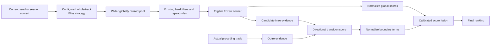
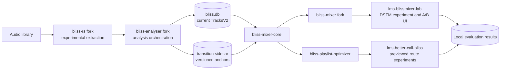
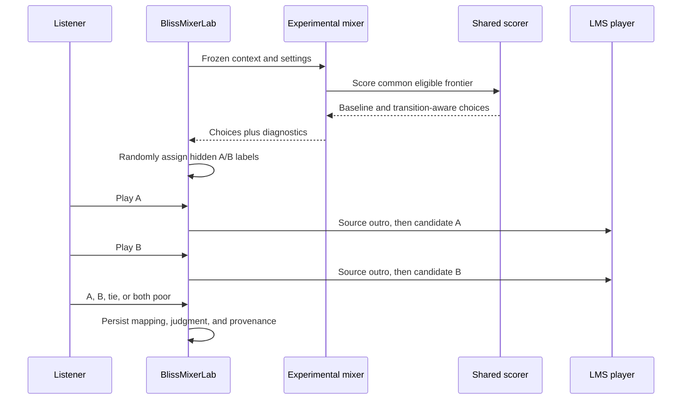

# Bliss transition-quality experiment and evaluation plan

**Status:** Working implementation concept  
**Scope:** Experimental contributor work across the Bliss ecosystem  
**Last reviewed:** 2026-09-09

## Purpose

This document turns the transition-quality research direction into a coherent,
incremental experiment across the existing Bliss repositories. Its first target
is audible playlist continuity, especially the
[Bohemian Rhapsody Problem](docs/analysis/overview.md#the-bohemian-rhapsody-problem):
a whole-track summary can be a poor description of the section that actually
ends or begins a transition.

The MkDocs material remains canonical for the underlying research and design
constraints:

- [transition-aware selection](docs/mixing/transitions.md) defines the scoring
  problem;
- [representation families](docs/analysis/representations.md) and
  [temporal evidence and confidence](docs/analysis/temporal-and-confidence.md)
  describe candidate analysis evidence;
- [maturity and resource cost](docs/analysis/versioning-and-storage.md) and
  [metadata and persistence](docs/integration/metadata-and-persistence.md)
  define lifecycle and storage considerations;
- [operational concerns](docs/mixing/operations.md) define reproducibility and
  fallback expectations; and
- [mixing evaluation](docs/evaluation/mixing-evaluation.md) defines the broader
  validation requirements.

This plan is not a proposal that the upstream `bliss-rs`, `bliss-analyser`,
`bliss-mixer`, or `lms-blissmixer` maintainers adopt a particular architecture.
It describes how experimental forks and companion projects can produce evidence
before any upstream API, schema, or ownership decision is requested.

The companion [experiment journal](BLISS_TRANSITION_QUALITY_EXPERIMENT_LOG.md)
records what was actually attempted, including frozen settings, results,
failures, interpretation, and the next decision. The plan describes intended
work; the journal is authoritative about executed work.

## Documentation protocol

Every material experiment receives a dated journal entry before its result is
used to change the direction. Each entry records:

1. the question and falsifiable hypothesis;
2. links to the corresponding canonical MkDocs rationale;
3. the input population and its selection limits;
4. analysis, scoring, playback, and randomization settings;
5. implementation and executable identity;
6. automated verification performed before interpretation;
7. raw or aggregate results suitable for publication;
8. limitations, including listener and library scope;
9. the decision taken and hypotheses rejected; and
10. the next evidence required.

Private audio, paths, server details, credentials, complete library or playlist
contents, catalog identifiers, and blinded answer keys remain in local
artifacts. The journal records enough sanitized provenance to understand and
repeat the method without publishing that private material. A result is never
silently rewritten after a later interpretation changes; a follow-up entry
supersedes it explicitly.

## Goals

1. Improve the perceived coherence of directional `A -> B` transitions.
2. Preserve the current whole-track Bliss result as the relevance baseline.
3. Use Version 2 temporal derivatives as a control and reusable scaffold, not
   as the assumed final descriptor family.
4. Compare a source outro with candidate intros without confusing transition
   compatibility with general song similarity.
5. Reduce reliance on a whole-track average when a track is structurally
   heterogeneous.
6. Reuse one transition-scoring definition in interactive mixing and one-shot
   playlist optimization.
7. Collect low-effort, blinded listening judgments under reproducible
   conditions.
8. Produce evidence that can justify, refine, or reject later integration.

## Non-goals for the first experiment

- Replacing the Version 2 23-feature representation.
- Changing the stable `TracksV2` schema.
- Treating transition quality as one universal song-similarity metric.
- Requiring segmentation, learned embeddings, MusicBrainz IDs, Last.fm, or a
  personal learned matrix.
- Replacing the current BlissMixer strategies or weakening their filters.
- Shipping experimental behavior in upstream `lms-blissmixer` before it has
  been evaluated.
- Training a boundary metric before boundary-specific judgments exist.
- Treating temporal derivatives over the current 23 features as the final
  answer when the underlying acoustic evidence is insufficient.

## Core hypothesis

Whole-track and boundary evidence answer different questions:

```text
whole-track/context score: Does candidate B belong in the current mix?
boundary score:            Does the audible end of A lead well into B's start?
```

The initial system therefore uses global Bliss similarity as a relevance gate
and boundary evidence as a late directional reranker:



This ordering is important. Boundary compatibility must not admit a quiet or
timbrally similar but contextually unrelated song that the active global
strategy would not consider relevant.

## Research sequencing after early evidence

The first temporal experiments deliberately operate over the existing 23 Bliss
features. This is a control condition and a measurement scaffold: it tests
whether whole-track aggregation is hiding useful timing information, and it
creates reusable machinery for windowing, anchors, playback rendering, ratings,
and reproducible comparison.

That scaffold should remain modest. It should not become a long effort to tune
every possible Version 2-derived local score. If a predeclared replication does
not support the temporal signal, the next experiment should move to one named
missing descriptor family rather than another combination of the same distances.

The preferred descriptor-family order is:

1. vocal activity, speech, and instrumental coverage;
2. rhythm, onset density, pulse clarity, and activity rate;
3. loudness, dynamics, transients, silence, and boundary shape;
4. tonal or harmonic trajectory beyond the current transposition-invariant
   chroma summaries.

Each family plugs into the same temporal scaffold and receives a family-level
ablation against Version 2. A result is only meaningful if it separates global
relevance, physical overlap, post-overlap continuation, and overall quality.

## Candidate transition evidence

### Anchors

An anchor is a bounded local analysis of a track intro or outro. A complete
experimental representation may retain several scales because different
properties require different observation lengths:

```text
TransitionEvidenceV1
|-- intro anchors
|   |-- short
|   |-- medium
|   `-- long
|-- outro anchors
|   |-- short
|   |-- medium
|   `-- long
|-- boundary shape
|   |-- silence and activity
|   |-- fade direction and slope
|   `-- loudness trajectory
`-- structural summary
    |-- within-track heterogeneity
    |-- whole-track-to-intro divergence
    `-- whole-track-to-outro divergence
```

Candidate anchor evidence includes, subject to feature-specific validity:

- loudness level and trajectory;
- spectral centroid, roll-off, flatness, and zero-crossing evidence;
- chroma or harmonic evidence;
- tempo and tempo confidence where the window contains sufficient evidence;
- silence, activity, fade-in, and fade-out behavior; and
- the exact covered sample/time range and boundary policy.

The first vertical slice intentionally uses one fixed intro window and one
fixed outro window over the current Version 2 feature semantics. This is the
control baseline for temporal use of existing evidence, not a claim that the
23-feature vector is sufficient for transition quality. Multi-scale anchors,
structure-aligned anchors, and additional descriptor families are later
ablations once the fixed-window baseline is understood.

### Structural heterogeneity

Structural heterogeneity is not itself a transition penalty. It estimates when
the whole-track summary may be unrepresentative. A stable track can continue to
rely predominantly on the global score; a strongly sectional track can give
compatible boundary evidence more influence.

An initial heterogeneity gate can be derived from windowed descriptor
dispersion and the divergence between the global vector and its intro/outro.
It does not need to name verses, choruses, or other formal sections.

### Confidence and compatibility

Every evidence product needs a representation/schema identity, descriptor
manifest, anchor policy, source range, validity mask, confidence layout, and
extractor identity. Only compatible anchors may be compared.

Low-confidence evidence reduces or disables its own contribution; it must not
move a track toward an arbitrary musical value. Missing or incompatible
evidence falls back to the global ranking rather than becoming a candidate
penalty.

The existing learned 23-by-23 matrix remains a whole-track option initially.
Triplets about symmetric whole-track similarity do not establish that the same
matrix is valid for directional intro/outro compatibility.

## Scoring model

For context `C`, actual predecessor `A`, and candidate `B`, define:

```text
G(B | C) = contextual whole-track relevance cost
T(A -> B) = compatible outro-to-intro anchor cost
Q(A -> B) = optional loudness/fade/boundary-shape penalty
K(A, B) = effective boundary coverage and confidence
H(A, B) = structural-heterogeneity gate

w_transition_effective = w_transition * K(A, B) * H(A, B)

S(A -> B | C) =
    w_global * normalize(G)
  + w_transition_effective * normalize(T)
  + w_boundary * normalize(Q)
```

This is a model family, not a fixed choice of weights. Every term must first be
normalized in its own score domain. For next-track reranking, candidate-pool
percentiles are a valid initial comparison because all candidates share the
same frozen context and frontier. Pool identity and size remain part of the
experiment record.

For full-route evaluation, percentiles must instead use a frozen cross-context
reference distribution. Percentiles calculated only from the selected route
legs are invalid: the worst selected leg would always receive the maximum
percentile regardless of its absolute quality.

## Repository and component model



### `bliss-rs`

The experimental fork supplies reusable audio measurements and anchor results.
It does not select candidates, know about playlists, or own player behavior.
The Version 2 `Analysis` result remains available unchanged while experimental
products evolve separately.

The first implementation may analyze extracted ranges less efficiently to
validate the concept. Shared decoding, streaming, and public API design should
follow evidence rather than precede it.

### `bliss-analyser`

The experimental analyser orchestrates library-wide extraction and persists
the results. During research it writes an independently rebuildable sidecar
instead of adding unstable columns to `TracksV2`.

To coexist with a normal BlissMixer installation, the experimental fork can
produce a separately named analyser binary without requiring the upstream LMS
plugin to invoke it. A second decode pass is acceptable for the first study;
single-pass integration is a later performance question.

### Transition-analysis sidecar

The sidecar joins to `bliss.db` by normalized file identity, not by SQLite
`rowid` alone. It records enough source size/modification or content identity to
invalidate stale analysis. A compact logical model contains:

- representation manifests;
- source-track identities and invalidation metadata;
- intro/outro anchor vectors with range, scale, validity, and confidence;
- boundary-shape summaries; and
- optional compact structural summaries.

Dense research intermediates remain cold and rebuildable. Runtime consumers
normally load only compact anchors and summaries.

### `bliss-mixer-core`

The shared core is the natural transport-independent home for application-side
evidence loading and transition-scoring semantics used by more than one
consumer. Experimental additions include:

- sidecar validation and lookup;
- anchor compatibility checks;
- boundary distance and confidence rules;
- independent score normalization and fusion;
- global-only fallback; and
- structured scoring diagnostics.

It does not decode audio, expose HTTP, search complete routes, or know about
Lyrion players.

### `bliss-mixer`

The experimental mixer retains a wider frontier from the selected Static,
Adaptive, or Extended Isolation Forest strategy, applies existing filters, and
then optionally calls the shared transition scorer. The actual source is the
track that will immediately precede a candidate, not the mean of the Adaptive
seed window.

An opt-in API request preserves baseline behavior. Diagnostics include global
rank/score, boundary rank/score, anchor policy, coverage/confidence, effective
weights, fallback reason, and final rank.

### `bliss-playlist-optimizer`

The optimizer is a second-stage consumer rather than a prerequisite for the
first DSTM experiment. Once the shared pair scorer is useful, it can include
boundary cost in fixed-set, destination, extension, and bridge-route objectives.

Every physical adjacency is directional. Inserting bridge `X` between `A` and
`B` requires evaluating both `A.outro -> X.intro` and
`X.outro -> B.intro`, followed by a complete repeat-policy check. Multi-track
gaps require rescoring the complete affected subroute.

### `lms-blissmixer-lab`

BlissMixerLab is the initial LMS experiment host. It already stages experimental
mixing behavior, owns a survey UI, and issues debug-only what-if comparison
requests. The transition harness extends that idea into an explicit blinded
listening workflow.

It owns process orchestration, settings inheritance, actual queue-boundary
identification, player control, A/B randomization, local judgments, and
privacy-safe aggregate export. It must not silently replace the stable DSTM
provider while the feature is under study.

### Better Call Bliss

Better Call Bliss is the later route-level evaluation surface. Its Preview
workflow can compare global-only and boundary-aware fixed-set orders, bridges,
and destination routes before the user saves or sends a result. Its primary
product purpose remains playlist transformation; it need not own the initial
research survey.

### Upstream `lms-blissmixer`

The stable plugin remains unchanged during the first experiment. It continues
to own its current analysis workflow, `bliss.db`, settings, and DSTM behavior.
Only a sufficiently validated capability should later be considered for an
opt-in upstream integration.

### `bliss-similarity-design`

This repository owns the research rationale, terminology, experimental
protocol, and aggregate conclusions. It does not own runtime implementation or
private experiment artifacts.

## Evaluation harness

### Purpose

The harness answers one controlled question:

> With the same source, context, candidate library, global strategy, and
> filters, is the transition-aware continuation preferable to the current
> global-only continuation?

It is not a new similarity algorithm. It creates matched comparisons, controls
confounding inputs, supports listening, records judgments, and makes results
reproducible.

### One comparison round



If both algorithms choose the same candidate, the harness records a no-change
scenario without asking the listener to compare identical transitions.

### Frozen scenario contract

Each round freezes:

- source track and recent seed context;
- actual queue boundary;
- eligible candidate inventory or its hash;
- global mixing strategy and all relevant parameters;
- learned-matrix identity and influence when applicable;
- genre, duration, BPM, seasonal, artist, album, and track constraints;
- candidate-frontier size;
- boundary-analysis schema and coverage;
- player transition behavior, including crossfade/gapless configuration;
- random seed and baseline/candidate executable identities; and
- A/B assignment.

The baseline and candidate may differ only in the declared treatment, initially
transition reranking.

### Listening interaction

The primary interaction stays deliberately small:

```text
Transition comparison

[ Play A ]    [ Play B ]

Which continuation works better?
[ A ] [ B ] [ No meaningful difference ] [ Both poor ]

Optional reason:
[ loudness ] [ rhythm ] [ harmony ] [ timbre ]
[ abrupt change ] [ musically unrelated ] [ other ]
```

The player repeats the same source outro before each candidate. The harness
uses local LMS playback; it does not upload, copy, or publish audio. A pilot
must verify reliable seeking and queue restoration on supported players.

### Comparison arms

Introduce complexity through explicit ablations:

1. Current global-only selection.
2. Global plus one fixed intro/outro anchor.
3. Anchors without boundary-shape penalties.
4. Anchors with loudness, fade, silence, and activity evidence.
5. Short, medium, and multi-scale anchors.
6. Fixed-window versus structure-aligned anchors.
7. Heterogeneity gating on and off.
8. Boundary-specific versus whole-track distance functions.

Results must be stratified by stable and structurally varied tracks rather than
reported only as one average.

### Automated validation

Before listening evaluation, test:

- deterministic extraction for fixed audio fixtures;
- short tracks, leading/trailing silence, fades, cold starts, and invalid tempo;
- schema, descriptor-manifest, anchor-policy, and confidence compatibility;
- stale sidecar invalidation;
- exact baseline parity when transition weighting is disabled;
- identical candidate frontier and filters between comparison arms;
- graceful global-only fallback for missing or incompatible evidence;
- preservation of track, artist, and album constraints;
- both affected legs after bridge insertion;
- deterministic result and diagnostic serialization; and
- analysis time, sidecar size, memory, and request latency.

Album adjacency, user-created playlists, and similar proxy labels can help find
regressions or difficult cases. They are not ground truth for perceived
transition quality.

### Human-evaluation measures

Report:

- wins, losses, ties, and both-poor responses;
- uncertainty intervals rather than percentages alone;
- structurally stable versus varied-track results;
- how often reranking changes the selected candidate;
- global-rank displacement caused by reranking;
- anchor coverage, confidence, and fallback rates;
- outcomes by optional reason category;
- constraint violations, which must remain zero; and
- analysis/storage/runtime cost.

A lower internal boundary score is diagnostic evidence, not validation. The
principal outcome is blinded listener preference. Playlist-level studies later
assess relevance, variety, and local flow separately.

### Privacy

Raw local experiment records may contain paths and library metadata and remain
private. Published results must omit private paths, complete playlists, player
addresses, credentials, LMS catalog IDs, and other machine-specific details.
Only aggregate results and redistributable fixtures belong in public reports.

## Delivery sequence

### Phase 0: baseline alignment and temporal scaffold

1. Start experimental branches from reviewed upstream/fork baselines.
2. Record which `bliss-rs` revision each consumer uses.
3. Align the experimental `bliss-mixer` and `bliss-playlist-optimizer` on a
   compatible `bliss-mixer-core` revision before comparing results.
4. Characterize current global-only output so transition weight zero is an
   exact compatibility test.
5. Build the smallest reusable temporal scaffold over Version 2 evidence:
   fixed windows, anchors, prefix volatility, rendering, blinded ratings, and
   diagnostic reports.

### Phase 1: Version 2 temporal control

1. Implement one deterministic fixed-duration intro/outro analysis in the
   `bliss-rs` fork.
2. Add feature validity, source ranges, policy identity, and provenance.
3. Add incremental sidecar generation to the experimental analyser.
4. Verify invalidation, partial coverage, and cross-platform decoder behavior.
5. Replicate the most promising local signal on a larger source set before
   tuning, fusion, or broader integration.

### Phase 2: first missing descriptor family

1. Prototype vocal activity, speech-like evidence, and instrumental coverage
   as temporal evidence, preferably before more expensive source separation or
   detailed vocal-technique classifiers.
2. Compare the new family against the Version 2 temporal control and against
   the unchanged whole-track baseline.
3. Keep relevance, overlap, continuation, and overall quality as separate
   outcomes.
4. Continue to rhythm/onset, dynamics/boundary shape, and harmonic trajectory
   only through similarly isolated family-level ablations.

### Phase 3: interactive scorer and harness

1. Add sidecar loading and transition-score primitives to
   `bliss-mixer-core`.
2. Add opt-in wider-pool reranking and diagnostics to the mixer fork.
3. Add a blinded comparison page and local result store to BlissMixerLab.
4. Run a pilot that includes Bohemian-Rhapsody-like cases and homogeneous
   controls.

### Phase 4: representation refinement

1. Compare anchor durations and multi-scale fusion.
2. Add boundary-shape ablations.
3. Add compact structural heterogeneity and global/anchor divergence.
4. Compare fixed and structure-informed boundaries only after the fixed-anchor
   baseline is understood.

### Phase 5: one-shot playlist optimization

1. Connect the shared scorer to `bliss-playlist-optimizer`.
2. Evaluate fixed-set route ordering against global-only ordering.
3. Evaluate both bridge legs and complete affected subroutes.
4. Expose boundary-aware alternatives in Better Call Bliss Preview.
5. Assess route-level relevance, variety, local flow, worst transitions, and
   resource cost separately.

### Phase 6: consolidation discussion

Only after the experiments produce useful, reproducible results should the
projects consider:

- which analysis products are generally reusable;
- whether a public upstream extraction interface is warranted;
- whether sidecar or consolidated persistence is preferable;
- which transition functionality is suitable for mainstream mixing APIs; and
- whether any experimental LMS behavior should graduate from BlissMixerLab.

## First vertical slice

The smallest useful end-to-end implementation involves:

```text
bliss-rs fork
    -> experimental bliss-analyser
    -> transition sidecar
    -> bliss-mixer-core
    -> experimental bliss-mixer
    -> lms-blissmixer-lab A/B page
```

It supports only:

- one 30-second intro anchor;
- one 30-second outro anchor;
- a manifest-defined subset of existing acoustic evidence;
- global top-`K` retrieval with current filters;
- directional outro-to-intro reranking;
- complete global-only fallback;
- diagnostics; and
- one blinded A/B listening workflow.

`bliss-playlist-optimizer` and Better Call Bliss join after this pairwise
vertical slice demonstrates value. Upstream `lms-blissmixer` is not modified.

## Current implementation gaps and constraints

Repository inspection identified several boundaries that the experiment must
handle explicitly:

- `bliss-analyser` currently persists only the flat `TracksV2` columns.
- `bliss-mixer-core` currently defines a fixed 23-dimensional feature and
  `TracksV2` contract; it has no boundary-evidence store or transition scorer.
- `bliss-mixer` and `bliss-playlist-optimizer` do not currently pin the same
  `bliss-mixer-core` revision.
- the analyser, mixer, and shared core do not all consume the same form or
  revision of `bliss-rs`;
- the optimizer currently evaluates routes with whole-track contextual
  features, not intro/outro anchors;
- BlissMixerLab's existing what-if comparisons are debug logging, not blinded
  listening experiments; and
- the personal learned matrix describes the existing 23 whole-track features
  and cannot silently be applied to a different anchor manifest.

These are dependency and contract issues, not reasons to merge responsibilities
into one program. The implementation order should follow the data dependency:

```text
extraction -> persistence -> shared scoring -> interactive consumer
           -> listening evidence -> route consumer -> consolidation
```

## Open research and implementation questions

1. Which existing measurements remain valid in short anchors?
2. What initial anchor duration provides enough information without averaging
   away the relevant boundary?
3. How should intentional silence and fades differ from padding or encoding
   artifacts?
4. Which confidence formulation is calibrated enough to control fallback?
5. Does heterogeneity of the source, candidate, or both best predict when
   boundary reranking helps?
6. How large can the global frontier become before relevance degrades or
   runtime becomes unsuitable for Raspberry Pi-class servers?
7. Should Static, Adaptive, and EIF use the same fusion calibration after their
   global scores are normalized?
8. How should actual player crossfade and gapless behavior enter later studies?
9. When does a fixed anchor stop being sufficient and justify structural
   boundary estimation?
10. What amount of low-effort listening evidence is sufficient to justify a
    broader integration trial?
