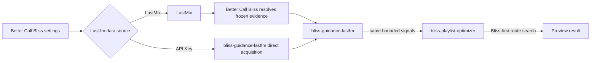

# Last.fm guidance acquisition plan

**Status:** Approved design and implementation plan  
**Scope:** Experimental Better Call Bliss and guidance-provider work  
**Last reviewed:** 2026-09-25  

## Goal

Keep playlist and route optimization Bliss-first while giving administrators a
clear choice of how optional Last.fm similarity observations are obtained.  
Both acquisition sources must produce the same bounded `lastfm_track` and
`lastfm_artist` guidance signals. Neither source may admit a track that Bliss
did not select as eligible, relax a hard repeat window, or make a failed route
valid.  

The scope covers `lms-better-call-bliss`, `bliss-guidance-lastfm`,
`bliss-playlist-guidance-spi`, and release packaging. It deliberately leaves
`bliss-playlist-optimizer` source-agnostic.  

## User-facing behaviour

Better Call Bliss adds one global **Last.fm data source** setting:  

| Choice | Availability | Behaviour |
| --- | --- | --- |
| **LastMix** | Selectable only when the LastMix plugin is installed. | Better Call Bliss obtains bounded similar-track and similar-artist observations through LastMix, then supplies the existing frozen, resolved evidence artifact. |
| **API Key** | Always selectable. | A visible API-key field accepts the administrator's Last.fm API key. `bliss-guidance-lastfm` obtains and caches public Last.fm similarity observations during provider preparation. |

The page explains how to obtain a Last.fm API key and makes clear that public
similarity endpoints need an application key, not a Last.fm user account,
password, session, or API secret.  

The existing per-job **similar-track guidance** and **similar-artist guidance**
percentages remain independent of this setting and retain their current target
share semantics. A value of `0%` disables its channel. When both are `0%`, a
Last.fm source is not started.  

If LastMix is unavailable, the direct key is empty or rejected, Internet access
is unavailable, or a provider times out, the affected Last.fm channel is
neutral and the job continues Bliss-only. The preview and LMS log state the
source attempted, cache/freshness outcome, and concise failure reason without
revealing the key.  

## Architecture

The sources are acquisition adapters beneath one Last.fm guidance provider.
They are not separate ranking models and do not change optimizer behavior.  

### LastMix path

This is the current path and remains artifact-backed. Better Call Bliss uses
LastMix's integration and cache, resolves observations against its frozen local
candidate inventory, writes `resolved-lastfm-evidence-v1`, and hash-binds that
artifact to the provider's `prepare` request. The provider remains network-free
in this mode.  

### API Key path

Better Call Bliss sends the optimizer a trusted provider mode of `direct`; it
does **not** serialize the API key into request JSON, a preview artifact,
diagnostic result, or report. The process-local trusted configuration makes the
key available only to `bliss-guidance-lastfm`.  

During its single job-scoped `prepare`, the provider:  

1. reads the source and route/history anchors supplied by SPI v2;  
2. identifies the distinct artist and recording queries needed for non-zero
   channels;  
3. resolves each query from a persistent cache or public Last.fm endpoint;
   and  
4. freezes the relations in memory for the remainder of that provider session.  

Later `score` calls never perform HTTP. They compare only the optimizer's
bounded candidate batch with those frozen relations, using candidate title,
artist, recording MBID, and artist MBIDs from SPI v2. This preserves bounded
route-search cost even for 200,000-plus-track libraries.  

The provider returns the same channel names, bounded scores, confidence, and
rationale schema in either mode. The optimizer applies the existing host policy
after Bliss has produced its acoustic shortlist.  

## Security and reproducibility

The API key is sensitive configuration even though public similarity calls do
not need an authenticated Last.fm account. It must:  

- remain in the LMS preference store only;  
- be injected only into the relevant provider process as trusted local
  configuration;  
- be redacted from all stdout/stderr, LMS logs, job request/result JSON, crash
  reports, and support bundles; and  
- never be accepted from a playlist, web-form job parameter, or arbitrary
  provider command line.  

Direct responses are live inputs, so the provider records non-sensitive
provenance: acquisition mode, cache/fresh counts, response timestamps, query
counts, and cache schema/version. It freezes the decoded relations for the
job, making subsequent route scoring deterministic even if Last.fm changes
while the job runs. A future explicit export may capture sanitized observations
for repeatability, but raw responses and API credentials are not preview
artifacts in the first implementation.  

## Operational requirements

Direct acquisition must be safe on small servers and useful on larger ones:  

- persistent positive and negative cache with a documented TTL and schema;  
- de-duplicated artist/track queries per job;  
- bounded request concurrency, rate limiting, connect/read deadlines, retry
  limits, cancellation, and total preparation budget;  
- no HTTP request per candidate or per `score` call;  
- no full decoded Bliss library copy in a provider;  
- parallel work only where profiling shows a benefit, with bounded workers;
  and  
- neutral degradation for cache corruption, invalid payloads, TLS/network
  problems, rate limiting, invalid keys, missing metadata, or provider failure.  

The direct provider emits aggregated preparation diagnostics. Better Call Bliss
maps them into its existing live-job status and debug logging without exposing
query strings or credentials unnecessarily.  

## Contract changes

SPI v2 already carries anchor and score-candidate identity metadata sufficient
for direct matching. No breaking protocol change is required. The work adds a
documented provider-specific `prepare` mode and trusted process-local secret
configuration; the generic SPI keeps its rule that `score` is network-free.  

`bliss-guidance-lastfm` gains two acquisition adapters behind one provider
interface:  

| Adapter | `prepare` input | Evidence retained for the session |
| --- | --- | --- |
| `artifact` | Hash-verified `resolved-lastfm-evidence-v1`. | Resolved local evidence already prepared by Better Call Bliss. |
| `direct` | SPI anchors plus trusted process-local API-key configuration. | Cached/fresh Last.fm relations resolved against each bounded score batch. |

The optimizer receives only provider identity, mode, channel policy, trusted
paths, and normal diagnostics. It never contains a Last.fm API key and does
not branch on LastMix versus direct acquisition.  

## Implementation sequence

1. Document the mode contract, settings, security boundary, and diagnostics in
   the SPI and Last.fm-provider repositories.  
2. Add Last.fm source selection and conditional settings UI to Better Call
   Bliss, including LastMix presence detection and API-key help.  
3. Refactor `bliss-guidance-lastfm` behind an acquisition-adapter interface;
   preserve the current artifact adapter as the regression baseline.  
4. Implement the direct adapter's cache, bounded HTTP client, response parser,
   identity matching, cancellation, and aggregate diagnostics.  
5. Extend optimizer provider launch configuration only as needed to deliver
   trusted process-local key material without persisting or logging it.  
6. Wire live status, preview reporting, and structured LMS logs to show source,
   availability, cache/fresh counts, and neutral fallbacks.  
7. Package all provider binaries with Better Call Bliss and update release,
   installation, and operator documentation.  
8. Run functional, failure, determinism, performance, and Raspberry Pi smoke
   tests before making direct acquisition the recommended alternative.  

## Acceptance and regression checks

1. LastMix and API Key modes produce valid guidance signals with the same
   channel semantics and target-share policy.  
2. With identical frozen observations, both modes yield identical provider
   signals and optimizer results.  
3. API Key mode makes no network request during `score`; a trace proves all
   outbound requests occur in `prepare`.  
4. A missing, invalid, or rate-limited key, offline network, malformed response,
   timeout, cancellation, or provider crash leaves a valid Bliss-only result.  
5. Source detection prevents choosing unavailable LastMix; direct mode with an
   empty key clearly explains why Last.fm guidance is neutral.  
6. Test fixtures prove artist MBID matching first, normalized-name fallback
   second, and recording/artist channel separation.  
7. Logs, result JSON, artifacts, and test snapshots contain no API key.  
8. Cache hits, cache misses, negative cache entries, expiry, and concurrent
   preparation are deterministic and bounded.  
9. A 200,000-track synthetic inventory stays within agreed memory limits and
   does not cause whole-library network or per-candidate HTTP activity.  
10. Raspberry Pi tests measure cold and warm preparation latency, route-search
    latency, cancellation latency, and offline fallback.  

## Out of scope

- Reusing AudioScrobbler credentials or storing a Last.fm username/password.  
- Authenticated Last.fm account features such as loved tracks or user tags.  
- Changing the Bliss scoring model, candidate eligibility, repeat rules, or
  genre/virtual-library policy.  
- A new SPI version or a Last.fm-dependent `bliss-playlist-optimizer`.  
- Other providers such as ListenBrainz.  

## Documentation follow-up

When implementation begins, update the status-quo documents in the repositories
that ship the behavior: Better Call Bliss's guidance data-flow document,
`bliss-guidance-lastfm` README, and the SPI contract. Do not describe direct
acquisition as shipped before the acceptance checks above pass.  
