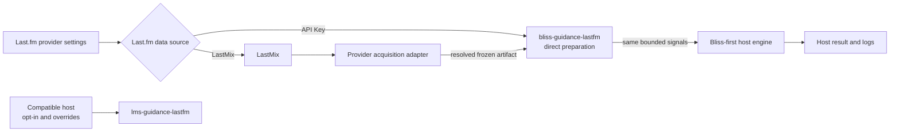

# Last.fm guidance acquisition plan

**Status:** Approved architecture; implementation plan revision in progress  
**Scope:** Discoverable Last.fm provider plus Better Call Bliss and Bliss Mixer
Lab host integration  
**Last reviewed:** 2026-10-03  

## Goal

Keep playlist and route optimization Bliss-first while giving administrators a
clear choice of how optional Last.fm similarity observations are obtained.  
Both acquisition sources must produce the same bounded `lastfm_track` and
`lastfm_artist` guidance signals. Neither source may admit a track that Bliss
did not select as eligible, relax a hard repeat window, or make a failed route
valid.  

The scope covers the new `lms-guidance-lastfm` Lyrion extension,
`bliss-guidance-lastfm`, `lms-bliss-guidance-host`,
`bliss-playlist-guidance-spi`, Better Call Bliss, Bliss Mixer Lab, and release
packaging. It deliberately leaves `bliss-playlist-optimizer` source-agnostic.  

## User-facing behaviour

`lms-guidance-lastfm` is an independently installable, discoverable Lyrion
guidance-provider plugin. It owns one provider settings page and its source
configuration:  

| Choice | Availability | Behaviour |
| --- | --- | --- |
| **LastMix** | Selectable only when the LastMix plugin is installed. | The provider's LastMix adapter obtains bounded similar-track and similar-artist observations, then creates a frozen, resolved evidence artifact for the native provider. |
| **API Key** | Always selectable. | A visible API-key field accepts the administrator's Last.fm API key. `bliss-guidance-lastfm` obtains and caches public Last.fm similarity observations during provider preparation. |

The page explains how to obtain a Last.fm API key and makes clear that public
similarity endpoints need an application key, not a Last.fm user account,
password, session, or API secret.  

The provider declares shared defaults for similar-track influence,
similar-artist mode, and similar-artist level. Every compatible host discovers
the provider but defaults it to disabled. When enabled, a host renders the
canonical provider controls, the effective-value annotation, and sparse
host-specific overrides. Better Call Bliss may additionally apply its existing
per-job values above the host and provider values. A value of `0%` disables the
relevant channel; when both channels are disabled, no Last.fm source starts.  

If LastMix is unavailable, the direct key is empty or rejected, Internet access
is unavailable, or a provider times out, the affected Last.fm channel is
neutral and the job continues Bliss-only. The preview and LMS log state the
source attempted, cache/freshness outcome, and concise failure reason without
revealing the key.  

## Architecture

The sources are acquisition adapters beneath one Last.fm guidance provider.
They are not separate ranking models and do not change optimizer behavior.
The provider plugin owns acquisition, credentials, cache configuration, and
provider defaults. The host owns opt-in, sparse overrides, and its normal
Bliss-first selection policy.  

```mermaid
flowchart LR
    PS[Last.fm provider settings] --> S{Last.fm data source}
    H[Compatible host\nopt-in and overrides] --> P[lms-guidance-lastfm]
    S -->|LastMix| LM[LastMix]
    LM --> A[Provider acquisition adapter]
    S -->|API Key| D[bliss-guidance-lastfm\ndirect preparation]
    A -->|resolved frozen artifact| D
    D -->|same bounded signals| O[Bliss-first host engine]
    O --> R[Host result and logs]
```

### LastMix path

This remains artifact-backed. The provider plugin uses LastMix's integration
and cache, receives the host's frozen source and candidate identities, resolves
observations against that inventory, writes `resolved-lastfm-evidence-v1`, and
hash-binds that artifact to the provider's `prepare` request. The native
provider remains network-free in this mode.  

### API Key path

The provider plugin sends the host a trusted provider mode of `direct`; the
host does **not** serialize the API key into request JSON, a preview artifact,
diagnostic result, or report. The provider supplies a non-serialized
`guidance_provider_process_environment_v1` hook. Better Call Bliss applies it
only while launching the job-private optimizer; Bliss Mixer Lab applies it
while launching or restarting its local `bliss-mixer` sidecar. The native host
inherits the variable solely so its child `bliss-guidance-lastfm` process can
read it. Changing the API key requires the Lab sidecar to restart before the
new value can take effect.  

During its single job-scoped `prepare`, the provider:  

1. reads the source and route/history anchors supplied by SPI v2;  
2. identifies the distinct artist and recording queries needed for non-zero
   channels;  
3. resolves each query from a persistent cache or public Last.fm endpoint;
   and  
4. freezes the relations in memory for the remainder of that provider session.  

Later `score` calls never perform HTTP. They compare only the optimizer's
bounded candidate batch with those frozen relations, using candidate title,
artist, recording MBID, and artist MBIDs from SPI v2. This preserves bounded
route-search cost even for 200,000-plus-track libraries.  

The provider returns the same channel names, bounded scores, confidence, and
rationale schema in either mode. The optimizer applies the existing host policy
after Bliss has produced its acoustic shortlist.  

## Security and reproducibility

The API key is sensitive configuration even though public similarity calls do
not need an authenticated Last.fm account. It must:  

- remain in the provider's LMS preference store, never in a host preference;  
- be delivered through the provider's non-serialized process-environment hook,
  never as provider options or another wire-contract value;  
- be inherited by the local native host only as required to launch its provider
  child;  
- be redacted from all stdout/stderr, LMS logs, job request/result JSON, crash
  reports, and support bundles; and  
- never be accepted from a playlist, web-form job parameter, or arbitrary
  provider command line.  

Direct responses are live inputs, so the provider records non-sensitive
provenance: acquisition mode, cache/fresh counts, response timestamps, query
counts, and cache schema/version. It freezes the decoded relations for the
job, making subsequent route scoring deterministic even if Last.fm changes
while the job runs. A future explicit export may capture sanitized observations
for repeatability, but raw responses and API credentials are not preview
artifacts in the first implementation.  

## Operational requirements

Direct acquisition must be safe on small servers and useful on larger ones:  

- persistent positive and negative cache with a documented TTL and schema;  
- de-duplicated artist/track queries per job;  
- bounded request concurrency, rate limiting, connect/read deadlines, retry
  limits, cancellation, and total preparation budget;  
- no HTTP request per candidate or per `score` call;  
- no full decoded Bliss library copy in a provider;  
- parallel work only where profiling shows a benefit, with bounded workers;
  and  
- neutral degradation for cache corruption, invalid payloads, TLS/network
  problems, rate limiting, invalid keys, missing metadata, or provider failure.  

The direct provider emits aggregated preparation diagnostics. Each host maps
them into its existing live-job status and debug logging without exposing query
strings or credentials unnecessarily.  

## Contract changes

SPI v2 already carries anchor and score-candidate identity metadata sufficient
for direct matching. No breaking protocol change is required. The work adds a
documented provider-specific `prepare` mode and trusted process-local secret
configuration; the generic SPI keeps its rule that `score` is network-free.  

`bliss-guidance-lastfm` gains two acquisition adapters behind one provider
interface:  

| Adapter | `prepare` input | Evidence retained for the session |
| --- | --- | --- |
| `artifact` | Hash-verified `resolved-lastfm-evidence-v1`. | Resolved local evidence prepared by the LastMix acquisition adapter. |
| `direct` | SPI anchors plus trusted process-local API-key configuration. | Cached/fresh Last.fm relations derived from the job anchors and frozen for all later score batches. |

The optimizer and `bliss-mixer` receive only provider identity, mode, channel
policy, trusted paths, and normal diagnostics. They never contain a Last.fm API
key and do not branch on LastMix versus direct acquisition.  

### Current native Bliss Mixer Lab path

`bliss-mixer` 0.11.4 exposes a native guidance-host endpoint and returns
`selection_trace_v1` for a bounded candidate request. When an enabled native
provider is present, Bliss Mixer Lab already sends its DSTM candidate pool to
`/api/guidance/score`, receives the provider signals and trace, and feeds the
signals through its established Lab log formatter. The Perl selection policy
and log presentation intentionally remain host-owned. The Last.fm provider
therefore needs discovery/policy integration and parity tests in Lab, not a
second DSTM transport migration.  

## Implementation sequence

1. Create `lms-guidance-lastfm` from the provider kit: descriptor, provider
   settings page, LastMix availability detection, API-key help, default
   settings, provider status, trusted native configuration, and packaging.  
2. Document the mode contract, settings ownership, security boundary, and
   diagnostics in the SPI and Last.fm-provider repositories.  
3. Refactor `bliss-guidance-lastfm` behind an acquisition-adapter interface;
   preserve the current artifact adapter as the regression baseline, and add a
   provider-owned LastMix acquisition adapter.  
4. Implement the direct adapter's cache, bounded HTTP client, response parser,
   identity matching, cancellation, aggregate diagnostics, and job-private
   API-key injection.  
5. Extend the shared host model only as needed for provider-owned acquisition
   and secrets; neither optimizer nor `bliss-mixer` may receive or log the key.  
6. Wire Better Call Bliss to discover the provider, keep it disabled by
   default, render canonical controls, and use provider acquisition instead of
   bespoke LastMix collection.  
7. Add the discoverable Last.fm provider to Bliss Mixer Lab's existing native
   endpoint path, preserve its established selection logging, and prove
   fixture- and Raspberry Pi-level parity.  
8. Wire live status, preview reporting, and structured LMS logs to show source,
   availability, cache/fresh counts, and neutral fallbacks.  
9. Package the provider and all platform-specific native binaries as its own
   Lyrion extension; update host release, installation, and operator docs.  
10. Run functional, failure, determinism, performance, and Raspberry Pi smoke
    tests before making direct acquisition the recommended alternative.  

## Acceptance and regression checks

1. The provider is separately installable, discoverable, and disabled by
   default in Better Call Bliss and Bliss Mixer Lab.  
2. LastMix and API Key modes produce valid guidance signals with the same
   channel semantics and target-share policy.  
3. With identical frozen observations, both modes yield identical provider
   signals and optimizer results.  
4. API Key mode makes no network request during `score`; a trace proves all
   outbound requests occur in `prepare`.  
5. A missing, invalid, or rate-limited key, offline network, malformed response,
   timeout, cancellation, or provider crash leaves a valid Bliss-only result.  
6. Source detection prevents choosing unavailable LastMix; direct mode with an
   empty key clearly explains why Last.fm guidance is neutral.  
7. Test fixtures prove artist MBID matching first, normalized-name fallback
   second, and recording/artist channel separation.  
8. Logs, result JSON, artifacts, and test snapshots contain no API key.  
9. Cache hits, cache misses, negative cache entries, expiry, and concurrent
   preparation are deterministic and bounded.  
10. A 200,000-track synthetic inventory stays within agreed memory limits and
   does not cause whole-library network or per-candidate HTTP activity.  
11. Lab's DSTM path consumes the Last.fm provider through the native
    `bliss-mixer` endpoint with fixture- and Pi-proven selection/logging parity.  
12. Raspberry Pi tests measure cold and warm preparation latency, route-search
   latency, cancellation latency, and offline fallback.  

## Out of scope

- Reusing AudioScrobbler credentials or storing a Last.fm username/password.  
- Authenticated Last.fm account features such as loved tracks or user tags.  
- Changing the Bliss scoring model, candidate eligibility, repeat rules, or
  genre/virtual-library policy.  
- A new SPI version or a Last.fm-dependent `bliss-playlist-optimizer`.  
- Other providers such as ListenBrainz.  

## Documentation follow-up

When implementation begins, update the status-quo documents in the repositories
that ship the behavior: Better Call Bliss's guidance data-flow document,
`bliss-guidance-lastfm` README, and the SPI contract. Do not describe direct
acquisition as shipped before the acceptance checks above pass.  
