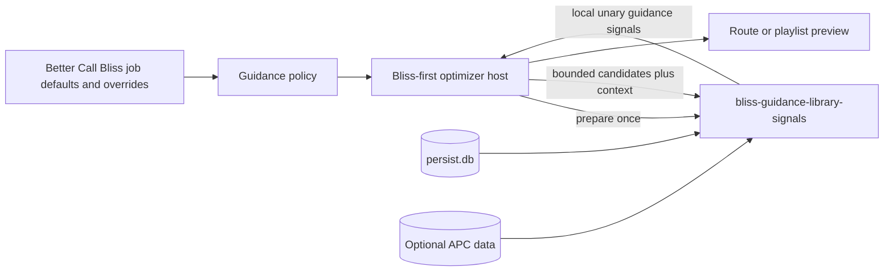

# Local library guidance plan

**Status:** Proposed follow-up  
**Scope:** Optional local Lyrion signals for Better Call Bliss and a future
BlissMixer guidance host  
**Last reviewed:** 2026-09-25  

## Goal

Add optional local-library guidance on top of a Bliss-derived candidate pool.
The signals express listening history, freshness, and explicit rejection; they
must never replace acoustic eligibility, repeat windows, virtual-library
membership, genre filtering, or route validity.  

The first implementation should use Lyrion's read-only SQLite data and the
optional Alternative Play Count (APC) plugin. It must remain practical for
large libraries: one bounded provider session per job, no whole-library JSON
export, and no database query or network operation per individual score call.  

## Available local data

| Signal family | Lyrion source | Meaning |
| --- | --- | --- |
| Standard listening statistics | `persist.db` / `tracks_persistent` | `playCount`, `lastPlayed`, `added`, and optional `rating`, keyed by `urlmd5`. |
| Alternative Play Count | `persist.db` / `alternativeplaycount` | APC play count, last played, skip count, last skipped, and dynamic played/skipped value (DPSV). |
| Detailed APC history | `apc_external.db` / `play_history` | Played timestamp, player identity, track identity, and rating captured at play time. |
| Catalog metadata | `library.db` | Artist, album, genre, year, MusicBrainz IDs, label, release type, duration, BPM, replay gain, technical fields, and tags. |

`tracks_persistent.added` is the appropriate library-age source. The catalog
table's `tracks.added_time` and `updated_time` describe catalog/scan activity
and must not be presented as a reliable user-facing "added to library" date.  

APC may be semantically preferable for playback signals: it can distinguish a
track played beyond the configured threshold from a track skipped early. Its
DPSV is a recent preference signal: it rises after counted plays and falls
after skips.  

## User controls

The controls belong in a per-job **Listening preferences** group. Global values
are defaults only, following Better Call Bliss's existing job-override model.  

| Control | Range | Meaning |
| --- | ---: | --- |
| Play-count preference | `-100` to `100` | Negative favors less-played tracks; positive favors more-played tracks. Existing behavior. |
| Last-played recency | `-100` to `100` | Negative favors tracks unheard for longer; positive favors tracks played more recently; zero is neutral. |
| Library age | `-100` to `100` | Negative favors older library additions; positive favors newer additions; zero is neutral. |
| Skip avoidance | `0` to `100` | Applies an increasingly strong penalty to tracks recently or frequently skipped according to APC. Zero disables it. |
| Recent affinity | `0` to `100` | Favors positive APC DPSV: tracks recently listened through rather than skipped. Zero disables it. |

Signed ranges are appropriate only where either direction expresses a plausible
listener intention. Play count, time since last play, and library age can
reasonably be inverted. Skip avoidance and positive recent affinity are
one-way safeguards; a positive control that deliberately favors skipped or
negative-DPSV tracks would be confusing and is out of scope.  

The first UI also offers a **Listening-statistics source** selector:  

- **Lyrion statistics** reads `tracks_persistent`;  
- **Alternative Play Count** reads APC fields and is unavailable when its
  database/table is absent or invalid.  

The source selection applies to count and last-played controls together. The
provider does not silently blend row-level Lyrion and APC values, because that
would make normalization and diagnostics ambiguous. Library age always uses
Lyrion persistence data; skip avoidance and recent affinity require APC.  

Ratings and player-specific history are deliberately deferred. Ratings should
not become a visible preference until a usable rating source is configured.
Player history needs a separate privacy and sparse-history policy before it can
influence a route.  

## Provider boundary

Create a successor provider, **`bliss-guidance-library-signals`**, rather than
continuing to expand the narrowly named `bliss-guidance-playcounts`. The new
provider owns the coherent domain of local, unary Lyrion listening and library
signals: count, recency, library age, skips, and DPSV. The existing provider
can remain a compatibility baseline while the successor is introduced, then be
retired in a coordinated Better Call Bliss release.  

The optimizer continues to own candidate admission and policy aggregation. The
provider does not select route members or mutate a queue/playlist. It receives
only trusted read-only resource paths and bounded score batches through the
guidance SPI.  

During `prepare`, it opens one read-only SQLite snapshot, validates the selected
schema, and makes any needed streaming pass over the eligible identity
population to establish stable normalizations. During `score`, it looks up only
the bounded batch's `urlmd5` values through indexed queries and a job-local
cache.  

## What remains outside this provider

Genre and virtual-library restrictions stay hard eligibility rules owned by
Better Call Bliss. Acoustic BPM, loudness, timbre, and chroma remain Bliss
evidence rather than competing metadata guidance. A future user-configurable
metadata-preference provider may cover carefully selected fields such as year,
label, composer, or rating, but it should be introduced only with a clear user
need rather than treating every catalog column as a ranking feature.  

## Acceptance criteria

1. Every local signal is neutral at zero and cannot admit an acoustically
   excluded candidate or violate a hard constraint.  
2. Positive and negative directions for signed controls are tested as exact
   opposites over a frozen candidate population.  
3. APC-only controls disable cleanly, with visible diagnostics, when APC is
   unavailable or selected data is missing.  
4. Lyrion and APC statistics are never silently blended row by row.  
5. The provider uses read-only snapshots, bounded candidate batches, indexed
   lookups, and a job-local cache; it exports no full-library value artifact.  
6. Provider diagnostics disclose source, coverage, normalization, and fallback
   state without logging private track paths or detailed play history.  
