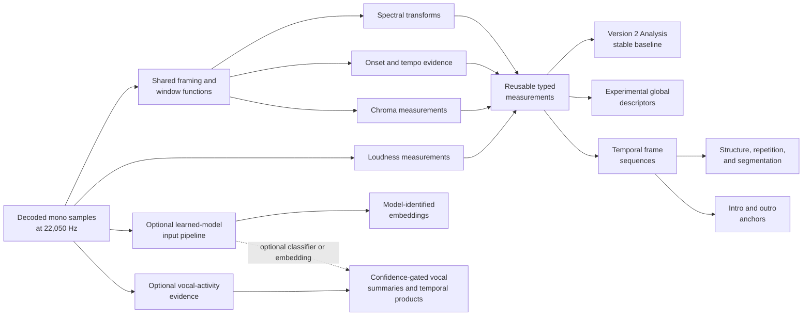

# Analysis API and extraction pipeline

**Status:** Living research and design proposal  
**Primary scope:** Optional products, schemas, and shared computation  
**Last reviewed:** 2026-07-23

## Proposed API direction

### Preserve [`Analysis`](https://github.com/Polochon-street/bliss-rs/blob/master/src/song/mod.rs#L240)

Existing calls should continue to work:

```rust
let analysis: Analysis = Song::analyze(samples)?;
```

No structured-analysis prototype should silently change this result or its
cost.

### Product selection

A consumer should request analysis products explicitly. A possible shape is:

```rust
pub struct AnalysisRequest {
    pub baseline: bool,
    pub global_descriptors: Option<GlobalDescriptorConfig>,
    pub frames: Option<FrameConfig>,
    pub structure: Option<StructureConfig>,
    pub anchors: Option<AnchorConfig>,
    pub embeddings: Option<EmbeddingConfig>,
}
```

The exact builder or options style is open. The important contract is that
expensive products are opt-in and configurations become part of representation
identity.

### Result bundle

One possible result model is:

```rust
pub struct AnalysisBundle {
    pub baseline: Option<Analysis>,
    pub global: Option<DescriptorVector>,
    pub frames: Option<FrameSequence>,
    pub structure: Option<StructureAnalysis>,
    pub anchors: Vec<AnchorAnalysis>,
    pub embeddings: Vec<EmbeddingAnalysis>,
}
```

This sketch does not decide whether all types live in the base crate, an
`enhanced-analysis` feature, or a companion crate.

### Schema identity

Every non-baseline representation needs more than a vector length:

```rust
pub struct RepresentationSchema {
    pub schema_id: String,
    pub kind: RepresentationKind,
    pub features: Vec<DescriptorDefinition>,
    pub normalization_id: String,
    pub configuration_id: String,
    pub model: Option<ModelProvenance>,
}
```

`schema_id` should change whenever ordering, semantics, units, normalization,
windowing, or preprocessing changes incompatibly. A human-readable manifest
should make stored data auditable.

### Descriptor definition and confidence

A descriptor definition should capture at least:

- stable name;
- family;
- units and expected range;
- normalization semantics;
- expected invariant, sensitive, and equivariant transformations;
- minimum valid duration;
- confidence semantics;
- implementation/schema version.

For a learned representation, model provenance additionally needs at least:

- model name, immutable version or artifact digest, and embedding dimension;
- model license and distribution/deployment assumptions;
- expected sample rate, channel policy, input normalization, and excerpt size;
- frame/segment sampling and track-level pooling policy;
- training objective and supervision source at a useful level of description;
- augmentations that intentionally establish invariance;
- output normalization and distance assumptions.

Confidence is not universally a probability. It may express detector strength,
ambiguity, stability, sample support, or boundary certainty. Each descriptor
must define what its confidence means and how it was calibrated.

## Extraction pipeline

### Shared intermediate computation

The prototype should first map which expensive intermediates can be reused:



The goal is not one monolithic analysis pass at any cost. It is to avoid
unnecessary duplicate transforms while allowing independent algorithms and
tests.

Optional vocal analysis should be staged rather than always paying its maximum
cost. A lightweight activity detector can establish supported frames and vocal
coverage before pitch, delivery, technique, or embedding backends run. Vocal
source separation is a possible higher-cost backend, not a baseline dependency;
its exact model, preprocessing, aggregation, gating policy, and artifact identity
belong in the representation schema and provenance.

### Streaming and retention

Some consumers need only summaries and can stream frame measurements into
aggregators. Other consumers need the full sequence for segmentation.

The API should permit:

- streaming summary-only analysis;
- caller-provided frame sinks or iterators where practical;
- retained in-memory frames for bounded inputs;
- deterministic reconstruction from configuration metadata.

Chroma currently has different streaming accuracy characteristics and must not
be forced into a generic streaming promise without measurement.

### Bounded audio

Anchors and segment analysis require correct behavior on short excerpts.
Descriptor validity must be tested as a function of duration. Whole-track tempo,
dispersion, and chroma semantics may not remain reliable on a 15-second anchor.

An excerpt API needs explicit timing and boundary policy; passing an arbitrary
slice to [`Song::analyze`](https://github.com/Polochon-street/bliss-rs/blob/master/src/song/mod.rs#L386) is technically possible but
does not by itself define valid short-window semantics.
