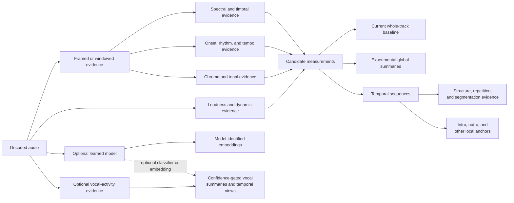

# Analysis evidence and computational considerations

**Status:** Living research and design proposal  
**Primary scope:** Experimental evidence identity, cost, and dependency relationships
**Last reviewed:** 2026-08-01

## Scope

This page describes information needed to compare analysis experiments. It does
not propose a `bliss-rs` API, Rust types, modules, crate boundaries, feature
gates, or an upstream extraction architecture. The filename is retained to
preserve existing links; implementation ownership remains outside the scope of
this site.

## Candidate evidence sets

An experiment may compare one or more of the following views:

- the current Version 2 whole-track baseline;
- additional global descriptor summaries;
- time-ordered frame or window sequences;
- structure, repetition, and segmentation evidence;
- bounded intro, outro, or other local anchors; and
- model-identified frame, segment, or whole-track embeddings.

No study needs to compute every view. It should declare exactly which evidence
was enabled and which configuration produced it so quality and resource cost
can be compared fairly. This experimental selection principle does not imply a
particular request API or result bundle.

## Experimental identity

Every non-baseline representation needs more identity than a vector length. A
human-readable experiment manifest should record at least:

- stable representation name and kind;
- descriptor names, ordering, units, and expected ranges;
- normalization and silence policy;
- sample-rate, channel, window, hop, cadence, and excerpt assumptions;
- temporal coverage and pooling or aggregation policy;
- minimum valid duration and missing-evidence semantics;
- confidence definition and calibration method;
- expected invariant, sensitive, and equivariant transformations; and
- exact extractor or research implementation identity.

For a learned representation, provenance additionally includes:

- model name, immutable version or artifact digest, and output dimension;
- model license and deployment assumptions;
- input normalization, excerpt selection, and pooling policy;
- training objective and supervision source at a useful level of description;
- augmentations that intentionally establish invariance; and
- output normalization and distance assumptions.

Confidence is not universally a probability. It may express detector strength,
ambiguity, stability, sample support, or boundary certainty. Each experiment
must state which meaning applies and how low-confidence or missing evidence
affects comparison.

## Computational relationships

The following diagram is a dependency map for candidate evidence, not a
software architecture or upstream implementation proposal:

Several candidates may depend on similar low-level calculations. A research
prototype should measure the quality and cost effects of sharing or duplicating
those calculations, but this document does not prescribe how an upstream
project should organize them.

Optional vocal analysis illustrates staged cost. A lightweight activity
detector can establish supported frames and vocal coverage before pitch,
delivery, technique, or embedding experiments run. Vocal source separation is
a possible higher-cost comparison condition whose artifacts and deployment
cost must be measured, not a baseline dependency.

## Retention tradeoffs

Some questions need only summary statistics; segmentation and sequence
comparison may need retained temporal evidence. Experiments should compare:

- streaming or incremental summary calculation;
- retained frame sequences for bounded corpora;
- one aligned cadence versus separate family-specific cadences;
- fixed windows versus content-dependent segments; and
- deterministic reconstruction from recorded configuration.

These are evaluation alternatives, not proposed iterator, sink, buffer, or
serialization APIs. Chroma and other families may have different accuracy and
retention characteristics, which should be measured rather than forced into one
generic assumption.

## Bounded audio

Anchors and segment experiments require correct behavior on short excerpts.
Descriptor validity must be tested as a function of duration: whole-track tempo,
dispersion, and chroma semantics may not remain reliable on a 15-second anchor.

Every bounded-audio study needs explicit timing, silence, fade, and boundary
policy. The fact that an implementation can technically analyze an arbitrary
slice does not establish that the resulting descriptor is meaningful or
comparable with its whole-track counterpart.
