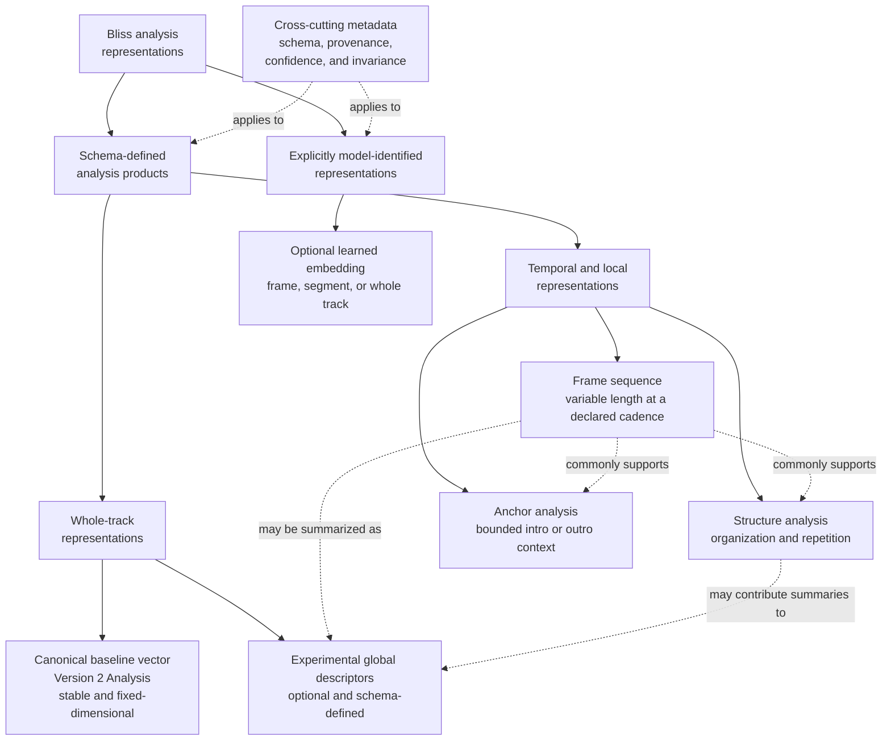

# Analysis products and descriptor families

**Status:** Living research and design proposal  
**Primary scope:** Flat, temporal, structural, anchor, and learned representations  
**Last reviewed:** 2026-07-23

## Representation taxonomy

The taxonomy classifies output contracts rather than implementation techniques.
A schema-defined descriptor or structure product may still use a learned
backend, in which case exact model provenance remains part of its identity.
Schema, provenance, confidence, and invariance are cross-cutting metadata. Solid
arrows show classification; dotted arrows show metadata applicability or common
derivation paths rather than required dependencies.

### Canonical baseline vector

The existing [`Analysis`](https://github.com/Polochon-street/bliss-rs/blob/master/src/song/mod.rs#L240) remains the small, versioned
representation expected by current playlist consumers.

Properties:

- one fixed-dimensional vector per track;
- cheap to store and load;
- suited to global pairwise distance;
- intentionally compatible and conservative.

### Experimental global descriptors

These are scalar track summaries under evaluation. They may be stored as a
named descriptor set instead of changing [`Analysis`](https://github.com/Polochon-street/bliss-rs/blob/master/src/song/mod.rs#L240).

Properties:

- fixed dimension within a declared schema;
- explicit name, units, range, confidence, and invariance contract;
- optional computation;
- individually ablatable;
- candidates for later promotion into a canonical feature version.

### Frame sequence

A frame sequence retains temporal measurements at a declared cadence.

Properties:

- fixed feature dimension within one schema;
- variable number of frames per track;
- timestamps or deterministic window/hop metadata;
- optional confidence per frame or feature;
- suitable for robust summaries, novelty, segmentation, anchors, and sequence
  comparison.

### Structure analysis

A structure analysis contains derived musical organization:

- novelty curve or selected novelty statistics;
- change points with confidence;
- sections or segments with an analysis scale or level;
- repetition and recurrence summaries;
- dominant-section and entropy measures;
- normalized feature-space path length.

It should distinguish computed evidence from an inferred section label. A
boundary may be useful even when the system cannot name the section "verse".
Because structure is hierarchical and partly viewpoint-dependent, the result
must not imply that one boundary set is the uniquely correct interpretation.
An experimental backend may return several compatible hypotheses or levels.

### Anchor analysis

An anchor describes a bounded local context such as an intro or outro:

- exact start and end time;
- local descriptor vector;
- loudness and boundary shape;
- tonal evidence where enabled;
- per-feature confidence;
- silence/fade handling policy.

Anchors are directional task inputs. They are not additional whole-track
features merely because they have a fixed dimension.

### Optional learned embedding

A learned embedding is a model-relative representation of a frame, segment, or
whole track. It can complement interpretable descriptors but is not an intrinsic
measurement with permanently stable semantics.

Properties:

- fixed dimension for one exact model and pooling configuration;
- optional computation behind an explicit backend or feature;
- model, training-objective, input, augmentation, and pooling provenance;
- separate identities for frame-, segment-, and track-level embeddings;
- declared intended sensitivities and invariances;
- no automatic inclusion in the canonical [`Analysis`](https://github.com/Polochon-street/bliss-rs/blob/master/src/song/mod.rs#L240)
  vector.

Learned embeddings are research products until they outperform simpler
representations on held-out target tasks and their deployment, licensing, and
versioning constraints are acceptable.

## Candidate global descriptor families

This is a research backlog, not the proposed Version 3 vector.

### Rhythm and tempo

| Candidate | Hypothesis | Important caveat |
|---|---|---|
| Tempo confidence | Downweight ambiguous tempo estimates | Detector confidence needs calibration |
| Tempo stability | Distinguish steady from varying tempo | Separate expressive timing from detector noise |
| Pulse clarity | Distinguish strong from weak rhythmic pulse | Genre and recording dependent |
| Onset density | Represent event/activity rate beyond BPM | Sensitive to mastering and percussion |
| Rhythmic regularity | Distinguish periodic from irregular activity | Window and tempo normalization matter |
| Rhythmic complexity/syncopation | Capture groove differences | Requires a precise, validated definition |

Tempo and key illustrate why analysis semantics must be task-conditioned. A
general style view may want reduced tempo sensitivity, while mix compatibility
usually needs the actual tempo, half/double-time alternatives, and stability.
The extractor should preserve this evidence and let the consumer choose the
view.

### Structure and repetition

| Candidate | Hypothesis | Important caveat |
|---|---|---|
| Repetition ratio | Identify recurrent musical material | Depends on frame representation and threshold |
| Change-point rate | Represent structural activity | Normalize by duration and confidence |
| Dominant-section share | Detect tracks governed by one texture | Segmentation errors can dominate |
| Section entropy | Separate repetitive from diverse arrangements | Do not treat cluster labels as truth |
| Normalized path length | Measure feature evolution over time | Must be duration and cadence invariant |
| Multi-scale recurrence | Distinguish local motifs from large repeated sections | Requires an explicit scale and feature source |
| Boundary hierarchy | Retain strong and weak structural levels | Multiple interpretations may be valid |

One scalar named `structural_variance` is unlikely to capture all of these
independent properties.

### Dynamics and perceived energy

| Candidate | Hypothesis | Important caveat |
|---|---|---|
| Loudness range | Distinguish flat from dynamic tracks | Define standard and gating correctly |
| Crest-factor summary | Capture transient versus compressed character | Level normalization affects interpretation |
| Energy trajectory | Preserve rising, falling, and alternating intensity | Belongs primarily in a sequence/anchor view |
| Spectral flux | Represent timbral/event change | Correlates with onset density |
| Bass-energy proportion | Capture low-frequency weight | Playback/mastering dependent |

"Energy" should not be introduced as an unexplained scalar. Perceived
intensity is likely a combination of loudness, density, transients, spectrum,
and temporal development.

### Tonality and harmony

| Candidate | Hypothesis | Important caveat |
|---|---|---|
| Key/mode with confidence | Support key-sensitive tasks | Categorical and ambiguous; not a global distance scalar |
| Harmonic-change rate | Distinguish static from changing harmony | Requires temporal tonal evidence |
| Harmonic-change magnitude | Distinguish frequent small changes from large tonal moves | Depends on tonal representation and distance |
| Tonal stability | Represent concentration versus movement | Separate key changes from noise |
| Tonal dispersion | Measure local deviation from a track-level tonal center | Interpretation varies for weakly tonal music |
| TIV entropy | Represent organization/complexity of pitch-class content | Definition and time scale must be explicit |
| Perceptual sonority qualities | Represent dissonance, chromaticity, diatonicity, and related qualities | Evidence comes mainly from Western tonal style tasks |
| Short/long-term tonal relation | Distinguish local chord-scale organization from large-scale tonal movement | Belongs to a multi-scale product before scalar promotion |
| Soft chord-transition statistics | Capture ordered harmonic movement without a brittle decoded sequence | Requires calibrated posterior-like evidence |
| Tonal-centroid trajectory | Compare local harmonic movement | Variable-length structured representation |

The current chroma-derived features are intentionally transposition-invariant.
That is useful for global harmonic character. Absolute key should be a separate,
task-selectable representation rather than silently changing that invariance.

The first harmonic prototype should expose a simple fixed-window tonal series
and derive several scales from it. It should compare the existing chroma
representation with a perceptually motivated TIV or equivalent representation.
Context-sensitive harmonic segmentation should remain a later experiment until
its incremental retrieval value justifies its extra cost.

Hard chord labels are not required for these experiments. If chord inference is
introduced, soft class evidence and transition probabilities should remain
available so an uncertain local decision does not become irreversible input to
all downstream descriptors.

### Bass-specific evidence

Possible measurements include:

- low-band energy and dynamics;
- bass-band onset density;
- low-register pitch-class evidence;
- bass rhythmic periodicity;
- coupling between bass and the general onset pattern.

A bass "pattern" is primarily temporal. Scalar summaries may complement, but
should not replace, the sequence.

### Vocal presence and character

Vocal evidence may improve similarity because the current whole-track vector
does not explicitly distinguish an instrumental track from one dominated by
clean singing, speech, shouting, or extreme vocal technique. It should not be
one mutually exclusive label: presence, register, delivery, and technique are
different properties, and several may occur in the same frame or track.

A layered experimental representation could expose:

- frame- or segment-level vocal-presence probability and whole-track vocal
  coverage;
- lead-vocal dominance and a temporal vocal-activity profile;
- pitch and tessitura statistics, such as median and robust range, only over
  supported voiced frames;
- multi-label probabilities for clean singing, spoken or rap delivery, breathy
  or whispered voice, falsetto or head voice, shout, scream, growl, and rough
  or distorted phonation;
- evidence for choir, backing, duet, or otherwise multiple voices; and
- an optional model-identified vocal embedding at frame, segment, or track
  level.

These outputs need temporal aggregation. A song can move from an instrumental
intro to a clean verse and a screamed chorus; one track-level class would erase
the distinction that may matter most for sequencing or transition scoring.
Missing vocal evidence is not an ordinary zero: style, pitch, and technique are
inapplicable when no vocal is detected and should be confidence-gated.

Terms such as soprano describe more than fundamental-frequency range and are
not reliably inferred from pitch alone. Continuous register and tessitura
evidence is the safer initial product. Any categorical voice-type estimate must
declare its supported repertoire, annotation policy, confidence, and biases.
Existing binary male/female vocal models should at most be interpreted as
model-relative perceived vocal presentation, not biological sex, gender
identity, or singer identity.

The first prototype should prioritize vocal activity and coverage, then test
whether technique probabilities or a compact embedding add held-out similarity
value. Source separation may improve vocal-specific analysis, but it is an
optional high-cost backend with artifact and deployment tradeoffs, not a
requirement for the baseline analyzer.

### Instrument and source character

Explicit instrument presence generally requires a classifier or embedding. If
added, it should be optional and return probabilities or confidence-bearing
evidence rather than hard labels.

Potential problems include dataset bias, domain shift, correlated outputs,
model size, licensing, platform availability, and instability across model
updates. This family is lower priority than interpretable rhythm, structure,
dynamics, and tonal measurements.
