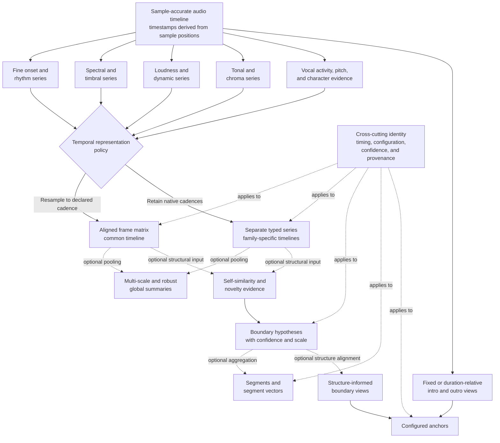

# Temporal representation, invariance, and confidence

**Status:** Living research and design proposal  
**Primary scope:** Time-varying evidence, invariance, and confidence
**Last reviewed:** 2026-08-01

## Temporal representation design

The following diagram shows temporal alignment and derivation policy. It does
not prescribe one cadence, require segmentation, or imply that anchors depend
on structural boundaries:

### Frame cadence

No universal frame duration and hop is assumed. Fine cadence improves boundary
and onset detail but increases storage and may make slow structure noisy. A
prototype should compare at least:

- one shared fine sequence with later pooling;
- separate cadences for rhythmic, timbral, and structural evidence;
- multi-scale summaries derived from shared low-level measurements;
- fixed musical or wall-clock windows against context-sensitive segmentation.

Frame timestamps should be derived from sample positions, not accumulated
floating-point durations.

### Feature alignment

Descriptor families naturally operate at different windows and hops. A single
rectangular `frame_count x feature_count` matrix is convenient but may imply
false simultaneity.

Options include:

1. resample all measurements onto a declared common timeline;
2. retain separate typed series per descriptor family;
3. compare low-level family-specific series with a derived aligned view.

An initial study may use an aligned sequence, but it should still compare
family-specific cadences when alignment may lose important information.

### Segmentation

Segmentation should not initially assume K-means or named verse/chorus labels.
A general study can record:

- feature source and scale;
- self-similarity construction;
- novelty computation;
- peak/change-point candidates;
- boundary confidence;
- optional segment vector aggregation;
- optional alternative boundary levels or hypotheses.

Experiments can compare fixed windows, change points, and explicit segments
before one method becomes a recommended view. A boundary result should state whether it was
driven by harmony, timbre, rhythm, a fused representation, or a learned model.
Two valid structural analyses of the same track may emphasize different
properties or time scales.

For the first prototype, fixed-window and conventional self-similarity/novelty
baselines should precede a learned or context-sensitive segmenter. This provides
an interpretable reference, keeps incremental analysis cost measurable, and
avoids treating an early model as the assumed representation.

### Anchors

Anchor extraction needs explicit policy:

- fixed or duration-relative length;
- leading/trailing digital-silence handling;
- fade preservation;
- short-track behavior;
- one window versus several pooled subwindows;
- descriptor validity on the selected duration.

An intro/outro is a configured view of the audio, not an intrinsic universal
boundary. Its policy belongs in the experimental identity.

## Invariance expectations

Each descriptor or representation should document expected behavior under
controlled transformations. "Invariant" alone is too narrow. At least three
behaviors are useful:

- **invariant:** the representation should remain within a declared tolerance;
- **sensitive:** the transformation intentionally changes the evidence because
  the property may matter to a downstream task;
- **equivariant or controllable:** the output should change in a predictable,
  documented way, allowing the consumer to retain or manipulate that property.

A representation can expose more than one view. For example, transposition-
invariant harmonic character and absolute-key evidence can be derived from the
same retained tonal sequence without claiming that either is universally
correct.

Examples:

| Transformation | Possible global contract | Possible task-sensitive contract |
|---|---|---|
| Constant gain | Spectral/harmonic views invariant after normalization | Loudness and boundary mismatch remain sensitive |
| Codec change | Stable within a measured tolerance | Confidence may fall for severe artifacts |
| Small leading/trailing trim | Whole-track summaries mostly invariant | Anchor timing and boundary shape remain sensitive |
| Alternate master | Musical-content views mostly invariant | Dynamics, spectral balance, and loudness remain sensitive |
| Time stretch | Style/timbre view may be invariant | Tempo and groove are sensitive; a learned representation may be tempo-equivariant |
| Pitch transposition | Harmonic-character view may be invariant | Absolute key and bass register remain sensitive |
| Equalization | Some learned/global views may suppress it | Timbre and bass-weight views remain sensitive |
| Added boundary silence | Often ignored by global summaries | Preserved by intro/outro views under declared policy |

There is no correct universal preprocessing chain. Task-specific studies may
derive different views from the same retained evidence. The experiment must
identify which view was produced.

For learned representations, expected behavior is partly established by training
data, positive-pair construction, augmentations, and objective. A model trained to ignore pitch shifts or
time stretching must not be advertised for key- or tempo-sensitive retrieval
without separate evidence. Transformation tests should verify the claimed
behavior directly on held-out audio.

## Feature confidence

Confidence should accompany measurements that can be ambiguous or unsupported:

- tempo detector confidence and half/double-time alternatives;
- key ambiguity and competing modes;
- soft chord or sonority alternatives where inferred;
- weak-tonality or unsupported-domain evidence;
- insufficient onset count;
- short-window validity;
- segmentation boundary strength;
- alternative-structural-hypothesis support;
- silence/fade confidence;
- vocal-activity probability and supported-frame coverage;
- pitch or tessitura validity only within supported voiced frames;
- vocal-technique probability, entropy, and supported-domain evidence;
- instrument classifier probability or entropy.

Consumers should be able to downweight or omit unreliable components. Missing
or invalid evidence must not be encoded as an ordinary zero unless zero is a
valid, distinguishable measurement.

Vocal evidence is especially conditional. A technique or pitch estimate should
not contribute when vocal presence is absent or uncertain, and a whole-track
summary should retain enough coverage and temporal information to distinguish
sparse vocals from a continuously vocal track. Classifier confidence must not
be mistaken for support outside the model's training domain.
