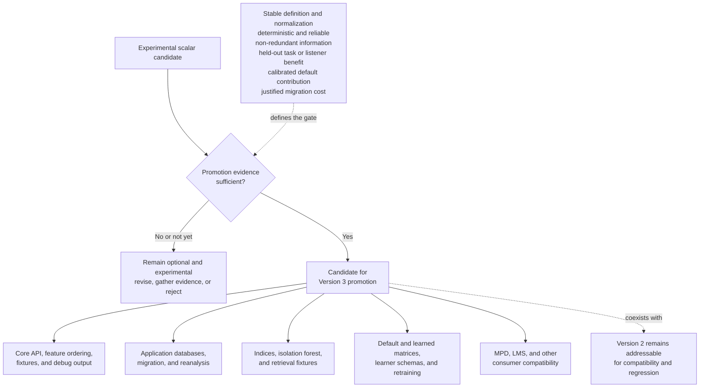

# Versioning, serialization, and resource cost

**Status:** Living research and design proposal  
**Primary scope:** Compatibility, persistence contracts, performance, and storage  
**Last reviewed:** 2026-07-14

## Future [`FeaturesVersion::Version3`](https://github.com/Polochon-street/bliss-rs/blob/master/src/lib.rs#L147)

The diagram summarizes a possible promotion gate and its compatibility impact;
it is not a commitment to create Version 3 or to promote any current candidate:



### Promotion criteria

A scalar should enter the canonical vector only when:

- its definition and normalization are stable;
- it is deterministic across supported decoders within declared tolerance;
- it has fixtures and invariance tests;
- it is reliable on the supported track-duration range;
- it adds information beyond existing features;
- it improves a defined held-out aspect-specific retrieval, playlist, or
  listener outcome;
- its default distance contribution has been calibrated;
- downstream migration cost is justified.

### Versioning consequences

A Version 3 release would require coordinated changes to:

- [`FeaturesVersion`](https://github.com/Polochon-street/bliss-rs/blob/master/src/lib.rs#L147),
  [`AnalysisIndex`](https://github.com/Polochon-street/bliss-rs/blob/master/src/song/mod.rs#L103), feature counts, and debug output;
- all golden analysis fixtures;
- library schema and migrations;
- `blissify-rs` persistence, configured metrics, reanalysis, and playlist
  behavior;
- `bliss-analyser` columns or vector serialization;
- fixed-dimension isolation forest use;
- default and learned distance matrices;
- `bliss-mixer` loading and diagnostics;
- `bliss-learner`, which currently assumes 23 named columns;
- compatibility and partial-library behavior.

### Default metric

Adding a dimension must not automatically imply equal Euclidean importance.
Version 3 needs a declared baseline normalization or weight matrix. Otherwise a
feature can dominate simply because of scale, redundancy, or multiplicity.

The Version 2 baseline must remain addressable for regression comparisons and
old stored analyses.

## Serialization contract

`bliss-rs` should make structured representations serializable or expose enough
metadata for deterministic consumer serialization. It should not require one
database schema.

### Dense numeric encoding

A simple interoperable encoding for a frame series is:

```text
encoding: f32le-row-major-v1
shape: frame_count x feature_count
values: contiguous little-endian IEEE-754 f32
```

Confidence may use a parallel array with the same shape or a representation-
specific compact shape. The manifest must declare it.

JSON is suitable for a small schema manifest, not for millions of floating-
point frame values. Compression should be optional and added only after size
and CPU measurements.

### Required stored metadata

A serialized representation needs:

- representation kind and schema ID;
- feature manifest or resolvable manifest ID;
- dimension and shape;
- encoding and compression;
- sample rate assumptions;
- window and hop policy;
- time origin and covered sample/time range;
- normalization and silence policy;
- confidence layout;
- analyzer implementation version;
- learned-model provenance where applicable, including artifact identity,
  input/pooling policy, objective, and declared augmentation-derived
  invariances;
- compatible baseline feature version.

### Storage recommendation for applications

A library analyzer can store structured output in a sidecar SQLite database:

- stable scalar vectors and anchors as one compact row/BLOB per track and kind;
- dense frames as one shaped BLOB per track and series;
- segments as individual rows with start/end times and vectors;
- optional learned embeddings as model-identified shaped BLOBs;
- representation manifests in a schema table;
- source size/mtime or content identity for invalidation.

The sidecar keeps experimental lifecycle separate from a stable Bliss database.
It may later be consolidated after ownership, migrations, and retention policy
are proven.

Do not store one SQL row per feature value. Do not persist a quadratic
self-similarity matrix by default; retain its frame source and compact derived
results so it can be regenerated offline.

## Performance and storage

### Illustrative frame cost

For a five-minute track, a five-second hop gives about 60 frames. With 32
[`f32`](https://doc.rust-lang.org/std/primitive.f32.html) features:

```text
60 * 32 * 4 bytes = 7,680 bytes per track
```

At 100,000 tracks, raw values alone are about 0.77 GB. A one-second hop is about
five times larger. Database, manifests, confidence, and indexing add overhead.

These estimates are manageable for optional dense sequences but justify an
explicit retention policy.

### Hot and cold products

Applications should distinguish:

- **hot runtime data:** global summaries, structure summaries, anchors, and
  selected segment vectors or validated track embeddings;
- **cold rebuildable data:** dense frame sequences, experimental embeddings,
  and research intermediates.

A normal mix request should not load dense frame sequences when precomputed
runtime representations suffice.

### Analysis cost

Benchmarks should report incremental cost over Version 2 for each requested
product:

- wall time and CPU time;
- peak memory;
- temporary allocation;
- serialized size;
- decoder parity;
- effect of retaining versus streaming frames;
- model loading, inference, and accelerator requirements for learned products.
