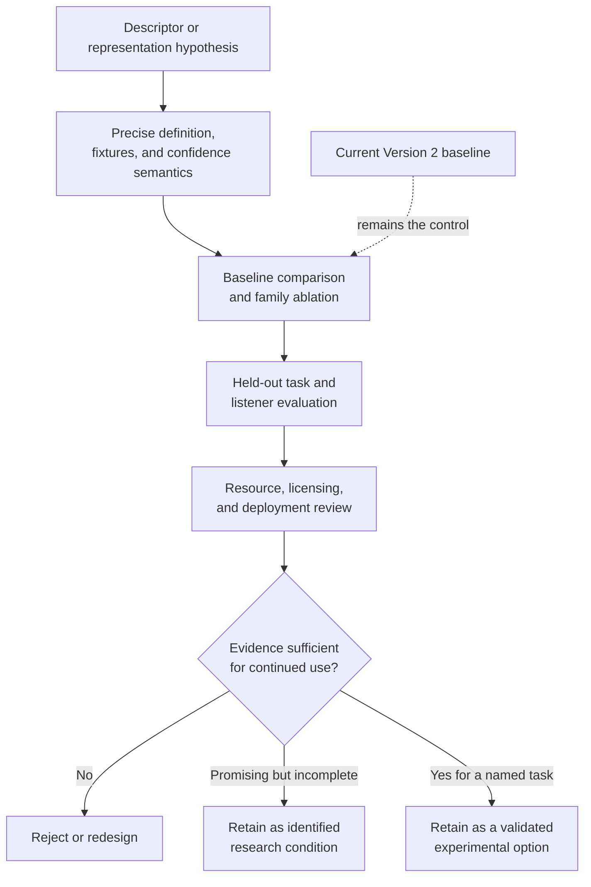

# Evidence maturity, reproducibility, and resource cost

**Status:** Living research and design proposal  
**Primary scope:** Candidate maturity, experimental identity, performance, and storage cost
**Last reviewed:** 2026-08-01

## Scope

This page defines when an analysis idea has enough evidence to remain in the
research program and what must be recorded to reproduce it. It does not propose
a new Bliss feature version, upstream serialization API, database schema,
migration, or release plan.

## Candidate maturity



The final state in this diagram means only that a candidate has earned continued
evaluation or use in a named experiment. It does not authorize an upstream code
change or imply inclusion in a canonical vector.

### Retention criteria

A candidate should remain under consideration only when:

- its definition and normalization are stable enough to reproduce;
- it is deterministic within a declared tolerance;
- it has fixtures, validity limits, and transformation tests;
- confidence or missing-evidence behavior is defined;
- it adds information beyond the current baseline or a simpler candidate;
- it improves a held-out, aspect-specific retrieval, playlist, transition, or
  listener outcome; and
- its analysis, storage, licensing, and deployment cost is reported.

Candidates that fail these conditions are useful negative results. They should
not be retained merely because they sound musically plausible or increase model
capacity.

## Experimental compatibility

Two results are comparable only when the representation identity matches. The
recorded identity should cover:

- representation kind, feature names, order, dimension, and units;
- normalization, preprocessing, silence policy, and bounded-audio policy;
- sample rate, channels, windows, hops, cadence, and pooling;
- confidence layout and missing-value semantics;
- extractor and dependency versions;
- learned-model artifact and input policy where applicable; and
- the baseline representation and distance used as the control.

Changing one of these properties creates a different experimental condition.
A learned matrix or classifier result tied to one condition cannot be assumed
compatible with another merely because the dimensions happen to match.

## Reproducible research data

Dense sequences, segments, anchors, and embeddings may need persistence during
experiments. This site does not select an encoding or database layout. Whatever
format a study uses should preserve:

- the complete experimental identity above;
- array shape, ordering, timing, and covered audio range;
- confidence and validity information;
- source-audio identity sufficient to detect replacement;
- compression and numeric precision; and
- enough provenance to rebuild or reject stale results.

Human-readable manifests are useful for auditing, while bulk numeric evidence
usually needs a compact representation. Quadratic intermediates such as full
self-similarity matrices should be counted explicitly and need not be retained
when compact derived evidence and reproducible inputs suffice. These are
research-data considerations, not an upstream persistence recommendation.

## Performance and storage

### Illustrative frame cost

For a five-minute track, a five-second hop gives about 60 frames. With 32
single-precision values per frame:

```text
60 * 32 * 4 bytes = 7,680 bytes per track
```

At 100,000 tracks, raw values alone are about 0.77 GB. A one-second hop is about
five times larger. Confidence, manifests, indices, compression, and database
overhead change the real total. The example illustrates why cadence and
retention must be evaluated rather than prescribing a storage design.

### Frequently used and research-only evidence

Evaluation should distinguish evidence needed for runtime scoring from evidence
retained only to derive or inspect an experiment:

- compact global summaries, anchors, or selected segment vectors may be cheap
  enough for frequent scoring;
- dense frame sequences, large embeddings, and research intermediates may be
  needed only offline; and
- a study should report whether a compact derived view reproduces the benefit
  of the denser source.

This distinction is a resource measurement, not a proposed application cache or
upstream storage architecture.

### Analysis cost

Benchmarks should report incremental cost over Version 2 for each experimental
condition:

- wall time and CPU time;
- peak memory and temporary allocation;
- retained or serialized size;
- decoder and platform variation;
- effect of retaining versus aggregating frames; and
- model loading, inference, artifact size, and accelerator requirements for
  learned representations.
