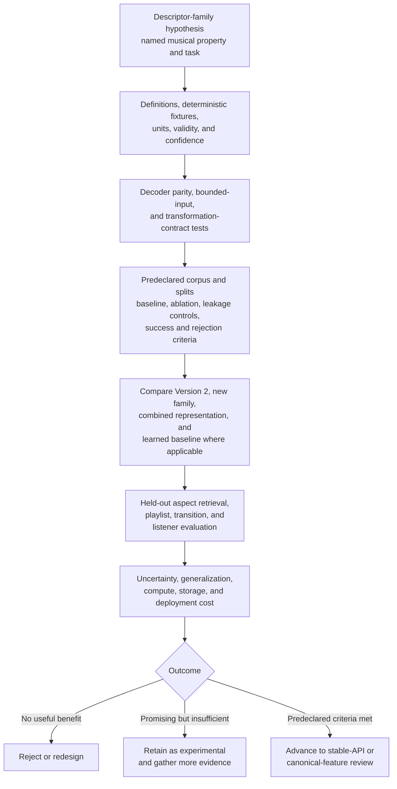

# Analysis evaluation

**Status:** Living research and design proposal  
**Primary scope:** Descriptor validity, representation tests, retrieval, and listener studies  
**Last reviewed:** 2026-07-23

## Descriptor tests

Every proposed descriptor needs:

- deterministic synthetic or recorded fixtures;
- units and range tests;
- silence and short-input behavior;
- decoder parity tolerance;
- confidence behavior;
- invariance tests for declared transformations;
- invalid/missing evidence behavior.

## Representation tests

- exact frame timestamps and shape;
- window/hop edge cases;
- bounded-excerpt behavior;
- segment coverage and non-overlap policy;
- anchor boundaries and short tracks;
- schema mismatch rejection;
- serialization round trips;
- reproducibility across thread counts;
- multi-scale and structural-level identity;
- learned-model artifact and pooling mismatch rejection;
- measured transformation behavior for declared invariant, sensitive, and
  equivariant properties.

### Vocal-evidence evaluation

Vocal experiments need annotated time segments and track-level listening review,
not only tag classification. Test at least instrumental music, sparse and
continuous vocals, clean-to-harsh changes, speech or rap, choirs or multiple
voices, processed or pitch-shifted voices, live recordings, and genres outside
the model's training distribution.

Report vocal-activity calibration and temporal coverage before evaluating pitch,
delivery, or technique. Pitch and tessitura errors count only where voiced-frame
support is valid. Technique outputs are multi-label probabilities, so evaluation
must include calibration, per-label support, co-occurrence, domain shift, and the
effect of confidence gating. Any perceived vocal-presentation experiment must be
defined as a timbral perception task rather than biological sex, gender identity,
or singer identity.

Similarity ablations should compare presence alone, presence plus continuous
register/activity, presence plus technique or embedding, and the complete fused
view. This separates genuine character information from gains caused merely by
distinguishing vocal and instrumental tracks.

## Experimental protocol

The experimental funnel separates exploratory descriptor discovery from the
evidence needed for stabilization or canonical-feature review:

Each descriptor-family experiment should state in advance:

- the musical property and downstream task it is expected to improve;
- the baseline, representation, distance, and normalization;
- the corpus scope and known unsupported domains;
- train, validation, and test separation, including artist/album leakage
  controls where a learned component is involved;
- the ablation that isolates the new information from increased dimension or
  model capacity;
- computational and storage cost;
- success, equivalence, and rejection criteria.

Evaluation should compare at least the Version 2 baseline, the new
interpretable family alone, the combined representation, and any learned
embedding baseline. Learned and handcrafted products should be evaluated both
independently and in fusion so that complementary value is distinguishable from
replacement value.

Where practical, an audio-only AudioMuse-AI run over the same library can serve
as an end-to-end comparison. It must not be presented as a descriptor ablation:
its extraction, pooling, indexing, clustering, retrieval, and playlist policy
form one system. Essentia-, librosa-, MAEST-, musicnn-, or MERT-based experiments
should instead enter as identified component baselines under a common retrieval
and evaluation harness. Any metadata-, lyrics-, or text-conditioned result must
be reported separately from audio-only similarity.

Because AudioMuse-AI is already available to Lyrion users, the comparison should
also measure operational suitability on representative player hardware. A Pi 5
with 8 GB RAM and NVMe is a documented working configuration, but results must
not be generalized to older or smaller Raspberry Pi systems without measuring
analysis throughput, clustering time, peak and idle memory, storage traffic,
thermal throttling where observable, and concurrent playback behavior.

Descriptor discovery may use exploratory analysis, but promotion evidence
should come from held-out tests. Multiple comparisons and repeated tuning on a
small listening set must be reported rather than hidden behind the final
configuration.

## Retrieval and listener evaluation

New descriptor families should be ablated one at a time against Version 2.
Evaluation should include:

- symmetric song-similarity triplets with an explicitly named aspect;
- aspect-conditioned nearest-neighbor review for rhythm, harmony, energy,
  timbre, instrumentation, vocal presence or character, and structure where
  supported;
- invariance under alternate masters and codecs;
- sensitivity/equivariance tests for tempo, pitch, gain, trim, and boundary
  transformations as declared by the schema;
- playlist relevance and diversity ratings;
- directional transition judgments for anchors;
- structurally simple and varied tracks;
- cases where Version 2 is known to fail;
- missing/low-confidence fallback behavior;
- repeated judgments on a calibration subset to estimate intra-rater
  stability and inter-rater disagreement.

Questions should be specific enough to identify the modeled outcome. Examples
include:

- Which pair is closer in rhythmic feel?
- Which pair has more similar harmonic movement?
- Which track has more compatible energy development?
- Which pair has more similar vocal activity and delivery?
- Which successor creates the smoother transition from this exact outro?
- Which result better continues the seed group while avoiding repetition?

Unqualified "general similarity" may still be measured as a secondary holistic
outcome, but it should not be the only ground truth. Transition evaluation must
also remain separate from symmetric whole-track similarity because direction,
boundary context, and playlist history change the task.

A higher-dimensional model that only improves training fit is not an analysis
improvement.
