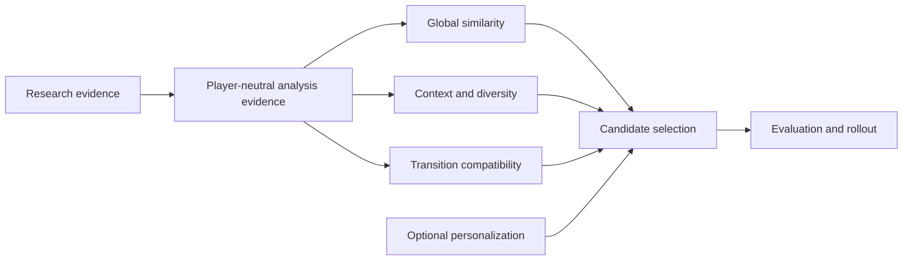

# Bliss similarity and analysis design

**Status:** Living research and design proposal  
**Last reviewed:** 2026-08-01

This site develops a research-backed path for improving how Bliss represents,
compares, and selects music. Its primary goal is better mixing quality through
better similarity criteria. Transition-aware selection is one important use
case, but the scope also includes psychoacoustics, temporal structure,
segmentation, structural variance, contextual similarity, diversity, and
personalization.

The discussion is deliberately split between analysis questions and downstream
mixing questions. It does not present experimental ideas as accepted
`bliss-rs` direction, propose changes to that project's code or architecture,
or require one player ecosystem.

## How to read this site

| Area | Question answered | Start here |
|---|---|---|
| Foundations | What exists today, and where are the system boundaries? | [Current system and ecosystem](foundations/current-system.md) |
| Research | What evidence supports or challenges the proposal? | [Analysis research](research/analysis-research.md) and [mixing research](research/mixing-research.md) |
| Analysis | Which additional forms of musical evidence might improve similarity? | [Analysis evolution](analysis/overview.md) |
| Mixing | How could consumers turn that evidence into better sequences? | [Mixing architecture](mixing/overview.md) |
| Integration | How do current consumers and experiments relate? | [Downstream consumers](integration/downstream-consumers.md) |
| Evaluation | How will the hypotheses be tested and delivered safely? | [Analysis evaluation](evaluation/analysis-evaluation.md) and [mixing evaluation](evaluation/mixing-evaluation.md) |

## Scope boundary

The analysis section is the source of truth for descriptor hypotheses, temporal
representations, confidence and provenance needs, experimental cost, and
evaluation. The mixing section covers candidate selection, context, diversity,
personalization, transition scoring, and downstream experiments.

The site describes the current `bliss-rs` implementation where that is useful
evidence, but it deliberately does not assign future responsibilities, public
types, modules, feature versions, or release work to the upstream project.
Whether any promising idea belongs upstream, in a separate research tool, or
only in an application is a decision for the relevant maintainers after the
evidence exists.

## Evidence and proposal status

The pages distinguish among:

- the **stable baseline**, describing behavior that exists today;
- **experimental evidence**, describing prototypes or comparison systems;
- a **working proposal**, which still requires design review and validation;
- an **open question**, for which the evidence or ownership is unresolved.

No candidate descriptor or metric is assumed to improve perceived similarity.
Promotion into a stable representation requires reproducible extraction,
measurable downstream benefit, acceptable resource cost, and listener-facing
evaluation.

## Project context

The repositories directly involved in the design's lineage and implementation
are listed first. Repositories used only as platform evidence or external
comparison baselines follow, so their inclusion does not imply that they are
proposed dependencies. This inventory includes every GitHub repository linked
elsewhere in the site.

### Documentation

| Repository | Role in this work |
|---|---|
| [`chrober/bliss-similarity-design`](https://github.com/chrober/bliss-similarity-design) | Canonical source for this cross-repository research and design site. |

### Bliss and MPD lineage

| Repository | Role in this work |
|---|---|
| [`Polochon-street/bliss-rs`](https://github.com/Polochon-street/bliss-rs) | Upstream, player-neutral audio-analysis library and owner of the stable Bliss representation. |
| [`Polochon-street/blissify-rs`](https://github.com/Polochon-street/blissify-rs) | MPD application demonstrating analysis persistence, configurable metrics, playlist generation, and consumption of a learned matrix. |
| [`Polochon-street/bliss-metric-learning`](https://github.com/Polochon-street/bliss-metric-learning) | Upstream experimental odd-one-out survey and Python metric trainer built around a `blissify-rs` library. |

### LMS lineage and current experiments

| Repository | Role in this work |
|---|---|
| [`CDrummond/bliss-analyser`](https://github.com/CDrummond/bliss-analyser) | Original offline analyzer and owner of the LMS-side `bliss.db` schema. |
| [`CDrummond/bliss-mixer`](https://github.com/CDrummond/bliss-mixer) | Original HTTP mixing service and source of the Static Weights and Extended Isolation Forest strategies. |
| [`CDrummond/lms-blissmixer`](https://github.com/CDrummond/lms-blissmixer) | Original Lyrion Music Server plugin and upstream of the current `chrober/lms-blissmixer` fork. |
| [`chrober/bliss-mixer`](https://github.com/chrober/bliss-mixer) | Mixer fork adding variance-based Adaptive Weighting and learned-matrix loading, use, and blending. |
| [`chrober/lms-blissmixer`](https://github.com/chrober/lms-blissmixer) | LMS integration fork hosting the current similarity survey and user-facing experiments. |
| [`chrober/bliss-learner`](https://github.com/chrober/bliss-learner) | Experimental Rust port of the `bliss-metric-learning` training workflow, adapted to the LMS survey and consumed by the mixer fork. |

### Platform and historical evidence

| Repository | Role in this work |
|---|---|
| [`LMS-Community/slimserver`](https://github.com/LMS-Community/slimserver) | Lyrion Music Server source and preserved MusicMagic/MusicIP plugin behavior used as historical implementation evidence. |

### External comparison and research baselines

| Repository | Role in this work |
|---|---|
| [`NeptuneHub/AudioMuse-AI`](https://github.com/NeptuneHub/AudioMuse-AI) | Current self-hosted end-to-end comparison system with sonic analysis, similarity, clustering, paths, and LMS/Lyrion integration. |
| [`MTG/essentia`](https://github.com/MTG/essentia) | Broad audio-analysis and model-inference framework used as a descriptor and representation baseline. |
| [`jordipons/musicnn`](https://github.com/jordipons/musicnn) | Pretrained music-tagging and feature-extraction models used as a learned-representation baseline. |
