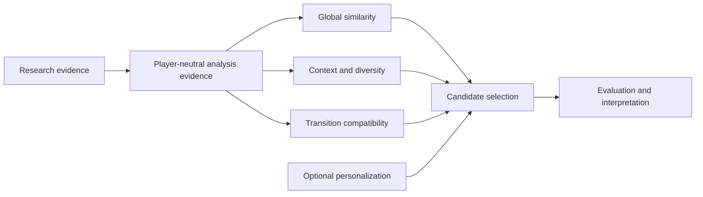

# Bliss similarity and analysis design

**Status:** Living research synthesis and design exploration

**Last reviewed:** 2026-08-19

## Abstract

Bliss already provides a valuable foundation for local, privacy-friendly music
analysis: compact whole-track acoustic features, deterministic processing, and
fast library-scale comparison. This document explores how that foundation could
evolve toward richer, task-aware musical understanding while preserving the
audio-first and local-first strengths that make Bliss attractive.

The site does not assume a particular extension model for `bliss-rs`. It asks
which forms of evidence are lost when music is reduced to one compact
whole-track vector and which of them might improve a defined task. Candidate
research conditions include temporal frame series, structure and repetition
summaries, intro/outro anchors, richer rhythm and onset evidence, energy and
loudness shape, bass behavior, tonal and harmonic stability, vocal or source
character, and carefully scoped embeddings.

These candidates are hypotheses, not proposed library outputs. Meaningful
experiments still need precise definitions, timing, provenance, confidence,
validity, invariance assumptions, computational cost, and fallback behavior.
Recording those properties makes comparisons reproducible; it does not imply a
public API, storage format, crate boundary, or implementation owner.

The broader question is how music similarity should be judged in practice.
Bliss currently exposes compact analysis features that downstream tools can
compare, combine, and adapt in different ways. This document asks how that
foundation could be evaluated through real musical tasks: sequencing,
continuation, grouping, transition judgment, personalization, library
exploration, and listener-facing workflows. Explicit user judgments, curated
collections, playback behavior, downstream application outcomes, and controlled
evaluation sets can all provide different kinds of evidence. None of these
signals is perfect ground truth by itself, but together they can reveal where
the current representation is already useful, where it struggles, and which
candidate dimensions are worth continued study.

For the wider Bliss ecosystem, the research opportunity is to test whether
richer local acoustic evidence can improve musical tasks without giving up
determinism, privacy, or local control. The site therefore connects analysis
hypotheses with similarity behavior and task-level evaluation while leaving
implementation and ownership decisions open.

The discussion is deliberately split between analysis questions and downstream
mixing questions. It does not present experimental ideas as accepted
`bliss-rs` direction, propose changes to that project's code or architecture,
or require one player ecosystem.

## How to read this site

| Area | Question answered | Start here |
|---|---|---|
| Foundations | What exists today, and where are the system boundaries? | [Current system and ecosystem](foundations/current-system.md) |
| Research | What evidence supports or challenges the candidate hypotheses? | [Analysis research](research/analysis-research.md) and [mixing research](research/mixing-research.md) |
| Analysis | Which additional forms of musical evidence might improve similarity? | [Analysis research scope](analysis/overview.md) |
| Mixing | How could consumers use that evidence in better sequences? | [Mixing scope and conceptual layers](mixing/overview.md) |
| Integration | How do current consumers and experiments relate? | [Downstream consumers](integration/downstream-consumers.md) |
| Evaluation | How will the hypotheses be tested and interpreted responsibly? | [Analysis evaluation](evaluation/analysis-evaluation.md) and [mixing evaluation](evaluation/mixing-evaluation.md) |

## Scope boundary

The analysis section is the source of truth for descriptor hypotheses, temporal
representations, confidence and provenance needs, experimental cost, and
evaluation. The mixing section covers candidate selection, context, diversity,
personalization, transition scoring, and downstream experiments.

The site describes the current `bliss-rs` implementation where that is useful
evidence, but it deliberately does not assign future responsibilities, public
types, modules, feature versions, or release work to the upstream project.
Whether any promising idea belongs upstream, in a separate research tool, or
only in an application is a decision for the relevant maintainers after the
evidence exists.

## Evidence and hypothesis status

The pages distinguish among:

- the **stable baseline**, describing behavior that exists today;
- **experimental evidence**, describing prototypes or comparison systems;
- a **research or design hypothesis**, which still requires review and
  validation;
- an **open question**, for which the evidence remains unresolved.

No candidate descriptor or metric is assumed to improve perceived similarity.
Further consideration requires reproducible extraction, measurable downstream
benefit, acceptable resource cost, and listener-facing evaluation.

## Project context

The repositories directly involved in the design's lineage and current
experiments are listed first. Repositories used only as platform evidence or
external comparison baselines follow, so their inclusion does not imply that
they are proposed dependencies. This inventory includes every GitHub repository
linked elsewhere in the site.

### Documentation

| Repository | Role in this work |
|---|---|
| [`chrober/bliss-similarity-design`](https://github.com/chrober/bliss-similarity-design) | Canonical source for this cross-repository research and design site. |

### Bliss and MPD lineage

| Repository | Role in this work |
|---|---|
| [`Polochon-street/bliss-rs`](https://github.com/Polochon-street/bliss-rs) | Upstream, player-neutral audio-analysis library and owner of the stable Bliss representation. |
| [`Polochon-street/blissify-rs`](https://github.com/Polochon-street/blissify-rs) | MPD application demonstrating analysis persistence, configurable metrics, playlist generation, and consumption of a learned matrix. |
| [`Polochon-street/bliss-metric-learning`](https://github.com/Polochon-street/bliss-metric-learning) | Upstream experimental odd-one-out survey and Python metric trainer built around a `blissify-rs` library. |

### LMS lineage and current experiments

| Repository | Role in this work |
|---|---|
| [`CDrummond/bliss-analyser`](https://github.com/CDrummond/bliss-analyser) | Original offline analyzer and owner of the LMS-side `bliss.db` schema. |
| [`CDrummond/bliss-mixer`](https://github.com/CDrummond/bliss-mixer) | Original HTTP mixing service and source of the Static Weights and Extended Isolation Forest strategies. |
| [`CDrummond/lms-blissmixer`](https://github.com/CDrummond/lms-blissmixer) | Original Lyrion Music Server plugin and upstream of the current `chrober/lms-blissmixer` fork. |
| [`chrober/bliss-mixer`](https://github.com/chrober/bliss-mixer) | Mixer fork adding variance-based Adaptive Weighting and learned-matrix loading, use, and blending. |
| [`chrober/bliss-mixer-core`](https://github.com/chrober/bliss-mixer-core) | Shared Rust scoring library used by the learned-matrix-enabled mixer and native playlist optimizer. |
| [`chrober/bliss-playlist-optimizer`](https://github.com/chrober/bliss-playlist-optimizer) | Native constrained-route optimizer providing versioned requests, deterministic results, diagnostics, progress, and cancellation. |
| [`chrober/lms-blissmixer`](https://github.com/chrober/lms-blissmixer) | LMS integration fork hosting the current similarity survey, learner integration, and the existing **Create bliss mix** action for immediate single-track-seeded Bliss mix generation. |
| [`chrober/lms-better-call-bliss`](https://github.com/chrober/lms-better-call-bliss) | LMS application layer for playlist and queue snapshots, per-job route controls, preview, and accepted playlist or queue output. |
| [`chrober/bliss-learner`](https://github.com/chrober/bliss-learner) | Experimental Rust port of the `bliss-metric-learning` training workflow, adapted to the LMS survey and consumed by the mixer fork. |

### Platform and historical evidence

| Repository | Role in this work |
|---|---|
| [`LMS-Community/slimserver`](https://github.com/LMS-Community/slimserver) | Lyrion Music Server source and preserved MusicMagic/MusicIP plugin behavior used as historical implementation evidence. |

### External comparison and research baselines

| Repository | Role in this work |
|---|---|
| [`NeptuneHub/AudioMuse-AI`](https://github.com/NeptuneHub/AudioMuse-AI) | Current self-hosted end-to-end comparison system with sonic analysis, similarity, clustering, paths, and LMS/Lyrion integration. |
| [`MTG/essentia`](https://github.com/MTG/essentia) | Broad audio-analysis and model-inference framework used as a descriptor and representation baseline. |
| [`jordipons/musicnn`](https://github.com/jordipons/musicnn) | Pretrained music-tagging and feature-extraction models used as a learned-representation baseline. |
