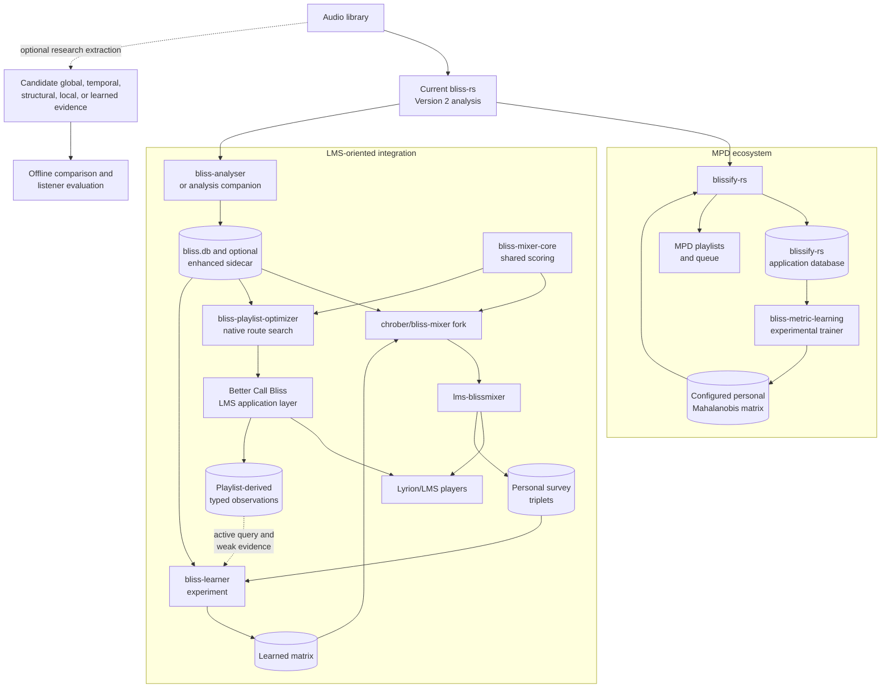

# Downstream consumers

**Status:** Living research and design proposal  
**Primary scope:** MPD, LMS, mixer, learner, and other library integrations  
**Last reviewed:** 2026-08-19

The contracts in this section are illustrative, not LMS-exclusive.
`blissify-rs` represents the established MPD lineage; `bliss-analyser`, the
`chrober/bliss-mixer` fork, `bliss-mixer-core`, `bliss-playlist-optimizer`,
`bliss-learner`, Better Call Bliss, and the
[`chrober/lms-blissmixer`](https://github.com/chrober/lms-blissmixer) fork
represent the current LMS-oriented experiment. They are evidence about existing
consumer relationships, not a proposed architecture for `bliss-rs` or other
players.

The diagram below summarizes current lineage and separates it from optional
research comparisons. It does not assign future ownership:

## MPD: `blissify-rs`

`blissify-rs` is a first-class downstream precedent for this design. It uses
Bliss to analyze an MPD library, persists the results, manages feature-version
selection and reanalysis, and exposes playlist generation through MPD. It also
keeps distance selection at the application boundary, including consumption of
a configured Mahalanobis matrix.

Relevant observations for future research:

- Version 2 supplies a real cost and behavior baseline;
- persistence and playlist policy can be evaluated separately from audio
  representation quality;
- learned matrices demonstrate why exact feature identity and normalization
  matter; and
- results observed in one player ecosystem must not be assumed to transfer to
  another.

## LMS: `bliss-analyser`

The current analyzer supplies the LMS-side baseline database and therefore
provides factual evidence about feature columns, path identity, rebuilds, and
analysis coverage. This document does not propose that it adopt structured
products or a new persistence role.

## LMS: `chrober/bliss-mixer` fork

This subsection refers to
[`chrober/bliss-mixer`](https://github.com/chrober/bliss-mixer), derived from
[`CDrummond/bliss-mixer`](https://github.com/CDrummond/bliss-mixer). The
upstream mixer already reads precomputed Bliss features and exposes the HTTP
mixing API used by the LMS integration. The fork's additions are
variance-based Adaptive Weighting and learned-matrix support: it loads a
Blissify-compatible JSON artifact through `--matrix`, uses that matrix directly
for a single seed, or blends it with a variance-derived matrix for multiple
seeds.

Potential questions for downstream experiments:

- load compatible hot representations without analysis dependencies;
- choose task-specific views;
- normalize and combine scores;
- preserve candidates with missing optional metadata;
- avoid loading cold sequences unless an explicit algorithm needs them.

## LMS: `bliss-learner` experiment

The name here refers specifically to the experimental Rust companion maintained
for the [`chrober/lms-blissmixer`](https://github.com/chrober/lms-blissmixer)
fork, not to an upstream `bliss-rs` tool. It ports the core workflow of
`bliss-metric-learning`, whose original application context was `blissify-rs`,
but adapts persistence, process integration, and artifact format for LMS.

The current learner is bound to the 23-feature schema and named
[`TracksV2`](https://github.com/CDrummond/bliss-analyser/blob/master/src/db.rs#L101)
columns. Additional representation evidence creates research opportunities:

- train personal weights over a validated expanded scalar representation;
- train separate task models over structure or anchors;
- compare interpretable descriptors with optional learned embeddings;
- learn aspect-specific or transition-specific weights instead of one
  undifferentiated similarity matrix.

It also creates experimental-identity requirements: learned artifacts need
feature definitions and normalization identity, not only matrix dimensions. Artifacts that
consume embeddings additionally need exact model and pooling identity.

Metric learning cannot validate a descriptor solely by fitting training
triplets. Evaluation must show held-out and playlist benefit, especially when
model capacity increases with the representation.

The research on playlist-derived weak supervision suggests a route around the
current high explicit-survey burden. Existing user playlists, accepted or
rejected continuations, skips with suitable context, repeated listening, and
other consented behavioral signals can bootstrap a metric. Explicit questions
can then be selected for uncertain, conflicting, or high-information cases
rather than presented as a fixed 100-plus-round prerequisite.

Better Call Bliss makes these signals more structured than ordinary playback
history. It records whether a playlist was merely previewed, accepted as a
copy, written over the source, sent to a player queue, extended with selected
library tracks, or used for a destination-constrained route. Those events
should be exposed to the learner as typed observations only after consent and
retention policy are defined. Raw
Better Call Bliss outputs should be treated as exposure records, not preference
labels, until the user reacts to them. See
[Playlist-derived learning signals](../mixing/playlist-derived-learning.md)
for the proposed evidence taxonomy.

This feedback remains model-relative and user-relative data and requires
appropriate privacy and deletion policy. That analytical distinction does not
assign future responsibilities to `bliss-rs` or prescribe where a production
learner should live.
