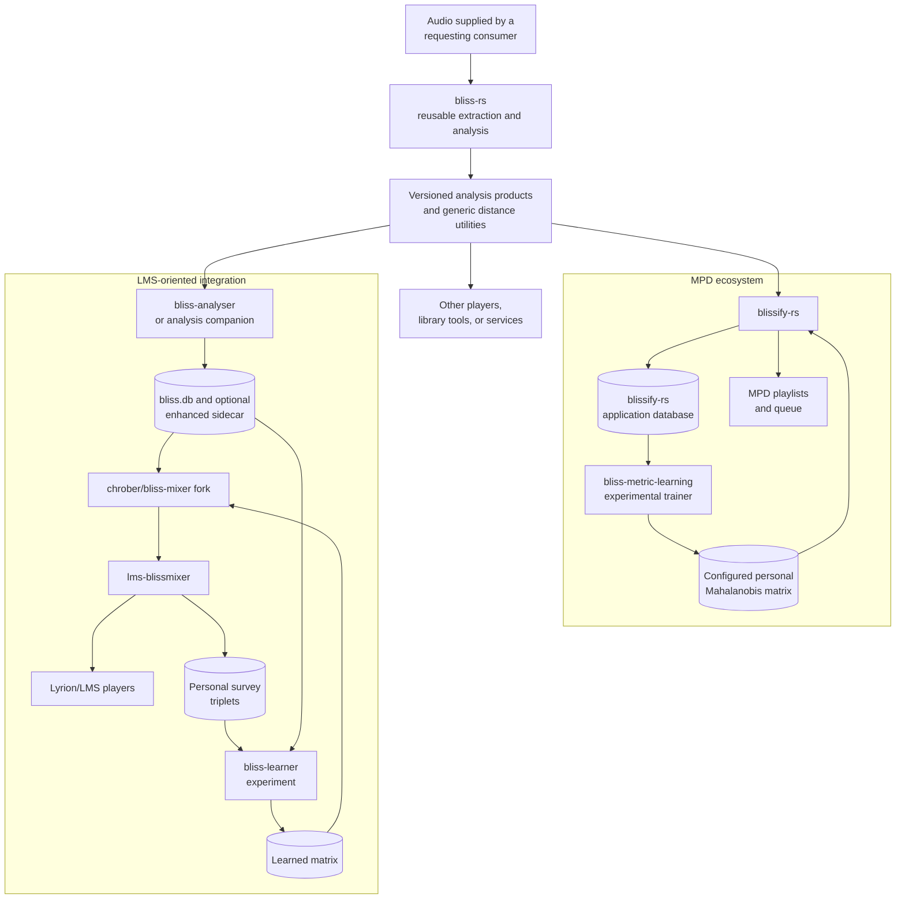

# Downstream consumers

**Status:** Living research and design proposal  
**Primary scope:** MPD, LMS, mixer, learner, and other library integrations  
**Last reviewed:** 2026-07-14

The contracts in this section are illustrative, not LMS-exclusive.
`blissify-rs` represents the established MPD lineage; `bliss-analyser`, the
`chrober/bliss-mixer` fork, `bliss-learner`, and the
[`chrober/lms-blissmixer`](https://github.com/chrober/lms-blissmixer) fork
represent the current LMS-oriented experiment. Other players should be able to
consume the same versioned analysis without adopting either application's
persistence or playlist policy.

The diagram below shows the ecosystem boundary. It is a representation and
ownership view, not a requirement that one process centrally analyzes every
consumer's audio:

## MPD: `blissify-rs`

`blissify-rs` is a first-class downstream precedent for this design. It uses
Bliss to analyze an MPD library, persists the results, manages feature-version
selection and reanalysis, and exposes playlist generation through MPD. It also
keeps distance selection at the application boundary, including consumption of
a configured Mahalanobis matrix.

Expected implications for an evolved analysis API:

- Version 2-only operation must remain cheap and supported;
- requested structured products must be optional so an MPD deployment does not
  pay for LMS experiments it does not use;
- representation identity must be sufficient for application-managed database
  migration and selective reanalysis;
- generic distance utilities may remain in Bliss, while MPD queue behavior and
  playlist policy remain in `blissify-rs`;
- new contracts should be usable by `blissify-rs` or another player without an
  LMS database schema, service, or plugin.

## LMS: `bliss-analyser`

Expected responsibilities:

- request configured structured products;
- schedule incremental analysis;
- own path identity and invalidation;
- store manifests and encoded values transactionally;
- expose coverage and failures;
- preserve existing Version 2 operation.

## LMS: `chrober/bliss-mixer` fork

This subsection refers to
[`chrober/bliss-mixer`](https://github.com/chrober/bliss-mixer), derived from
[`CDrummond/bliss-mixer`](https://github.com/CDrummond/bliss-mixer). The
upstream mixer already reads precomputed Bliss features and exposes the HTTP
mixing API used by the LMS integration. The fork's additions are
variance-based Adaptive Weighting and learned-matrix support: it loads a
Blissify-compatible JSON artifact through `--matrix`, uses that matrix directly
for a single seed, or blends it with a variance-derived matrix for multiple
seeds.

Expected responsibilities:

- load compatible hot representations without analysis dependencies;
- choose task-specific views;
- normalize and combine scores;
- preserve candidates with missing optional metadata;
- avoid loading cold sequences unless an explicit algorithm needs them.

## LMS: `bliss-learner` experiment

The name here refers specifically to the experimental Rust companion maintained
for the [`chrober/lms-blissmixer`](https://github.com/chrober/lms-blissmixer)
fork, not to an upstream `bliss-rs` tool. It ports the core workflow of
`bliss-metric-learning`, whose original application context was `blissify-rs`,
but adapts persistence, process integration, and artifact format for LMS.

The current learner is bound to the 23-feature schema and named
[`TracksV2`](https://github.com/CDrummond/bliss-analyser/blob/master/src/db.rs#L101)
columns. Structured analysis creates later opportunities:

- train personal weights over a validated expanded scalar representation;
- train separate task models over structure or anchors;
- compare interpretable descriptors with optional learned embeddings;
- learn aspect-specific or transition-specific weights instead of one
  undifferentiated similarity matrix.

It also creates compatibility requirements: learned artifacts need feature
schema and normalization identity, not only matrix dimensions. Artifacts that
consume embeddings additionally need exact model and pooling identity.

Metric learning cannot validate a descriptor solely by fitting training
triplets. Evaluation must show held-out and playlist benefit, especially when
model capacity increases with the representation.

The research on playlist-derived weak supervision suggests a route around the
current high explicit-survey burden. Existing user playlists, accepted or
rejected continuations, skips with suitable context, repeated listening, and
other consented behavioral signals can bootstrap a metric. Explicit questions
can then be selected for uncertain, conflicting, or high-information cases
rather than presented as a fixed 100-plus-round prerequisite.

This feedback remains model-relative and user-relative data. It belongs in the
learner/application layer, with appropriate privacy and deletion policy, not in
an intrinsic `bliss-rs` song analysis. `bliss-rs` is responsible for producing
stable, identified evidence that such a learner can consume.
