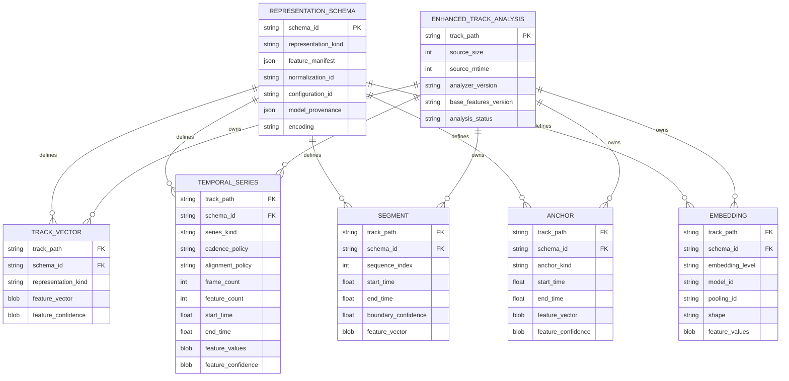

# Metadata ownership and persistence

**Status:** Living research and design proposal  
**Primary scope:** Application-owned identity, schemas, and SQLite integration  
**Last reviewed:** 2026-08-01

Adding a table to the existing SQLite file is technically attractive because
lookup and joins are simple, but the database is owned by `bliss-analyser` and
its real schema uses `TracksV2`/`File`, not a generic `songs(filepath)` model.

Two options remain:

## Option A: extension tables inside `bliss.db`

Advantages:

- one file to configure and back up;
- direct joins;
- no cross-database consistency window.

Risks:

- an external component writes into a database it does not own;
- upstream migrations, replacement, or rebuild behavior may remove or conflict
  with extension tables;
- concurrent access and transaction behavior require verification.

## Option B: a sidecar enhanced-analysis database

Advantages:

- clear ownership and independent migrations;
- safe deletion and complete rebuilding;
- no assumptions about preservation of unknown tables by upstream tools.

Risks:

- path identity and stale-record cleanup must be coordinated;
- deployment needs one more configured file;
- `bliss-mixer` must load or attach two databases.

**Working preference:** use a sidecar database until preservation and locking
behavior of extension tables in `bliss.db` are verified. The logical model is
the same for either option.

## Logical model

The schema below is an illustrative model for the LMS-oriented experiments, not
a migration plan or upstream analysis contract. Exact columns, encoding, and
ownership remain implementation-specific:

```text
representation_schema
  schema_id                  primary representation identity
  representation_kind       global, frame series, segment, anchor, or embedding
  feature_manifest           names, units, ordering, invariance, confidence
  normalization_id
  configuration_id           window, hop, silence, and derivation policy
  model_provenance           nullable model, input, objective, augmentation,
                             and pooling identity
  encoding

enhanced_track_analysis
  track_path                 primary identity compatible with TracksV2.File
  source_size
  source_mtime
  analyzer_version
  base_features_version
  analysis_status
  analyzed_at
  error                      nullable

track_vector
  track_path
  representation_kind       enhanced global or structural summary
  schema_id
  feature_vector             compact versioned numeric vector
  feature_confidence         nullable validity/uncertainty data

temporal_series
  track_path
  series_kind                aligned or descriptor-family-specific series
  schema_id
  cadence_policy             window/hop or native measurement cadence
  alignment_policy           native or declared resampling policy
  frame_count
  feature_count
  start_time
  end_time
  feature_values             shaped dense series, normally one BLOB
  feature_confidence         optional shaped confidence data

segment
  track_path                 parent identity
  schema_id
  sequence_index
  start_time
  end_time
  boundary_confidence
  feature_vector
  feature_confidence

anchor
  track_path
  schema_id
  anchor_kind                intro or outro
  start_time
  end_time
  feature_vector
  feature_confidence

embedding
  track_path
  schema_id
  embedding_level            frame, segment, or whole track
  model_id                   immutable model/artifact identity
  pooling_id                 nullable, required for pooled representations
  shape
  feature_values             model-identified shaped BLOB
```

The relationships are easier to see as a conceptual entity model. It shows
ownership and schema reuse, not final table keys or migration syntax:



Dense frame data should use one shaped numeric BLOB per track and series rather
than one SQL row per feature value. Separate typed series may therefore occupy
separate rows without being forced onto a false common cadence. Segments remain
individual rows because their boundaries and vectors are independently
meaningful. Anchors remain small hot runtime rows. Embeddings use shaped BLOBs
and are accepted only with compatible model and pooling identity. A
self-similarity matrix should not be persisted by default; it can be regenerated
offline from retained frames.

Applications should distinguish:

- **hot runtime data:** global and structural summaries, anchors, and selected
  segment vectors loaded by `bliss-mixer`;
- **cold rebuildable data:** dense frame sequences and research intermediates
  used by offline analysis.

Any physical schema would need to preserve experiment identity, shape, ordering,
timing, normalization, and confidence. This site does not select a bulk numeric
encoding or propose one for `bliss-rs`.

Before a physical schema is selected, the actual `bliss.db` schema, path
normalization, vector serialization cost, migration strategy, and concurrent
read/write behavior must be inspected.
