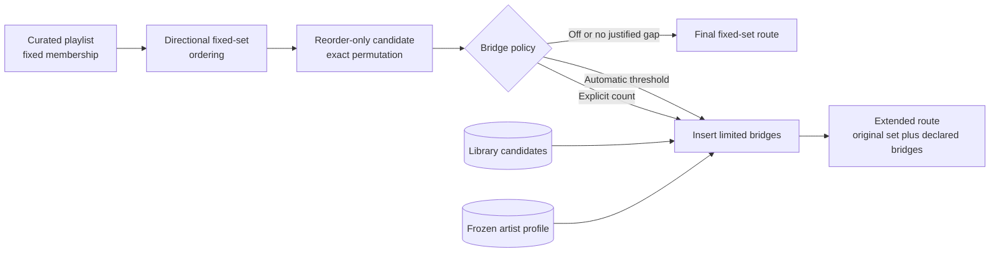

# Fixed-set sequencing and bridge insertion

**Status:** Experimental one-shot prototype; implementation currently untracked
and not part of the shipped LMS BlissMixer system

**Primary scope:** Ordering an already curated collection and optionally adding
explicitly justified bridge tracks

**Last reviewed:** 2026-07-19

Fixed-set sequencing starts after somebody or something has already chosen the
playlist members. Its question is not _which tracks belong in the playlist?_
but _in which direction and order should these tracks play?_ An optional later
stage may add a limited number of bridge tracks, but that changes membership and
must therefore remain separately visible and evaluable.

The current evidence comes from a standalone, experimental one-shot prototype.
It operates on immutable snapshots and writes candidate playlists for review.
It does not add a command, API, or user interface to LMS BlissMixer, and none of
the behavior below should be read as shipped plugin functionality.

## Relationship to retrieval, diversity, and transitions

The design separates four decisions that are easily conflated:

| Stage | Input | May change membership? | Primary question |
|---|---|---:|---|
| Retrieval or recommendation | Seeds, context, and a library | Yes | Which tracks are relevant enough to consider? |
| Diversity or subset selection | A candidate frontier | Yes | Which relevant subset has useful coverage and variety? |
| Fixed-set ordering | One already curated track set | No | Which directional open path gives the best local flow while respecting sequence constraints? |
| Bridge insertion | An ordered path plus the wider library | Yes, explicitly | Can a small number of additional tracks repair difficult legs without weakening relevance or repeat policy? |



Retrieval and diversity are covered under [context, diversity, and
exploration](context-and-diversity.md). Boundary-aware candidate reranking is a
related but later refinement described under [transition-aware
selection](transitions.md). Fixed-set sequencing can be evaluated now with the
existing whole-track Bliss representation because it requires no new analysis
schema.

## Constrained-route variants

Exact-permutation reordering is one member of a broader family of constrained
sequencing problems. Three policies should remain distinct in an API,
evaluation, and user-facing explanation:

- **Optimize order:** every curated track is reorderable and must appear exactly
  once. This is the fixed-set problem implemented by the current one-shot
  prototype.
- **Preserve order and fill gaps:** every curated track is an immutable anchor.
  The output must contain the originals as an identical ordered subsequence,
  while zero or more explicitly classified additions may be placed between
  them. Opening and closing additions are separate policy choices rather than
  implicit ways to satisfy a requested count.
- **Destination-constrained route:** the source context and final destination
  are fixed, while zero or more intermediate tracks may be selected. When the
  source is a live queue, existing entries form an immutable prefix and only a
  validated suffix ending at the destination may be appended.

The latter two are generic design extensions, not capabilities of the current
one-shot implementation. They also differ from retrieval: their anchors or
destination are requirements, not merely seeds that may disappear from the
result.

When several tracks are inserted into one anchor gap, they form a small
directional route rather than independent bridges. Contextual scoring must be
recomputed from the earliest affected position through the right anchor, and
hard repeat constraints must be checked over the complete tentative sequence.
Optimizing every insertion independently would miss interactions between the
inserted tracks and their changing seed windows.

## Reorder-only contract

A reorder-only result must be an exact permutation of the input:

- every original track appears exactly once;
- no original track is removed or replaced;
- no library track is added;
- track metadata and extended-M3U entry blocks remain associated with the same
  path; and
- the output is rejected if the input contains duplicate track paths or lacks
  one unambiguous usable Bliss analysis row per track.

These invariants distinguish sequencing from recommendation. Improvement in a
route score cannot justify silently changing a curated collection.

### Directional open path

The playlist has a beginning and an end, so the objective covers only the
successive playback legs. It does not add an artificial final-to-first edge and
does not optimize a cycle.

For a symmetric pairwise metric, reversing an open path preserves its aggregate
edge cost. That equivalence does **not** hold for contextual Adaptive scoring:
reversal changes the preceding seed window at every position and therefore
usually changes both the metric and the route score. A reversed route is a
useful evaluation control, not a free canonicalization of an Adaptive result.

## Adaptive similarity as a continuation score

The current mix API finds new tracks from seeds; it does not accept a complete
collection and return an ordering. The one-shot prototype nevertheless reuses
the current Adaptive calculation as a directional continuation score inside
its own route search.

For position `k`, let `S_k` be the strictly ordered suffix of tracks already
placed before the candidate, limited to the configured seed-window size. The
prototype uses:

```text
centre_k = mean(features(track) for track in S_k)

inverse_i = 1 / (population_variance_i(S_k) + 1e-6)
variance_weight_i = inverse_i * feature_count / sum(inverse)

M_k = learned_blend * M_learned
      + (1 - learned_blend) * diagonal(variance_weight)

continuation_cost(S_k, candidate)
    = sqrt((centre_k - candidate)' M_k (centre_k - candidate))
```

The current representation has 23 dimensions, so the variance-derived diagonal
is normalized to sum to 23. This preserves the overall scale of an identity
matrix. It is not normalized to the total of the four Static feature sliders,
and those sliders must not influence Adaptive scoring.

The first leg necessarily has one preceding seed. Population variance is not
defined for that context, so the current mixer and prototype use the learned
matrix alone. The second leg has two seeds; later legs use up to the configured
maximum. Consequently, every proposed route must be rescored from its own start
rather than assembled from one fixed pairwise distance matrix.

The executions inspected for this design had strict seed ordering enabled. The
current runner always applies the strict sliding rule and reads the configured
seed count, but it does not yet reject or reinterpret a captured
`seed_strict_order=false` setting. A reusable implementation must validate that
flag or record an explicit algorithm override instead of silently claiming
configuration parity.

The learned matrix is blended directly with the variance-derived matrix. It is
not a separate ranking channel in Adaptive mode. The score is contextual and
asymmetric even though each individual Mahalanobis matrix is symmetric once its
context has been fixed.

### Route objective and search

For route legs `d_1 ... d_n`, the prototype minimizes:

```text
route_cost = sum(d_i) + worst_leg_weight * max(d_i)
```

The current experimental `worst_leg_weight` is `2`. The maximum-leg term keeps
one conspicuously poor jump from being hidden by many inexpensive transitions.
It is a declared heuristic, not an empirically validated perceptual weight.

Search uses deterministic seeded multi-start construction followed by reversal
and relocation improvements. This is a practical heuristic for a one-shot
playlist, not proof of the global optimum. Reproducibility therefore requires
the random seed and restart count, and evaluation needs controls rather than
only the best route found by one run.

### Repeat constraints

The active LMS BlissMixer look-back settings are part of the frozen run
configuration:

- the same artist must not recur within the configured artist window;
- the same non-empty album must not recur within the configured album window;
- the same track must not recur within the configured track window.

Artist and album windows are hard route constraints: infeasible candidates are
excluded during construction, local-search results are checked across the whole
sequence, and a final route containing a violation is rejected. The current
prototype requires unique input paths, preserves every path exactly once, bars
curated tracks from bridge candidacy, and never reuses a chosen bridge. Track
repetition is therefore impossible and any positive track window is satisfied
by construction rather than by a separate search parameter.

If no route satisfies the configured artist and album windows, the prototype
fails instead of quietly relaxing them. Any productized implementation must
make an explicit relaxation policy a user-visible decision.

### Energy arc as a secondary selector

Tempo, zero-crossing rate, spectral centroid, spectral rolloff, and mean
loudness ranks form a deliberately rough intensity proxy. The prototype
generates a separate arc-aware route using a small placement penalty, then
selects it only when:

- its primary Adaptive route cost is within 8% of the best smoothness route;
  and
- it reduces positional arc error by at least 10%.

Energy shape therefore selects between similarity-competitive routes; it does
not replace the similarity objective. The proxy is not a psychoacoustic energy
model and needs separate listener validation.

## Bridge insertion

Bridge insertion runs only after the curated-only path has been chosen. Every
result must state whether it is reorder-only or extended, preserve every
original member, and identify each addition and its reason.

Two modes exist in the prototype:

- **Automatic mode** considers only internal legs whose contextual percentile
  exceeds a declared threshold and inserts no more than the configured cap.
  It may legitimately add zero tracks.
- **Explicit-count mode** attempts to insert exactly the requested number while
  retaining the same acoustic and repeat gates. If it cannot find that many
  acceptable bridges, it fails rather than returning a smaller undeclared
  count. Start and end slots become eligible only when the request exceeds the
  number of internal gaps.

The explicit mode demonstrates controlled membership expansion. It must not be
interpreted as evidence that more bridges are better.

### Rescore both affected legs

Inserting `X` between `A` and `B` replaces one leg with two:

```text
A -> B        becomes        A -> X -> B
```

For Adaptive scoring, neither new cost is necessarily a pairwise `A-X` or
`X-B` distance. The incoming leg scores `X` from the actual preceding sliding
context. The outgoing leg then scores `B` from a newly constructed context that
includes `X`. This second rescore is essential: evaluating `X -> B` under the
old route context would not reproduce the algorithm that will be applied during
playback.

Previously inserted bridges can enter later contexts when they fall inside the
seed window. After every tentative insertion, the complete sequence is checked
again against artist and album windows; unique curated and bridge paths keep
the track constraint valid.

### Frozen Last.fm/LastMix artist evidence

The artist profile is built once from every distinct artist in the **original**
playlist. It retains the per-source Last.fm similar-artist results as well as a
collection-wide aggregation. The profile is then frozen: inserted bridges never
become new lookup seeds and cannot recursively expand the candidate space.

For a particular transition, candidate evidence is ranked in this order:

1. the candidate artist is returned for both transition-endpoint artists;
2. it is returned for one endpoint;
3. it appears in the collection-wide similar-artist aggregation built from the
   complete original artist set;
4. it is an original-playlist artist fallback;
5. it has only Bliss acoustic evidence.

Tiers 3–5 are eligible only when the endpoint-local Last.fm artist pool itself
is empty. If endpoint evidence exists but none of its local library tracks pass
the acoustic and repeat gates, the prototype skips that slot rather than
silently substituting collection-wide evidence. Last.fm evidence narrows and
orders candidates; it does not replace acoustic scoring.

This tiered bridge policy is specific to the one-shot prototype. It is not the
same algorithm as the existing LMS BlissMixer Last.fm weighting option, even
when both draw metadata from the LastMix integration.

### Generalized semantic evidence

A provider-neutral extension should keep semantic evidence separate from the
acoustic continuation score and preserve where every assertion came from. A
useful evidence ordering is:

1. a candidate recording supported by both transition endpoints;
2. a candidate recording supported by one endpoint;
3. candidate-artist support local to both or one endpoint;
4. an artist from the frozen original-collection profile, but only when the
   endpoint-local semantic pool is empty; and
5. Bliss-only candidacy when no usable semantic evidence remains.

Stable recording and artist identifiers should be preferred where the library
and provider expose them. Normalized artist/title matching may be retained as a
lower-confidence fallback, but ambiguous external results must not silently
become local candidates. An externally suggested item is usable only after it
resolves to one local, analyzed track.

Raw scores from different providers need not share a scale. Combination should
therefore use a declared tier or normalized-rank policy while retaining the
provider, source endpoint, raw rank or score, lookup time, and identity-match
confidence. Disabled, unavailable, partial, cached, or stale providers are
evidence states rather than failures of acoustic sequencing; a Bliss-only path
must remain possible whenever the local candidate set permits one.

As with the prototype's artist profile, the complete evidence snapshot must be
frozen from the original request. Inserted tracks must not become new lookup
seeds, recursively expand the semantic graph, or change the evidence available
to later candidates.

### Dynamic contextual percentile scale

Raw Adaptive distances vary with their seed contexts, so the bridge gate uses
an empirical percentile reference. A sample made only from the selected route's
legs is invalid: by construction its worst leg would always receive percentile
`1.0`, making a “bridge the worst percentile” rule self-triggering even when
the complete route is already strong.

The prototype instead freezes a cross-context reference distribution by
scoring every original curated candidate under every actual seed context in the
selected route, excluding the context's own seeds. Direct route legs and both
candidate bridge legs are mapped onto this same distribution. This supplies a
broader contextual baseline, although it is still library- and playlist-relative
and must not be presented as a calibrated probability of transition quality.

Bridge acceptance currently requires both a maximum-leg threshold and a
two-leg-total threshold. Artist-evidence tier breaks semantic ties before the
acoustic leg criteria and deterministic track identity fields.

## Relationship to boundary-aware transitions

This prototype sequences tracks using the existing 23 whole-track descriptors.
It is therefore a baseline for local flow, not the boundary-aware algorithm
described under [transition-aware selection](transitions.md):

- it cannot observe whether an outro fades, ends abruptly, changes character,
  or contains silence;
- it cannot compare the source outro with the candidate intro;
- its tempo, chroma, timbre, and loudness summaries may describe sections that
  never meet at playback time; and
- a lower whole-track continuation score does not guarantee a better audible
  transition.

Future intro/outro anchors or structure-aligned boundary regions could rescore
or refine a whole-track route without changing the fixed-set membership
contract. They could also improve bridge selection by evaluating the actual
`A.outro -> X.intro` and `X.outro -> B.intro` boundaries. Such reranking is a
later analysis-dependent refinement, not functionality already implemented by
the one-shot prototype.

## Evidence and implementation boundary

The prototype demonstrates that fixed-set sequencing, repeat-safe heuristic
search, contextual rescoring, and conservative bridge analysis can be evaluated
without changing the Bliss database schema. It does not yet establish:

- that its heuristic route is globally optimal;
- that whole-track continuation cost predicts perceived flow;
- that the energy proxy improves listening experience;
- that a particular bridge threshold or budget generalizes across libraries;
- that Last.fm artist proximity implies a musically good transition; or
- that the workflow is ready for unattended or interactive LMS use.

Current unit tests cover M3U block handling, the leading `#CURTRACK` case,
Static scaling, learned-distance caching, the Adaptive variance formula,
deterministic exact-permutation search, artist/album repeat safety, and the
artist-evidence tier helper. They do not yet exercise end-to-end automatic or
explicit-count bridge insertion, outgoing-context rescoring, cross-context
reference construction, run-manifest completeness, native candidate-score
parity, or post-deployment scanner behavior.

Evaluation requirements are specified under [fixed-set sequencing
evaluation](../evaluation/mixing-evaluation.md#fixed-set-sequencing-evaluation),
and the limited two-playlist observations are summarized in the
[exploratory case study](../evaluation/fixed-set-case-study.md).
