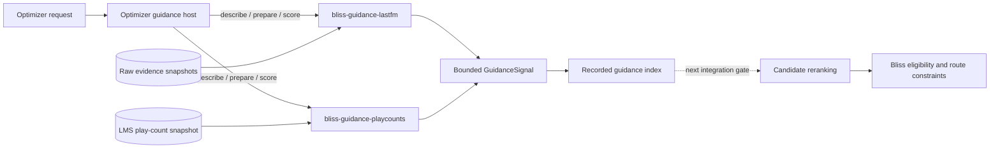

# Guidance add-ons for playlist optimization

The optimizer has two distinct concepts that should not be conflated:

- **Evidence** is an observation or frozen input artifact: for example a raw
  Last.fm response snapshot or an LMS play-count snapshot.
- **Guidance** is a normalized, bounded recommendation derived from that
  evidence. It can support or penalize a candidate, but it never overrides
  Bliss eligibility, repeat windows, or route validity.

This vocabulary also keeps the component boundaries clear. The native
`bliss-playlist-optimizer` owns route search and guidance aggregation. The
[`bliss-playlist-guidance-spi`](https://github.com/chrober/bliss-playlist-guidance-spi)
crate defines the versioned process interface. Independent providers are
named after the guidance they supply:

| Component | Responsibility |
| --- | --- |
| `bliss-playlist-optimizer` | Discover trusted add-ons, send batches, combine guidance, and enforce Bliss constraints. |
| `bliss-playlist-guidance-spi` | Define the JSONL request/response types and bounded `GuidanceSignal`. |
| `bliss-guidance-lastfm` | Adapt raw `semantic-evidence-v1` observations into edge-scoped Last.fm guidance. |
| `bliss-guidance-playcounts` | Adapt raw `lms-play-counts-v1` observations into global play-count guidance. |

The executable names follow the repository names. Provider IDs are
`lastfm-guidance` and `playcount-guidance`; neither name implies that the
provider performs network access. Better Call Bliss/LastMix still obtains the
raw Last.fm snapshot, while the play-count provider reads a frozen snapshot.

## Runtime boundary

The optimizer launches each configured add-on as a separate process and speaks
newline-delimited JSON on stdin/stdout. A session is described, prepared with
the job snapshot, and queried with candidate batches. A provider can return a
global signal (candidate preference) or an edge signal (candidate support for
the current pair of route anchors).

The host uses a finite response timeout and treats a timeout, malformed
response, or provider error as neutral guidance. Add-ons are advisory: they
cannot admit an ineligible track, create a repeat-window violation, or make a
route valid when the Bliss distance model rejects it. The request-side
`guidance_addons` list is therefore a trusted integration setting, not a shell
command facility for arbitrary user input.

The first implementation gate establishes this host contract and records
provider diagnostics. The next integration gate plumbs global and edge signal
indexes into each outer planner without duplicating provider-specific logic:
the queue-tail destination route, multi-gap playlist planning, fixed-count
bridges, and preserved-order extension all call the same guidance aggregation
boundary.
