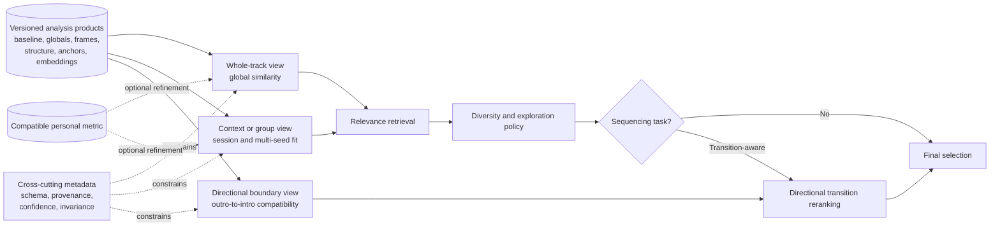
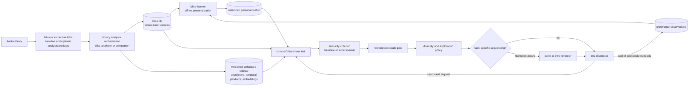

# Mixing design: scope and architecture

**Status:** Living research and design proposal  
**Primary scope:** Cross-repository similarity and mixing policy  
**Last reviewed:** 2026-07-29

## Problem statement

The existing 23-dimensional representation is a deliberately compact set of
whole-track statistics. It cannot retain every property that might matter to a
listener. Means, standard deviations, and chroma aggregates preserve more than
a simple average, but still discard section identity and temporal order. The
same fixed representation is then used for several different mixing objectives.

Potential failure modes include:

- two tracks are close in the current vector space but do not feel similar;
- a perceptually important difference is underrepresented, or an inaudible
  physical difference contributes too strongly;
- a structurally varied track exhibits the
  [Bohemian Rhapsody Problem](../analysis/overview.md#the-bohemian-rhapsody-problem):
  it lands at a synthetic average that resembles none of its actual sections;
- current seed tracks share a progression or structural character that a flat
  mean and variance do not express;
- a globally appropriate candidate begins in a way that conflicts with the
  current track's ending.

The design problem is to determine which additional descriptors and temporal
representations improve mixing, and how similarity criteria should select among
them for a particular task without discarding the strong existing baseline.

## Goals

- Improve perceived song similarity and overall mix quality in DSTM and other
  BlissMixer flows.
- Identify additional audio descriptors that measurably complement the current
  23 Bliss features.
- Preserve useful temporal information through windows, segments, anchors, or
  structural summaries where whole-track aggregation is insufficient.
- Allow different mixing tasks to use appropriate similarity criteria over a
  shared, versioned analysis foundation.
- Enable smoother consecutive-track transitions as one task-specific outcome.
- Preserve the current Bliss representation and algorithms as the baseline and
  compatibility fallback.
- Perform expensive audio analysis offline, not during an LMS mix request.
- Remain useful during partial rollout: missing enhanced data must degrade to
  current behavior rather than exclude tracks or fail a request.
- Keep metadata versioned and rebuildable.
- Make each proposed feature and scoring change measurable through retrieval
  evaluation and listener feedback.
- Reuse the existing learner and survey data while reducing the interaction
  cost of meaningful personalization.

## Non-goals

- Reimplementing MusicIP or claiming compatibility with its proprietary model.
- Replacing the existing 23-feature whole-track representation.
- Assuming that more descriptors or a larger vector automatically improve
  similarity.
- Building one universal similarity formula before the target tasks and
  evaluation criteria are defined.
- Requiring every user to train a personal metric before receiving good mixes.
- Beatmatching, key-locked DJ mixing, time stretching, or waveform-level audio
  rendering.
- Controlling the player's crossfade duration or DSP pipeline.
- Introducing mandatory network services or cloud analysis.
- Making segmentation, structural variance, or advanced perceptual masking a
  prerequisite for the first experimental pipeline.

## Terminology

- **Descriptor/feature:** A measured property of audio, such as tempo, a timbre
  coefficient, loudness, chroma, or a future experimental measurement.
- **Perceptually motivated descriptor:** A measurement designed around a
  hypothesis about human hearing or musical perception. The motivation does not
  establish perceptual validity; listener and task evaluation remain required.
- **Representation:** The collection and organization of descriptors used to
  describe a track, window, segment, or anchor.
- **Temporal representation:** Time-ordered measurements or vectors that retain
  how audio properties develop instead of reducing the complete track
  immediately to one aggregate vector.
- **Baseline vector:** The existing 23-feature whole-track Bliss vector.
- **Enhanced metadata:** Any versioned experimental descriptor or temporal
  representation added by this design.
- **Global score:** A whole-track or whole-context score produced by the selected
  existing or experimental similarity criterion.
- **Segment:** A time range intended to represent a coherent musical section.
- **Segmentation:** The process of proposing boundaries and coherent time ranges
  from temporal evidence. It need not assign names such as verse or chorus, and
  multiple structural levels or interpretations may be valid.
- **Anchor:** A local analysis window representing an intro or outro.
- **Transition score:** A compatibility score between the current track's outro
  anchor and a candidate's intro anchor.
- **Task-specific scoring:** A similarity or compatibility function defined for
  one use case, such as whole-track retrieval, session fit, or directional
  transition quality, rather than one universal music distance.
- **Candidate pool:** The tracks retained from the global algorithm before final
  truncation.
- **Reranking:** Reordering that candidate pool using transition information.
- **Structural variance:** A summary of how much a track's features change over
  its duration. The exact definition is not yet decided.
- **Feature confidence:** An estimate of whether a descriptor is reliable for
  this track, window, or segment; for example, tempo confidence or key
  ambiguity.
- **Invariance contract:** A statement of which transformations a descriptor
  should ignore and which it should preserve for a particular task.
- **Group profile:** A population-relative representation of an artist, album,
  playlist, mood, seed set, or session context.
- **Relevance:** How well a candidate matches the requested seed or context.
- **Diversity policy:** How redundancy and exploration are controlled among
  otherwise relevant candidates.
- **Sequencing:** Choosing the order of selected tracks, distinct from deciding
  which tracks belong in the set.
- **Personal metric:** A distance model learned from one listener's explicit or
  implicit preferences, currently represented by a 23x23 Mahalanobis matrix.
- **Strong feedback:** A deliberate similarity or transition judgment, such as
  an odd-one-out answer.
- **Weak feedback:** A behavioral signal such as skipping, completing, removing,
  or manually reordering a generated track. It is informative but ambiguous.

## Design principles

1. **Preserve a known baseline.** Every experiment must be comparable with the
   current 23-feature algorithms and capable of falling back to them.
2. **Match the representation to the question.** Whole-track similarity,
   structural similarity, session coherence, and transition compatibility may
   use different views of shared analysis data.
3. **Add evidence, not dimensions.** A descriptor belongs in production only if
   it improves a defined retrieval or listener outcome.
4. **Keep analysis offline and scoring cheap.** Audio decoding and temporal
   analysis do not belong in a live mix request.
5. **Global context constrains local criteria.** For transition-aware selection,
   a locally compatible intro must not pull an unrelated track from the whole
   library.
6. **Normalize before combining.** Static squared-Euclidean distance, isolation
   forest anomaly score, and adaptive Mahalanobis distance have different
   scales. Raw values cannot be mixed with an anchor distance using fixed
   coefficients.
7. **Graceful partial coverage.** A library can be analyzed incrementally.
8. **Version all derived data.** Changes to windowing or feature extraction must
   be detectable and rebuildable.
9. **Prefer evidence over plausible-sounding DSP.** Each added descriptor needs
   a definition, units, test data, and an evaluation purpose.
10. **Separate relevance, diversity, and sequencing.** A nearest-neighbor
    metric should not implicitly carry all three responsibilities.
11. **Make uncertainty explicit.** Unreliable tempo, key, segmentation, or
    short-window estimates should contribute less rather than masquerade as
    precise values.
12. **Define invariance per task.** Gain, encoding, silence trimming, absolute
    key, and boundary shape can be nuisance variables for one task and useful
    signals for another. There is no single universally correct enhanced
    vector.
13. **Personalization must be progressive.** Useful default behavior must not
    depend on a long survey. Personal feedback should refine a strong prior,
    with model capacity and influence increasing only as evidence accumulates.

### Logical layers

The design separates five layers even when an implementation combines them:

1. **Descriptors:** measured audio properties and their confidence.
2. **Representations:** track, window, segment, anchor, and group views derived
   from those measurements.
3. **Relevance retrieval:** candidates related to the seed or session context.
4. **Diversity policy:** a relevant subset with controlled redundancy and
   exploration.
5. **Sequencing:** an ordering that serves smoothness, transition quality, a
   destination, or another requested trajectory.

The same versioned analysis can support several task-conditioned views without
pretending that they share one universally correct distance. Confidence,
invariance, schema, and provenance constrain every view:

## Proposed architecture

### High-level flow

### Component responsibilities

#### `bliss-rs`

The companion [Bliss Analysis
Evolution](../index.md)
design is authoritative for extraction APIs and representation contracts.

Responsibilities:

- preserve the current Version 2 `Analysis` result and cost;
- expose reusable spectral, loudness, onset, tempo, chroma, tonal, and bass
  measurements without requiring consumers to duplicate decoding or DSP;
- provide optional analysis products such as global descriptor sets, aligned
  or typed frame series, structure, anchors, and model-identified embeddings;
- attach cross-cutting schema, provenance, confidence, and invariance metadata
  to those products;
- make requested products and their configuration explicit;
- version representation schemas and support deterministic serialization;
- keep player-specific persistence, retrieval, diversity, and sequencing out
  of the audio-analysis contract.

General-purpose novelty or segmentation primitives may live in the base crate,
behind a feature, or in a companion module. That ownership detail remains open;
reusable extraction itself belongs in `bliss-rs`.

#### Library analysis orchestration

**Working proposal:** extend `bliss-analyser` or introduce a small offline
companion, provisionally called `bliss-feature-analyser`, to request structured
`bliss-rs` products and persist them. It must not duplicate shared audio
extraction or decode audio inside `bliss-mixer`. The final binary and repository
ownership remain open.

Responsibilities:

- find tracks that have Bliss data but no current enhanced analysis;
- request configured, versioned analysis products from `bliss-rs`;
- run application-level experimental derivations that are not yet suitable for
  a stable library API;
- persist global descriptors, frame series, structure, segments, anchors,
  optional embeddings, and their cross-cutting metadata in application-owned
  storage;
- attach validity and confidence estimates where a measurement can be
  ambiguous or unstable;
- update metadata atomically and report failures without damaging existing
  Bliss data.

The production path should consume `bliss-rs` directly or through an explicitly
versioned binding. A prototype may compare external algorithms, but any retained
shared DSP should be upstreamed or isolated behind a compatible component rather
than becoming a second independent audio-analysis definition.

#### `chrober/bliss-mixer` fork

In this document, subsequent shorthand references to `bliss-mixer` mean the
[`chrober/bliss-mixer`](https://github.com/chrober/bliss-mixer) fork unless an
upstream repository is named explicitly.

Responsibilities:

- load enhanced metadata without requiring audio-analysis dependencies;
- support experimental similarity criteria alongside the existing algorithms;
- load a compatible personal metric and normalize it before blending with
  context-derived matrices;
- apply an optional, explicit diversity policy after relevance retrieval;
- expose comparable baseline and enhanced scores for evaluation;
- retain a larger globally suitable candidate pool when task-specific reranking
  requires it;
- identify the actual current boundary track;
- optionally calculate transition compatibility for candidates with anchor data;
- normalize global and transition scores over the pool;
- combine scores, apply existing filtering/fallback semantics, and return the
  requested count;
- expose useful diagnostics for tuning and evaluation.

#### `lms-blissmixer`

Responsibilities:

- expose enhanced similarity and transition experiments as opt-in settings
  during development;
- retain the existing survey and learner integration while making
  personalization useful at progressive evidence thresholds;
- collect weak feedback only with clear semantics, privacy boundaries, and an
  opt-out;
- pass analysis/scoring configuration and metadata location to `bliss-mixer`;
- package or locate the enhanced analyzer if this repository owns its
  distribution;
- surface analysis coverage/status where practical;
- preserve existing behavior when the new binary or metadata is absent.
