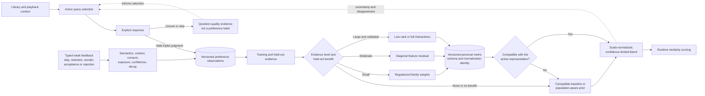

# Personalization and feedback

**Status:** Living research and design proposal  
**Primary scope:** Learned metrics, bliss-learner, and lower-effort adaptation  
**Last reviewed:** 2026-07-14

## Learned personalization and feedback

### Provenance and maturity

Four related pieces need to be distinguished:

1. [`blissify-rs`](https://github.com/Polochon-street/blissify-rs) is the
   upstream MPD application from the `bliss-rs` author. It analyzes and stores
   an MPD library, generates playlists with Bliss, and supports a Mahalanobis
   distance whose matrix is read from its configuration. It is the original
   application and storage context for the metric-learning experiment; it is
   not itself the learner.
2. [`bliss-metric-learning`](https://github.com/Polochon-street/bliss-metric-learning)
   is the author's separate, explicitly experimental Python prototype. Its
   local web survey presents three tracks from a `blissify-rs` library, stores
   the odd-one-out triplets, learns a matrix, and writes it back for
   `blissify-rs` to consume.
3. [`bliss-learner`](https://github.com/chrober/bliss-learner) is this
   project's public standalone Rust port of that training algorithm. It adapts
   the inputs and outputs to the LMS integration: triplets are read from JSON
   by filename, the 23 named Version 2 columns are read from `TracksV2`, and
   the learned matrix is emitted as JSON. It remains an independently
   maintained experiment, not an upstream component of Bliss.
4. `lms-blissmixer` supplies the survey UI, persists the triplets, launches the
   learner, reports progress, and passes the resulting artifact through
   `--matrix` to the [`chrober/bliss-mixer`](https://github.com/chrober/bliss-mixer)
   fork, which performs the actual Mahalanobis scoring and optional multi-seed
   blending.

The public upstream precedent is therefore
`blissify-rs` + `bliss-metric-learning`; the current LMS workflow is a derived
experiment. This lineage establishes technical feasibility, not evidence that
the learned model improves playlists reliably or that its interaction cost is
acceptable.

### Current experimental integration

Metric learning is already an integrated experimental capability, not a future
placeholder:

1. `lms-blissmixer` presents three library tracks and records which one the
   listener considers the odd one out.
2. The two remaining tracks form the similar pair in a stored triplet.
3. `bliss-learner` reads the triplets and the 23 Bliss features, fits a full
   matrix factor with a regularized probabilistic triplet objective and
   cross-validated regularization, and writes the positive-semidefinite 23x23
   Mahalanobis matrix `M = L * L^T`.
4. The `chrober/bliss-mixer` fork loads that JSON through `--matrix`. For a
   single seed, Adaptive Weighting can use the learned matrix directly. For
   multiple seeds, the fork linearly blends it with the seed-variance matrix
   according to the configured learned-matrix influence.

The matrix is portable across tracks only while feature definitions, ordering,
scaling, and preprocessing remain compatible. Training triplets reference file
paths and are less portable than the resulting matrix.

### Role and representation ceiling

The learned metric answers a useful question: which distinctions available in
the current representation matter to this listener? It can reweight features
and learn interactions between them, but it cannot reconstruct information that
the 23-feature vector never captured. Structural progression, absolute key,
intro/outro compatibility, or a missing perceptual descriptor require enhanced
analysis before personalization can learn to use them.

The learner is therefore both:

- an optional personalization layer over a baseline or enhanced
  representation; and
- evaluation infrastructure, because held-out triplets can compare the current
  metric, population-aware weighting, and candidate enhanced representations.

Odd-one-out labels normally describe symmetric whole-track similarity. They
must not be reused unmodified as labels for directional transition quality,
diversity, or sequence-level satisfaction.

### Current UX and statistical limitations

The current survey draws three tracks uniformly at random. Many such triplets
have an obvious odd track, so they cost listening time while adding little
information about difficult nearest-neighbor decisions. At the same time, the
learner optimizes a full 23x23 factor from a relatively small number of answers.
The output matrix is symmetric, but this is still a high-capacity model relative
to roughly 100-200 noisy judgments.

The minimum accepted triplet count is only an execution threshold. It must not
be presented as evidence that the model is useful. With 100 triplets, a 20%
holdout contains only about 20 judgments, making accuracy and hyperparameter
selection noisy. Training-triplet accuracy can also improve without producing
better playlists.

**Working proposal:** personalization must remain optional and must never be a
prerequisite for good default mixing.

### Active and progressive learning

The personalization lifecycle keeps observation semantics, model capacity,
validation, compatibility, and runtime influence separate. A weak signal enters
the learner only after its context is retained; more evidence increases model
capacity only when held-out results justify it:

The highest-priority learner experiment is active query selection. Rather than
uniform random triplets, choose questions expected to reduce uncertainty:

- use a familiar anchor from playback history, favorites, or a user-selected
  seed;
- present two plausible neighbors, not arbitrary tracks from the full library;
- prioritize cases where the baseline and current personal model disagree;
- prioritize near-ties or high-uncertainty comparisons;
- avoid repeated, trivially separable genre extremes;
- allow `unsure` or `skip` without treating it as a preference.

Relative comparisons are an established basis for distance-metric learning
[[9]](../research/mixing-research.md#m9). Information-gain selection has reduced the number of human
comparisons needed for similarity learning [[10]](../research/mixing-research.md#m10), including work aimed
specifically at active feature-space metric learning [[11]](../research/mixing-research.md#m11). This
supports the direction of active selection, but not a particular query heuristic
or evidence threshold in this implementation. Uniform-random selection remains
the required experimental control.

This should be combined with progressive model capacity:

1. **No judgments:** use the compatible baseline or population-aware metric.
2. **Small evidence set:** learn four regularized family weights for tempo,
   timbre, loudness, and chroma.
3. **Moderate evidence set:** learn a diagonal 23-feature residual.
4. **Large, validated evidence set:** allow low-rank or full-matrix feature
   interactions.

The personal model should be regularized toward a useful baseline matrix, not
merely toward a zero matrix. Its influence should depend on validation and
confidence as well as a manual blend setting. The UI should show learning
progress in terms of held-out improvement and uncertainty, and should stop
requesting feedback when additional rounds no longer add measurable value.

### Weak and contextual feedback

Low-effort LMS behavior can supplement, but not replace, explicit judgments:

- quick skip versus substantial playback or completion;
- removal from or retention in a generated queue;
- manual reordering or manual choice among offered candidates;
- more-like/less-like actions;
- repeated acceptance or rejection of a transition.

These observations are affected by mood, interruption, familiarity, queue
position, and exposure bias. They need lower confidence weights, provenance,
decay, and preferably repeated evidence. A contextual micro-question such as
"which candidate fits better after this track?" may provide stronger
directional evidence with less effort than a separate long survey.

Playlist co-occurrence can provide useful weak supervision for music similarity
[[12]](../research/mixing-research.md#m12), but it represents collective playlist practice rather than one
listener's intrinsic similarity judgment. Skip timing is also correlated with
musical section boundaries [[13]](../research/mixing-research.md#m13), so a skip can encode structure,
position, or interruption rather than dislike. Weak signals must be evaluated
by type and context instead of being pooled into one implicit preference label.
The most promising local source of such weak evidence is a combination of
human-curated playlists and reactions to Better Call Bliss previews. Curated
membership, curated adjacency, accepted or rejected generated routes, bridge
retention, post-save edits, and queue playback can all help select better
questions for `bliss-learner`. Raw generated playlists should not be used as
training truth by themselves, because that would mostly teach the learner to
reproduce the metric that generated them. The detailed signal taxonomy is kept
in [Playlist-derived learning signals](playlist-derived-learning.md).

### Matrix compatibility and blending

Before learned personalization is relied on more broadly:

- include the Bliss feature version, descriptor schema, dimension, training
  model version, and normalization convention in the matrix artifact;
- validate finiteness, symmetry, and positive-semidefiniteness when loading;
- normalize learned and seed-derived matrices to a comparable scale before
  interpolation, for example by trace or a robust reference-distance statistic;
- report effective influence after normalization, because a linear coefficient
  is not a meaningful percentage when matrix scales differ;
- preserve the default metric if held-out judgments do not beat it by a
  meaningful margin;
- make cross-feature interactions visible in diagnostics rather than reporting
  only diagonal weights.

The implementation currently parameterizes and emits `M = L * L^T`. Related
documentation should use the same convention. `L^T * L` is also
positive-semidefinite, but mixing the two descriptions makes reproduction and
gradient review unnecessarily difficult.
