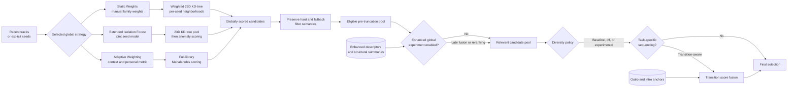

# Similarity and existing mixing strategies

**Status:** Living research and design proposal  
**Primary scope:** Baseline metrics, candidate generation, and population-aware weighting  
**Last reviewed:** 2026-07-14

## Baseline and experimental whole-track similarity

The existing Static, EIF, and Adaptive algorithms remain the baseline. Enhanced
metadata can be evaluated in several ways without immediately replacing their
23-dimensional input:

- add one candidate descriptor family at a time and measure its effect;
- rerank baseline candidates using an independent enhanced-similarity score;
- extend a distance matrix only after new features are normalized and their
  contribution can be explained;
- compare whole-track mean vectors with robust temporal summaries;
- use structural similarity as a score, a confidence signal, or a pool-selection
  criterion;
- learn task-specific weights from listener judgments when enough directional
  or symmetric training data exists.

The first experiments should use late fusion or reranking because they preserve
an exact baseline result and make ablations straightforward. Expanding the core
Bliss vector is a later option that would require coordinated schema, matrix,
and compatibility changes across repositories.

## Relationship to existing mixing strategies

The three strategies documented in [ALGORITHMS.md](https://github.com/chrober/lms-blissmixer/blob/master/ALGORITHMS.md) are not
superseded by this proposal. They are alternative implementations of the global
relevance stage: each turns one or more recent tracks into a scored candidate
set. Enhanced analysis can change their input or scoring after validation;
diversity and transition awareness can operate as explicit layers after global
retrieval.

| Strategy | Current role | Direct relationship to this proposal | Main integration constraint |
|---|---|---|---|
| **Static Weights** | Applies four user-controlled feature-family weights, performs a separate 23-dimensional KD-tree search for each seed, and keeps the best per-seed score when merging results. | Remains the most interpretable control. Candidate perceptual or structural families can first be added through late fusion; validated families could later receive explicit controls or enter a rebuilt index. | Its preweighted KD-tree admits candidates using only the current representation. An enhanced scorer cannot recover a track excluded by that gate. Per-seed best-score merging also represents a union of neighborhoods rather than agreement with the complete context. |
| **Extended Isolation Forest** | Builds a joint anomaly model from the seed tracks, after constructing a candidate pool with the existing KD-tree. | Provides a distribution-based alternative to distance from a seed or centre. Standardized enhanced descriptors could be tested as forest input, while independent reranking allows safer ablation. | Equal treatment of dimensions makes scale, redundancy, and correlated descriptor families consequential. A high-dimensional forest trained from few seeds may be unstable, and its KD-tree prefilter uses a different criterion from its final anomaly score. |
| **Adaptive Weighting** | Computes a seed-variance Mahalanobis matrix, optionally blends the personal learned matrix, represents multiple seeds by their mean, and scans the full database. | Is the closest existing host for population-aware regularization, schema-aware personal metrics, enhanced scalar families, and more robust context representations. | Low variance proves seed agreement, not perceptual importance. A single mean can erase multimodal contexts, and every expanded matrix must match the exact feature schema, order, scale, and normalization. |

The intended layering is shown below. The filter box represents preservation of
the existing hard-exclusion and fallback semantics; its exact capture point in
each implementation remains subject to code-level review.



This leads to three integration rules:

1. **Preserve distinct baselines.** Static tests an interpretable manual metric,
   EIF tests joint distribution membership, and Adaptive tests a
   context-derived metric. An improvement against one does not establish that
   the other two should be removed.
2. **Separate global relevance from later policies.** The selected strategy
   should expose a scored pool before final truncation. The
   [diversity policy](context-and-diversity.md#diversity-and-exploration-policy) and
   [transition reranker](transitions.md#transition-aware-selection) then operate on that pool
   while preserving the hard and fallback filtering semantics described in
   [ALGORITHMS.md](https://github.com/chrober/lms-blissmixer/blob/master/ALGORITHMS.md#common-filtering-all-algorithms). Existing
   artist shuffle and Last.fm sampling are comparison policies, not equivalent
   implementations of perceptual diversity or transition compatibility.
3. **Measure candidate recall as well as reranking quality.** Reranking can only
   choose candidates admitted by the global stage. Static and EIF may require a
   wider KD-tree pool, a second enhanced index, or an experimental full scan.
   Adaptive already scans the library and is therefore the cleanest first host
   for an enhanced scoring experiment, but it must not become the only baseline
   by convenience.

For every experiment, record the original algorithm, original score and rank,
pool size, filter outcome, enhanced score and rank, and final selection. Compare
both quality within the retrieved pool and whether the baseline retrieval stage
omitted tracks that the enhanced criterion would otherwise rank highly.

## Population-aware adaptive weighting

A potentially high-value first experiment requires no new audio descriptors.
Current Adaptive Weighting rewards features on which the seeds have low
variance, approximately:

```text
seed_reliability_i = 1 / (seed_variance_i + epsilon)
```

Low seed variance means agreement, but not distinctiveness. A seed group can
agree on a value that is ordinary across the whole library, causing an
uninformative dimension to receive excessive weight. A MusicIP-inspired context
signal compares the seed centre with the library population:

```text
distinctiveness_i = abs(seed_mean_i - library_mean_i)
                    / (library_std_i + epsilon)

context_weight_i = blend(baseline_prior_i,
                         seed_reliability_i,
                         distinctiveness_i)
```

The blend needs shrinkage toward a baseline prior, clipping, and minimum sample
sizes. Library statistics must be robust to outliers and recomputed when the
analyzed population changes materially. This is an inference from MusicIP's
documented group-profile approach, not a claim that the formula reproduces its
production mixer. Existing work motivates comparing a seed set with both its
members and its surrounding population, but does not validate this particular
formula. It therefore remains a hypothesis requiring an ablation against the
current seed-variance method and simpler robust alternatives.
