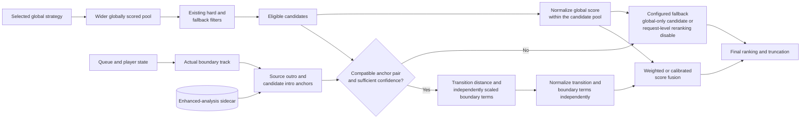

# Transition-aware selection

**Status:** Living research and design proposal  
**Primary scope:** Boundary descriptors, compatibility, and late reranking  
**Last reviewed:** 2026-07-19

## Transition-aware selection

Transition awareness is the first fully described task-specific scoring path.
It consumes anchor and boundary descriptors from the broader enhanced-analysis
model, but it is not required for experiments that improve general song
similarity.

The reranker operates only after global retrieval and existing filtering. It
uses the actual playback boundary, preserves candidates with missing metadata,
and combines scores only after normalizing their different domains:



### Candidate generation

The selected existing algorithm runs first. It must retain more candidates than
the final requested count so the transition layer has meaningful choices.

Published systems commonly separate selection or a fixed input set from later
sequence optimization. Bittner et al. reorder a preselected playlist and then
optimize transition regions [[2]](../research/mixing-research.md#m2); Flexer et al. exclude tracks far from
both path endpoints before constructing an ordered path [[3]](../research/mixing-research.md#m3). These
results support global gating before local optimization, but do not determine
the correct pool size or filter boundary for this implementation.

The pool size should be configurable internally and measured. A fixed multiplier
such as 5x or 10x is a starting experiment, not a final default. Existing hard
filters and repeat behavior must not be weakened merely to fill the pool.

### Boundary source

For transition scoring, the source is the single track whose audio will
immediately precede the new candidate. It is not the mean of the recent seed
window used by Adaptive Weighting.

The plugin and mixer must agree on which queued track is the actual boundary in
DSTM and manual mix flows, including queued-but-not-yet-played tracks.

### Transition distance

The initial transition distance is:

```text
d_transition = distance(current.outro_vector, candidate.intro_vector)
```

The distance function may reuse the active static or learned metric when
compatible. Variance weights learned from several whole-track seeds may not be
appropriate for a single boundary pair and require validation.

Additional penalties can later represent loudness jumps or incompatible
boundary shapes, but each term must be normalized independently. Prior
transition work uses section boundaries, downbeats, beat-synchronous timbre,
chroma, loudness, and vocal presence rather than assuming that one arbitrary
fixed window contains all relevant evidence [[2]](../research/mixing-research.md#m2). The fixed
outro-to-intro vector is therefore a deliberately simple baseline. It must be
compared with structure-aligned regions and with feature-specific confidence;
the published work does not validate the exact distance or weights proposed
here.

### Score normalization and fusion

A direct weighted sum such as `0.4 * global + 0.6 * transition` was considered.
Raw values cannot be combined that way because each global algorithm emits a
different score domain.

**Working proposal:** normalize within the candidate pool, then fuse:

```text
g = normalized global score, lower is better
t = normalized anchor distance, lower is better
l = normalized loudness/boundary penalty, lower is better

final_score = w_global * g + w_transition * t + w_loudness * l
```

Rank percentiles are a robust first normalization method that works across all
three global algorithms. Distribution-aware score normalization can be compared
later if score magnitude contains useful information that ranks discard.
Percentiles depend on the candidate-pool composition and erase absolute
confidence: the best member of a poor pool still receives the best rank. They
are therefore a prototype fusion mechanism, not the final calibrated model.

Initial experiments should keep `w_global` dominant or equal to the combined
local terms. The illustrative `0.4/0.6` split is a hypothesis, not a default.

### Missing metadata

A candidate without transition data must remain eligible.

Possible fallback policies:

- rank it only by global score and renormalize the weights for that candidate;
- place analyzed candidates first only when their fused score is genuinely
  better;
- disable reranking for the whole request below a minimum coverage threshold.

The first policy gives the smoothest incremental rollout, but it must be tested
for systematic bias toward or against unanalyzed tracks.

### Relationship to existing filtering

Transition reranking must preserve the common filters documented in
[ALGORITHMS.md](https://github.com/chrober/lms-blissmixer/blob/master/ALGORITHMS.md), including duration, BPM, genre, seasonal,
album, artist, and title constraints. Exact ordering needs implementation-level
review because some current filters retain fallback candidates rather than
discarding them permanently.

### Relationship to fixed-set sequencing

[Fixed-set sequencing](fixed-set-sequencing.md) and transition-aware reranking
operate at different levels:

- the current one-shot sequencing prototype orders an entire curated set using
  contextual distances over the existing whole-track Bliss descriptors;
- transition-aware reranking uses outro and intro evidence to refine local
  boundary compatibility after the relevant tracks or candidate pool are
  known.

Whole-track contextual sequencing is therefore the currently executable
baseline. Boundary-aware scoring is a later refinement that depends on analysis
products not present in the Version 2 vector; it is not another name for the
same algorithm. A future system could first find a strong fixed-set route and
then use anchors to rescore local alternatives, or combine the terms in one
route objective after their scales and relative influence have been validated.

Bridge insertion makes the distinction especially important. Inserting `X`
between `A` and `B` changes both `A -> X` and `X -> B`. Under contextual
whole-track scoring, the outgoing leg must be recomputed from a seed window
that includes `X`. Under boundary-aware scoring, both new physical boundaries
must likewise be evaluated: `A.outro -> X.intro` and
`X.outro -> B.intro`. Scoring only the incoming bridge leg is insufficient.

Every tentative insertion must also preserve track, artist, and album
look-back constraints across the complete resulting route. A bridge that
improves acoustic compatibility but creates a repeat-window violation is not a
valid repair. These constraints remain hard regardless of whether the local
score uses whole-track vectors or future anchors.

If a gap contains several inserted tracks, the affected region is a short
route rather than a set of independent bridge decisions. Whole-track
contextual scoring must be replayed from the earliest insertion through the
right anchor because each addition changes later seed windows. Boundary-aware
scoring must likewise evaluate every newly created physical boundary. Both
views still require one final repeat-policy check over the complete sequence.

### Relationship to path interpolation

[PATH_INTERPOLATION.md](https://github.com/chrober/lms-blissmixer/blob/master/PATH_INTERPOLATION.md) solves a different problem:
constructing several intermediate tracks between a known source and target.
Transition-aware mixing selects the next track from a global candidate pool.

A destination-constrained route is a path-interpolation variant in which the
existing source context and destination are immutable and only the intermediate
suffix is selectable. Order-preserving gap filling applies the same idea
between consecutive immutable playlist anchors. Neither is the same as
exact-permutation fixed-set ordering, although all three can share route
scoring, anchor distance, hard-constraint, and evaluation utilities.
