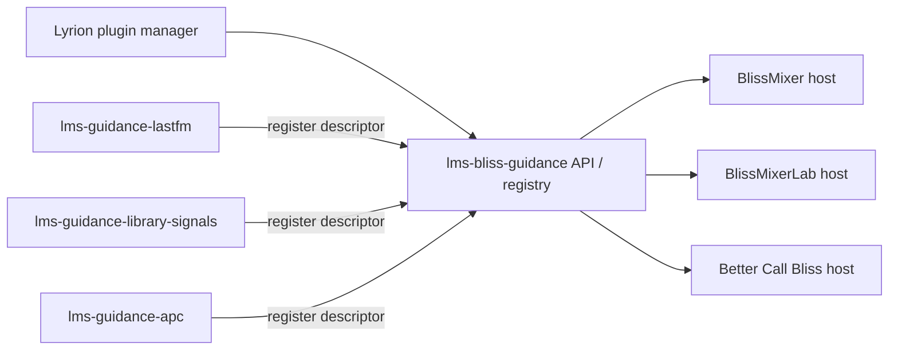
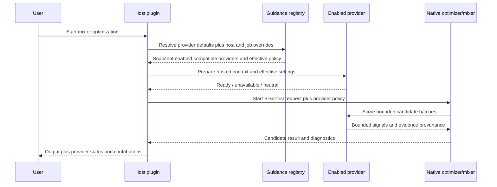

# Lyrion guidance-provider discovery and host integration

## Status

Proposed design. This document describes the Lyrion-side integration for
independently installable guidance extensions. It complements the native
[`bliss-playlist-guidance-spi`](https://github.com/chrober/bliss-playlist-guidance-spi)
contract; it does not replace that Rust process protocol.

Reviewed against local Lyrion and BlissMixerLab sources on 2026-09-27.
Each provider must have its own settings page. Its current guidance settings
are inherited defaults for consuming hosts, which may override individual
settings through schema-rendered controls.

## Feasibility and revisions

The design is feasible with existing Lyrion extension mechanisms:

- `Slim::Web::Settings->new` registers each provider's own settings page;
  its `prefs` and `handler` methods support preference storage and validation.
- `Slim::Utils::Prefs` supplies separate namespaces, validators, and change
  callbacks for provider defaults and host overrides.
- `Slim::Utils::PluginManager` calls `preinitPlugin`, `initPlugin`, and
  `postinitPlugin` in separate passes specifically to support inter-plugin
  services. Initialize the registry in `preinitPlugin`, register providers in
  `initPlugin`, and perform initial host discovery in `postinitPlugin`.

The registry, descriptor contract, and schema renderer require new code;
Lyrion does not automatically supply this guidance integration. No Material
Skin changes are required for ordinary settings pages and form controls.
Hosts need an integration adapter; an unchanged upstream BlissMixer will not
automatically consume registered providers.

This revision makes three boundaries explicit:

- The registry is one shared Lyrion extension, loaded once. Providers and hosts
  must not bundle competing registry implementations. If it is absent or
  incompatible, providers keep their settings pages and hosts continue without
  optional guidance. Installation instructions must explain this dependency.
- Provider settings supply live inherited defaults, not values copied once
  into each host. Host enablement and overrides remain independent.
- Provider descriptors declare supported execution backends. A Perl DSTM
  host needs an asynchronous adapter; a native host needs trusted JSONL SPI
  process descriptors. A shared meaning does not make these execution paths
  interchangeable or make their capabilities automatically identical.

## Intent

Last.fm, local-library signals, play counts, APC, and future sources should be
installable as separate Lyrion extensions. BlissMixer, BlissMixerLab, Better
Call Bliss, and later hosts should discover those extensions without hard-coded
knowledge of every provider.

Discovery must not imply activation. Every host keeps an explicit, per-provider
enabled/disabled setting, with **disabled as the default**. Installing a
provider must never silently change playlist or queue results, make network
requests, read additional databases, or increase job duration.

The design must preserve these invariants:

- Bliss remains the primary authority for candidate admission, acoustic
  similarity, eligibility, route validity, and repeat constraints.
- A provider contributes bounded evidence or a boost/penalty only; it cannot
  inject a track or override a hard constraint.
- Provider failure, timeout, missing data, or incompatible versions degrades to
  neutral guidance and remains visible in diagnostics.
- Provider activation and overrides remain independent for each host.
  Enabling Last.fm in Better Call Bliss does not enable it in BlissMixer.
  Hosts without overrides intentionally follow shared provider defaults.
- The existing native SPI remains reusable by both
  `bliss-playlist-optimizer` and the future `bliss-mixer` host.

## Terminology

| Term | Meaning |
| --- | --- |
| **Provider** | An independently installable Lyrion extension that supplies one or more guidance capabilities. |
| **Host** | A plugin or native application that owns candidate selection, such as BlissMixer or Better Call Bliss. |
| **Capability** | A stable function offered by a provider, for example `artist_similarity`, `track_similarity`, `play_count`, `last_played`, or `library_age`. |
| **Provider descriptor** | Metadata used for discovery, compatibility checks, UI, and diagnostics. |
| **Provider policy** | Host-owned effective settings for one run: enabled providers, channel weights, limits, and timeouts. |
| **Provider-owned setting** | A source setting such as an API key, or a shared default for a schema-declared guidance control. |
| **Host-owned setting** | Explicit provider activation or an override of a guidance default for one host. |
| **Guidance signal** | A bounded, candidate-level recommendation returned by a provider. |

Provider IDs are stable machine identifiers, not display names. Initial IDs may
include `lastfm-guidance`, `library-signals`, and `apc-guidance`. Capability IDs
must be independent of repository names and executable names.

## Architecture decision

Use a small shared Lyrion-side registry/API as the discovery authority. Do not
use the numeric `install.xml` plugin type as a guidance category, and do not
make hosts scan arbitrary plugin directories or infer capabilities from module
names.



The registry is a small service boundary, not a second ranking engine. It owns
registration, descriptor validation, host-specific policy lookup, and provider
invocation/adaptation. It does not combine scores and does not choose tracks.

The native Rust SPI remains the provider execution boundary where a host uses a
native optimizer or mixer binary:


The adapter may call a provider in-process, invoke a trusted helper, or prepare
an immutable artifact for the Rust JSONL SPI. Hosts select a declared compatible
backend through the registry without depending on source-specific internals.
A provider must never receive an executable path,
database path, or unrestricted command-line arguments from an LMS form field.

## Discovery and lifecycle

### Registration

An enabled provider registers during plugin initialization through the shared
API. Registration is idempotent and contains a descriptor like:

```perl
{
    id           => 'library-signals',
    api_version  => 1,
    display_name => 'Local library signals',
    capabilities => [
        'play_count',
        'last_played',
        'library_age',
    ],
    scopes       => ['global_candidate'],
    settings     => [ ... ],
    settings_page => 'plugins/LibrarySignals/settings.html',
    defaults     => sub { ... },
    status       => sub { ... },
    backends     => { perl_async => { ... }, native_spi => { ... } },
}
```

The registry validates:

- stable provider ID and API version;
- unique capability IDs within each provider; different providers may expose
  the same capability, addressed by provider ID plus capability ID;
- supported scopes (`global_candidate`, `edge_candidate`, or both);
- setting schema and safe value types;
- callback/process availability; and
- provider status and failure reporting.

Duplicate IDs are rejected deterministically. An incompatible API version is
shown as unavailable rather than partially activated. A provider that is not
installed or not enabled simply does not register.

### Startup ordering and late availability

Hosts must not assume that provider registration occurred before their own
`initPlugin` callback. The registry exposes a query after plugin initialization
and its own registration/default-change notifications. Hosts refresh on those
notifications and settings-page/job access, and always rebuild discovery after
Lyrion restart. Do not assume every plugin installation or enable/disable
operation becomes active without the restart requested by Lyrion.

At job/mix start, the host takes a snapshot of the currently registered
providers and their effective policy. A provider appearing later does not alter
an already-running job.

### Host discovery policy

Hosts discover descriptors but activate only providers explicitly enabled in
their own settings. New providers are inserted as disabled entries and shown as
available but inactive. Explicit host overrides remain unchanged when a
provider is upgraded or temporarily unavailable; inherited values follow its
validated current defaults when it is available.

The host should show, at minimum:

- provider display name and stable ID;
- capabilities;
- installed/provider API version;
- enabled/disabled state;
- availability and last failure;
- effective host policy; and
- whether the provider contributed any signals to the current result.

## Settings ownership and injection

### Provider-owned settings

Providers own settings needed to acquire or interpret their data. Examples:

- Last.fm API key, acquisition mode, cache, and privacy/network behavior;
- APC database or endpoint selection;
- source-specific identity matching and cache retention.

Every provider has its own settings page, containing source configuration and
the default values for its host-exposable guidance controls. For example,
Last.fm can expose the artist strategy and its strength/target; library signals
can expose influences and saturation horizons. Those defaults apply across
hosts that have not overridden the respective control.

The host obtains defaults through the registry/provider API, never by reading
another plugin's preference namespace. Credentials and acquisition settings
remain exclusively on the provider page and are not host-overridable guidance
controls. Changing defaults does not activate a provider in any host.

### Host-owned settings

Each host owns its own policy namespace, for example:

```text
plugin.blissmixer.guidance.lastfm-guidance.enabled
plugin.blissmixer.guidance.lastfm-guidance.overrides.artist_influence
plugin.bettercallbliss.guidance.lastfm-guidance.enabled
plugin.bettercallbliss.guidance.lastfm-guidance.overrides.artist_influence
```

At minimum, host policy contains `enabled` and a sparse map of explicit
overrides. The default for `enabled` is false. Host safety limits for timeouts,
batches, and combined guidance remain authoritative. Each job snapshots the
resolved policy; a host may support validated per-job overrides as well.

### Default inheritance and precedence

Resolve each host-exposable control in this order, highest priority first:

1. Explicit per-job override, where the host offers one.
2. Explicit persistent override in the consuming host.
3. Current default saved on the provider's settings page.
4. Provider schema's factory default when no saved default exists.

Do not copy inherited values into host preferences merely when enabling a
provider or saving the host settings page. An absent override means inherit;
zero and false are real explicit values. Store presence separately or use a
sparse override map, and never use truthiness to decide inheritance.

Inherited values follow future provider-default changes for subsequent runs.
Explicit overrides remain fixed. Capture effective values, their origins, the
provider/schema versions, and the settings revision at job/mix start. Running
jobs keep that snapshot even when defaults change. Host limits still apply
after resolution; an unsupported strategy is reported unavailable for that
host rather than silently replaced with a different meaning.

Example: the provider's last-played influence is `-60`. Better Call Bliss and
BlissMixerLab initially inherit `-60` after their respective activation. An
explicit Better Call Bliss override of `0` disables that channel there. If the
provider default later becomes `-80`, BlissMixerLab follows `-80` on its next
mix while Better Call Bliss keeps `0`. **Use provider default** removes the
override and restores inheritance.

### Can providers inject settings into host pages?

Yes, but the safe form is **schema-driven rendering**, not arbitrary HTML
injection.

The provider descriptor may declare host-exposable controls:

```perl
{
    key         => 'artist_influence',
    type        => 'integer',
    min         => 0,
    max         => 100,
    factory_default => 25,
    host_overridable => 1,
    label_token => 'LASTFM_ARTIST_INFLUENCE',
    help_token  => 'LASTFM_ARTIST_INFLUENCE_DESC',
}
```

The host renders these controls in a provider-specific, namespaced section of
its own settings page and validates them using the declared schema. The host
stores only explicit overrides in its own preference namespace. The registry
resolves the policy before the host passes the frozen values to the relevant
adapter/native SPI. The shared renderer and resolver should be reused by all
hosts so defaults, zero values, validation, and reset behavior stay consistent.

On the host settings page, each discovered provider section contains:

- an **Enable this provider** checkbox, initially unchecked;
- a link to the provider's own settings page;
- an inherited value and label such as **Provider default: -60**;
- **Use provider default** or **Override for this plugin** for each control;
- editable schema-rendered controls only when overriding and relevant to the
  selected strategy; and
- **Reset overrides to provider defaults**, leaving activation unchanged.

The provider page clearly states that changing its defaults affects hosts
following those defaults on their next run. Host pages display the setting's
origin, and refresh effective values on access. Cross-field validation applies
to the complete resolved policy, including relationships between inherited
values and overrides. Reject invalid saves with a useful message. If a later
provider-default change makes a host's overrides invalid, report the conflict
and omit that provider for the run rather than silently altering overrides.

This provides the desired integrated UX while retaining ownership boundaries:

- provider owns the meaning, schema, and shared default of the control;
- host owns whether the provider is enabled and when it is applied;
- host owns persistence and per-job overrides;
- provider owns acquisition credentials and source-specific settings.

Raw provider-generated HTML, JavaScript, CSS, or arbitrary form callbacks are
not part of the contract. They would be fragile across Material skin versions,
unsafe to validate, difficult to localize, and likely to break other skins.

Each provider must expose a separate settings page for its shared defaults,
source behavior, and diagnostics. Host-rendered controls customize consumption
by that host; they do not replace the provider page.

## Runtime flow



The exact execution path may instead be `H -> N -> P` when the native host
launches provider processes directly. The observable contract is the same:
provider inputs are trusted and bounded, provider output is advisory, and the
host receives provenance.

Registry queries, default resolution, and settings-page rendering must be
cheap in-memory operations: they must not launch Rust, fetch Last.fm data, or
query the whole music library. Preparation and scoring use asynchronous Perl
callbacks or managed subprocesses with cancellation and bounded batches.
They must not block Lyrion's event loop or delay playback/UI responses.
One acquisition/result cache may be shared across hosts where its keys include
all relevant source settings; effective host policy and job snapshots are never
shared implicitly. Avoid starting a native provider when all of its effective
channel influences are zero.

### Provider failure behavior

The host and native SPI treat the following as neutral guidance:

- provider not installed or disabled;
- missing provider-owned configuration;
- unavailable Last.fm/APC/database source;
- timeout or cancellation;
- malformed descriptor or response;
- stale or incompatible artifact;
- insufficient identity coverage; and
- provider process crash.

The result records the failure category, provider ID, capability, and whether
any signals were applied. A failed provider must not cause an otherwise valid
Bliss-only mix or route to fail.

## Capability examples

| Provider | Capabilities | Typical scope | Provider-owned data |
| --- | --- | --- | --- |
| Last.fm guidance | `artist_similarity`, `track_similarity` | edge and global | LastMix or direct API acquisition, credentials/cache |
| Library signals | `play_count`, `last_played`, `library_age` | global candidate | Lyrion database/API access and identity mapping |
| APC guidance | alternative play count or listening-history channels | global candidate | Alternative Play Count data source |

The same provider may offer multiple channels. Hosts enable the provider as a
whole but may set individual channel influence to zero. A zero influence is the
normal way to disable a channel; it avoids a second enable/disable model.

## Security and trust boundaries

- Only installed, enabled Lyrion providers may register.
- Provider IDs, capabilities, and setting keys are validated against a strict
  schema.
- Executable paths, database paths, and network destinations come from trusted
  plugin configuration, never directly from form fields.
- Provider-owned secrets remain in the provider namespace and are never copied
  into job artifacts or rendered in diagnostics.
- Database access is read-only and bounded to the candidate identities needed
  by the current job.
- Provider output cannot admit a track, bypass a repeat rule, or override an
  acoustic route-quality gate.

## Compatibility and versioning

The Lyrion registry API version and native SPI version are independent:

- the registry API governs discovery, settings, lifecycle, and invocation from
  Lyrion plugins;
- the native SPI governs JSONL messages between native hosts and provider
  processes.

Descriptors declare both versions where both layers are used. A host must
reject unsupported versions gracefully and continue without that provider.
Provider IDs and capability IDs are permanent once published. Renaming a
provider requires an explicit migration alias rather than silently creating a
new preference namespace.

Descriptors also version their settings schema and map Lyrion capabilities to
native provider IDs and channel IDs explicitly. For example, the illustrative
Lyrion `library-signals` descriptor maps to native `library-signals-guidance`
and channels `playcount`, `last_played`, and `library_age`. Hosts must not guess
these mappings from labels. Validate stored overrides after schema updates;
preserve them for review when incompatible, and report why the provider cannot
be used. Never reinterpret an existing target-share percentage as bounded
influence without an explicit strategy change.

## Testing and acceptance criteria

The first implementation is acceptable when:

- a fake provider can register, be discovered, disabled, enabled, and invoked;
- a newly installed provider appears disabled by default;
- provider-owned and host-owned settings remain separate;
- every provider has its own registered settings page for shared defaults;
- a host with no overrides follows changes to provider defaults on its next
  run, while a running job retains its original snapshot;
- explicit zero/false overrides survive saving, restart, and provider updates;
- resetting an override restores inheritance without changing activation;
- strategy-dependent controls and cross-field validation operate on the
  resolved policy, including inherited values;
- a host shows unsupported backends or strategies as unavailable rather than
  silently substituting different semantics;
- schema-declared controls render in at least the host's normal settings page
  without raw HTML injection;
- duplicate IDs and incompatible versions are rejected;
- startup ordering and late registration are handled;
- missing registry and normal Lyrion restart requirements are handled;
- opening a settings page performs no provider acquisition or native startup,
  and slow provider preparation does not block the Lyrion event loop;
- all provider failure modes produce neutral guidance and diagnostics;
- Bliss-only behavior is byte-for-byte or decision-for-decision unchanged when
  all providers are disabled; and
- both Better Call Bliss and the future Bliss Mixer host can consume the same
  provider descriptor and native SPI fixtures.

## Delivery phases

### First vertical slice: Better Call Bliss plus local library signals

1. Define and test the Lyrion registry/API package and descriptor schema.
2. Create the independently installable local-library-signals Lyrion provider.
   It owns its settings page and exposes its existing native
   `library-signals-guidance` executable through a trusted descriptor.
3. Add shared default resolution and a reusable host renderer with
   disabled-by-default activation and explicit overrides.
4. Wire Better Call Bliss to registry discovery and resolved provider policy,
   while preserving its native SPI execution path and its decision-for-decision
   Bliss-only fallback when the provider is disabled or unavailable.

This validates registration, descriptor validation, settings ownership,
inheritance, host enablement, resolved-policy snapshots, native invocation,
and result provenance without network credentials or APC-specific state.

### Second vertical slice: Bliss Mixer fork host integration

5. Integrate the same registry, descriptor schema, default resolver, and
   provider settings into the maintained `bliss-mixer` fork. It must consume
   the native SPI provider interface while ranking its existing
   Bliss-derived DSTM candidate pool; it must not introduce a second discovery
   registry, preference convention, or provider-specific host contract.
6. Add cross-host policy/parity fixtures proving that the same enabled provider
   and effective settings yield equivalent bounded guidance semantics in Better
   Call Bliss pathfinding and the fork's candidate reranking, while their
   distinct Bliss selection algorithms remain independent.
7. Migrate Last.fm to a separate provider extension, then add APC as another
   separate provider without changing either host's discovery or policy code.
8. Remove duplicated host-specific provider logic only after both host paths
   pass their parity and Bliss-only fallback tests.

## Source references for this review

- [Lyrion plugin lifecycle and loaded-plugin checks](https://github.com/LMS-Community/slimserver/blob/public/9.2/Slim/Utils/PluginManager.pm)
  (`preinitPlugin`, `initPlugin`, `postinitPlugin`, `enabledPlugins`, `isEnabled`).
- [Lyrion settings registration and preference handling](https://github.com/LMS-Community/slimserver/blob/public/9.2/Slim/Web/Settings.pm)
  (`new`, `prefs`, `handler`).
- [Lyrion preferences](https://github.com/LMS-Community/slimserver/blob/public/9.2/Slim/Utils/Prefs.pm).
- [BlissMixerLab settings example](https://github.com/chrober/lms-blissmixer-lab/blob/feature/local-library-signals/BlissMixerLab/Settings.pm).

These mechanisms were checked in the local clones. The proposed registry and
inheritance API are new design work, not existing Lyrion guidance APIs.
