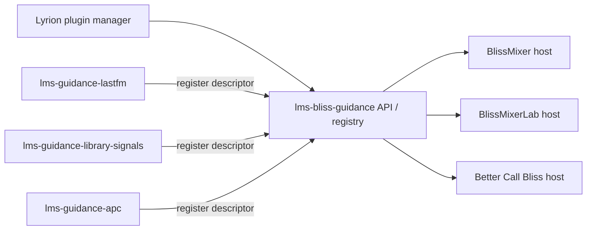
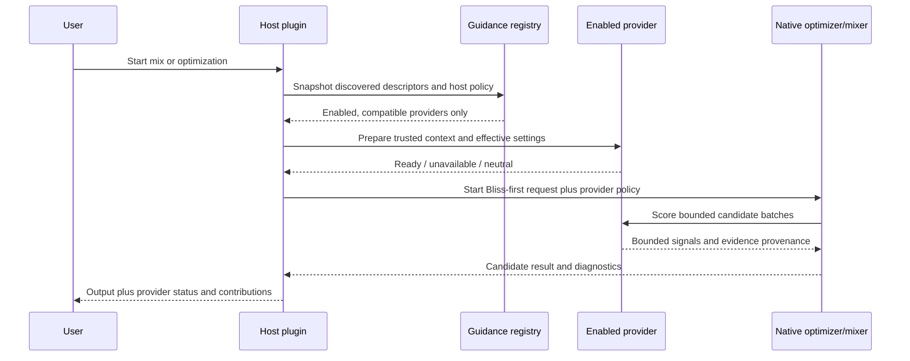

# Lyrion guidance-provider discovery and host integration

## Status

Proposed design. This document describes the Lyrion-side integration for
independently installable guidance extensions. It complements the native
[`bliss-playlist-guidance-spi`](https://github.com/chrober/bliss-playlist-guidance-spi)
contract; it does not replace that Rust process protocol.

## Intent

Last.fm, local-library signals, play counts, APC, and future sources should be
installable as separate Lyrion extensions. BlissMixer, BlissMixerLab, Better
Call Bliss, and later hosts should discover those extensions without hard-coded
knowledge of every provider.

Discovery must not imply activation. Every host keeps an explicit, per-provider
enabled/disabled setting, with **disabled as the default**. Installing a
provider must never silently change playlist or queue results, make network
requests, read additional databases, or increase job duration.

The design must preserve these invariants:

- Bliss remains the primary authority for candidate admission, acoustic
  similarity, eligibility, route validity, and repeat constraints.
- A provider contributes bounded evidence or a boost/penalty only; it cannot
  inject a track or override a hard constraint.
- Provider failure, timeout, missing data, or incompatible versions degrades to
  neutral guidance and remains visible in diagnostics.
- Provider settings remain independent for each host. Enabling Last.fm in
  Better Call Bliss does not enable it in BlissMixer.
- The existing native SPI remains reusable by both
  `bliss-playlist-optimizer` and the future `bliss-mixer` host.

## Terminology

| Term | Meaning |
| --- | --- |
| **Provider** | An independently installable Lyrion extension that supplies one or more guidance capabilities. |
| **Host** | A plugin or native application that owns candidate selection, such as BlissMixer or Better Call Bliss. |
| **Capability** | A stable function offered by a provider, for example `artist_similarity`, `track_similarity`, `play_count`, `last_played`, or `library_age`. |
| **Provider descriptor** | Metadata used for discovery, compatibility checks, UI, and diagnostics. |
| **Provider policy** | Host-owned effective settings for one run: enabled providers, channel weights, limits, and timeouts. |
| **Provider-owned setting** | A setting required to operate the source, such as an API key or source-specific cache policy. |
| **Host-owned setting** | A setting controlling whether and how a provider affects one host, such as enabled state or influence. |
| **Guidance signal** | A bounded, candidate-level recommendation returned by a provider. |

Provider IDs are stable machine identifiers, not display names. Initial IDs may
include `lastfm-guidance`, `library-signals`, and `apc-guidance`. Capability IDs
must be independent of repository names and executable names.

## Architecture decision

Use a small shared Lyrion-side registry/API as the discovery authority. Do not
use the numeric `install.xml` plugin type as a guidance category, and do not
make hosts scan arbitrary plugin directories or infer capabilities from module
names.



The registry is a small service boundary, not a second ranking engine. It owns
registration, descriptor validation, host-specific policy lookup, and provider
invocation/adaptation. It does not combine scores and does not choose tracks.

The native Rust SPI remains the provider execution boundary where a host uses a
native optimizer or mixer binary:


The adapter may call a provider in-process, invoke a trusted helper, or prepare
an immutable artifact for the Rust JSONL SPI. That implementation choice must
not be visible to hosts. A provider must never receive an executable path,
database path, or unrestricted command-line arguments from an LMS form field.

## Discovery and lifecycle

### Registration

An enabled provider registers during plugin initialization through the shared
API. Registration is idempotent and contains a descriptor like:

```perl
{
    id           => 'library-signals',
    api_version  => 1,
    display_name => 'Local library signals',
    capabilities => [
        'play_count',
        'last_played',
        'library_age',
    ],
    scopes       => ['global_candidate'],
    settings     => [ ... ],
    status       => sub { ... },
    score        => sub { ... },
}
```

The registry validates:

- stable provider ID and API version;
- unique capability IDs;
- supported scopes (`global_candidate`, `edge_candidate`, or both);
- setting schema and safe value types;
- callback/process availability; and
- provider status and failure reporting.

Duplicate IDs are rejected deterministically. An incompatible API version is
shown as unavailable rather than partially activated. A provider that is not
installed or not enabled simply does not register.

### Startup ordering and late availability

Hosts must not assume that provider registration occurred before their own
`initPlugin` callback. The registry exposes a query after plugin initialization
and a change notification/rescan hook. Hosts refresh the provider list when a
plugin is enabled, disabled, installed, or removed.

At job/mix start, the host takes a snapshot of the currently registered
providers and their effective policy. A provider appearing later does not alter
an already-running job.

### Host discovery policy

Hosts discover descriptors but activate only providers explicitly enabled in
their own settings. New providers are inserted as disabled entries and shown as
available but inactive. Existing provider settings remain unchanged when a
provider is upgraded or temporarily unavailable.

The host should show, at minimum:

- provider display name and stable ID;
- capabilities;
- installed/provider API version;
- enabled/disabled state;
- availability and last failure;
- effective host policy; and
- whether the provider contributed any signals to the current result.

## Settings ownership and injection

### Provider-owned settings

Providers own settings needed to acquire or interpret their data. Examples:

- Last.fm API key, acquisition mode, cache, and privacy/network behavior;
- APC database or endpoint selection;
- source-specific identity matching and cache retention.

These settings may have a provider-specific settings page. The host must not
duplicate credentials or reach into provider preference namespaces.

### Host-owned settings

Each host owns its own policy namespace, for example:

```text
plugin.blissmixer.guidance.lastfm-guidance.enabled
plugin.blissmixer.guidance.lastfm-guidance.artist_influence
plugin.bettercallbliss.guidance.lastfm-guidance.enabled
plugin.bettercallbliss.guidance.lastfm-guidance.artist_weight
```

At minimum, host policy contains `enabled`, per-capability influence/weight,
and bounded timeout or batch limits. The default for `enabled` is false. A host
may add a per-job override, but the persistent default remains the host setting.

### Can providers inject settings into host pages?

Yes, but the safe form is **schema-driven rendering**, not arbitrary HTML
injection.

The provider descriptor may declare host-exposable controls:

```perl
{
    key         => 'artist_influence',
    type        => 'integer',
    min         => 0,
    max         => 100,
    default     => 25,
    label_token => 'LASTFM_ARTIST_INFLUENCE',
    help_token  => 'LASTFM_ARTIST_INFLUENCE_DESC',
}
```

The host renders these controls in a provider-specific, namespaced section of
its own settings page and validates them using the declared schema. The host
stores the values in its own preference namespace and passes them to the
provider as effective policy.

This provides the desired integrated UX while retaining ownership boundaries:

- provider owns the meaning and schema of the control;
- host owns whether the provider is enabled and when it is applied;
- host owns persistence and per-job overrides;
- provider owns acquisition credentials and source-specific settings.

Raw provider-generated HTML, JavaScript, CSS, or arbitrary form callbacks are
not part of the contract. They would be fragile across Material skin versions,
unsafe to validate, difficult to localize, and likely to break other skins.

Providers may still expose a separate settings page for credentials, advanced
source behavior, cache management, and diagnostics. A provider with no
provider-owned settings page is valid; it can be configured entirely through
host-rendered schema controls.

## Runtime flow



The exact execution path may instead be `H -> N -> P` when the native host
launches provider processes directly. The observable contract is the same:
provider inputs are trusted and bounded, provider output is advisory, and the
host receives provenance.

### Provider failure behavior

The host and native SPI treat the following as neutral guidance:

- provider not installed or disabled;
- missing provider-owned configuration;
- unavailable Last.fm/APC/database source;
- timeout or cancellation;
- malformed descriptor or response;
- stale or incompatible artifact;
- insufficient identity coverage; and
- provider process crash.

The result records the failure category, provider ID, capability, and whether
any signals were applied. A failed provider must not cause an otherwise valid
Bliss-only mix or route to fail.

## Capability examples

| Provider | Capabilities | Typical scope | Provider-owned data |
| --- | --- | --- | --- |
| Last.fm guidance | `artist_similarity`, `track_similarity` | edge and global | LastMix or direct API acquisition, credentials/cache |
| Library signals | `play_count`, `last_played`, `library_age` | global candidate | Lyrion database/API access and identity mapping |
| APC guidance | alternative play count or listening-history channels | global candidate | Alternative Play Count data source |

The same provider may offer multiple channels. Hosts enable the provider as a
whole but may set individual channel influence to zero. A zero influence is the
normal way to disable a channel; it avoids a second enable/disable model.

## Security and trust boundaries

- Only installed, enabled Lyrion providers may register.
- Provider IDs, capabilities, and setting keys are validated against a strict
  schema.
- Executable paths, database paths, and network destinations come from trusted
  plugin configuration, never directly from form fields.
- Provider-owned secrets remain in the provider namespace and are never copied
  into job artifacts or rendered in diagnostics.
- Database access is read-only and bounded to the candidate identities needed
  by the current job.
- Provider output cannot admit a track, bypass a repeat rule, or override an
  acoustic route-quality gate.

## Compatibility and versioning

The Lyrion registry API version and native SPI version are independent:

- the registry API governs discovery, settings, lifecycle, and invocation from
  Lyrion plugins;
- the native SPI governs JSONL messages between native hosts and provider
  processes.

Descriptors declare both versions where both layers are used. A host must
reject unsupported versions gracefully and continue without that provider.
Provider IDs and capability IDs are permanent once published. Renaming a
provider requires an explicit migration alias rather than silently creating a
new preference namespace.

## Testing and acceptance criteria

The first implementation is acceptable when:

- a fake provider can register, be discovered, disabled, enabled, and invoked;
- a newly installed provider appears disabled by default;
- provider-owned and host-owned settings remain separate;
- schema-declared controls render in at least the host's normal settings page
  without raw HTML injection;
- duplicate IDs and incompatible versions are rejected;
- startup ordering and late registration are handled;
- all provider failure modes produce neutral guidance and diagnostics;
- Bliss-only behavior is byte-for-byte or decision-for-decision unchanged when
  all providers are disabled; and
- both Better Call Bliss and the future Bliss Mixer host can consume the same
  provider descriptor and native SPI fixtures.

## Delivery phases

1. Define and test the Lyrion registry/API package and descriptor schema.
2. Add provider registration adapters to Last.fm and local-library signals.
3. Add host settings discovery with disabled-by-default provider entries.
4. Wire Better Call Bliss to the registry and native SPI while retaining
   Bliss-only fallback.
5. Add APC as a separate provider without changing host planner code.
6. Integrate the same registry/SPI policy into the Bliss Mixer fork.
7. Remove duplicated host-specific provider logic only after parity tests pass.

